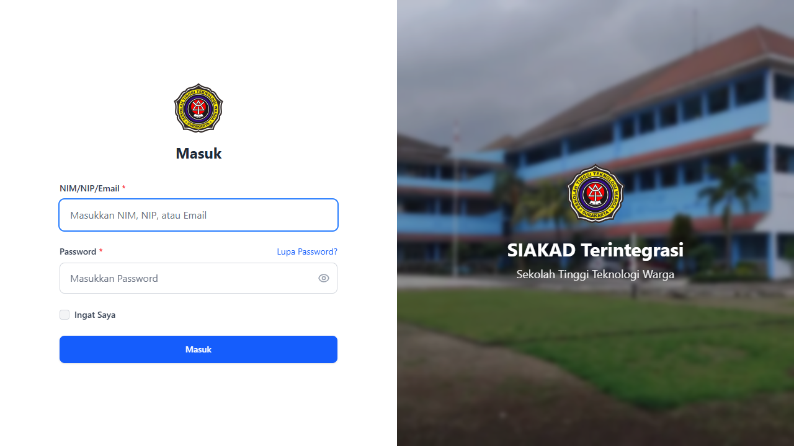
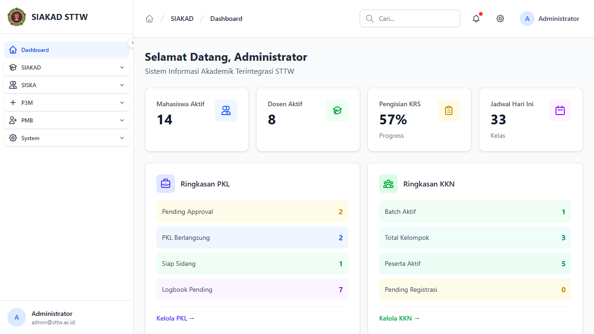
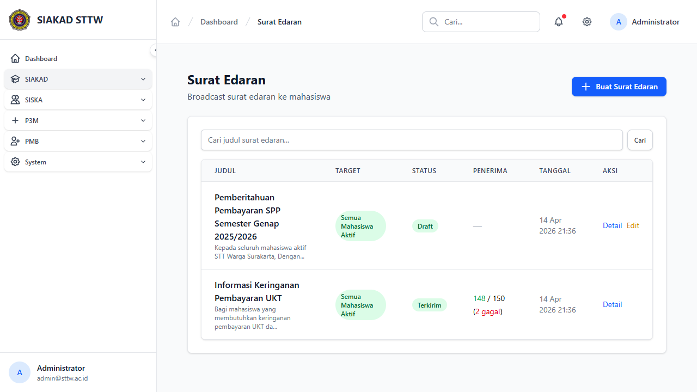
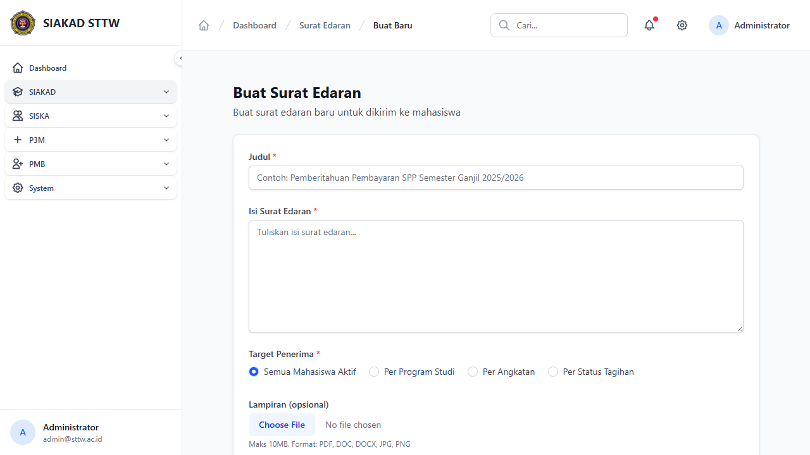
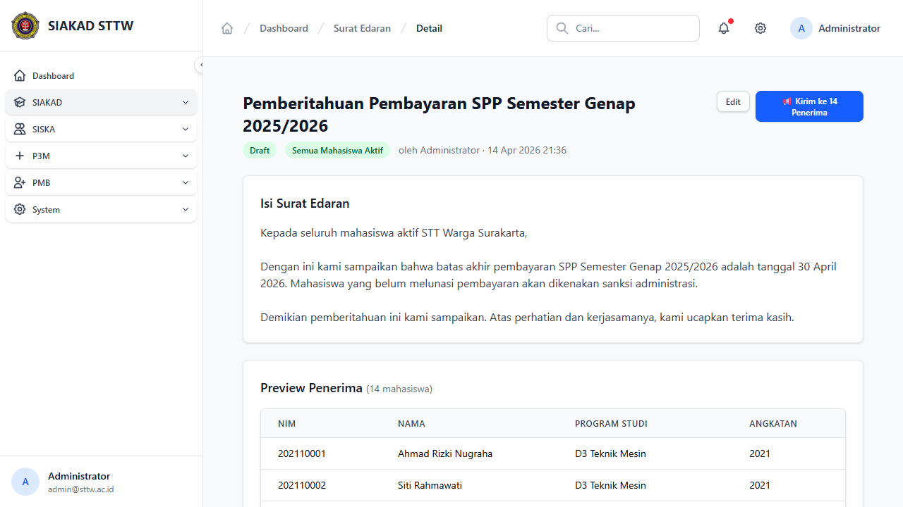
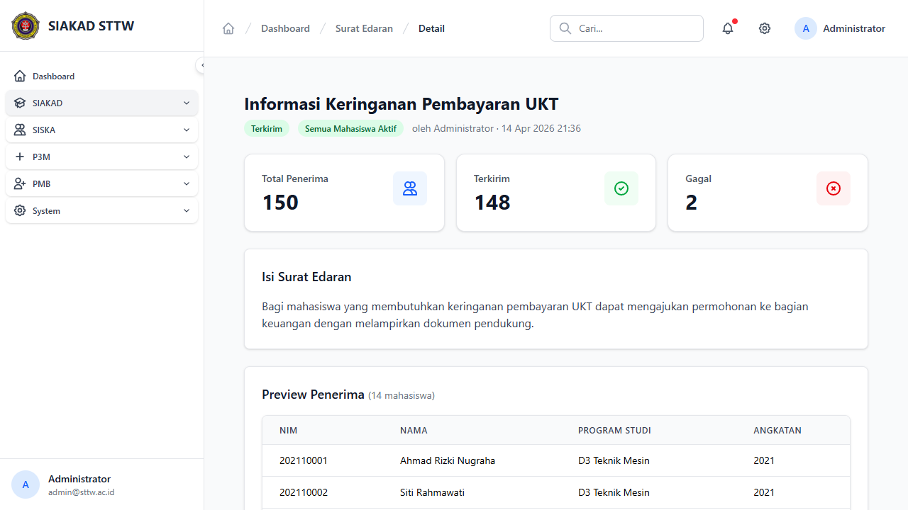
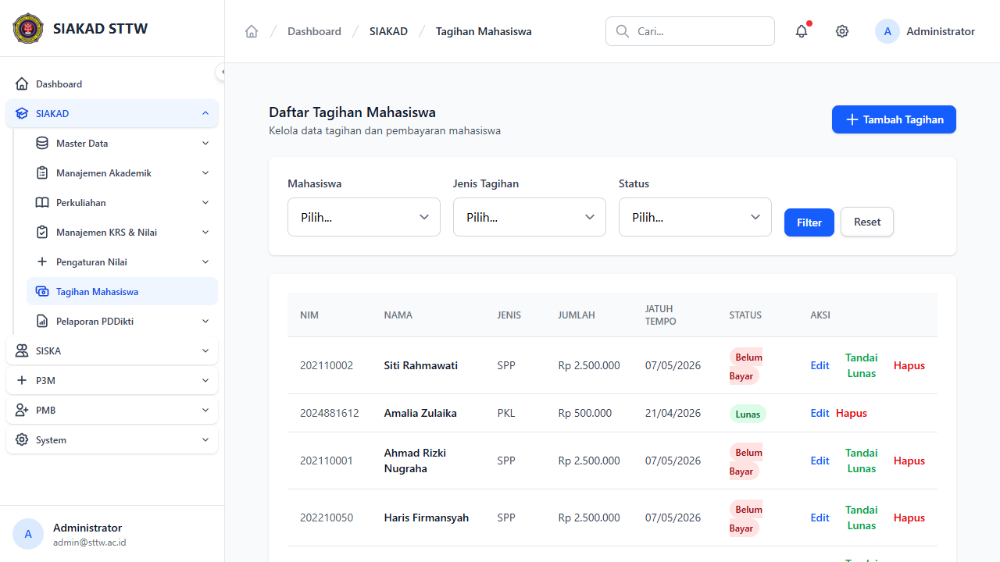
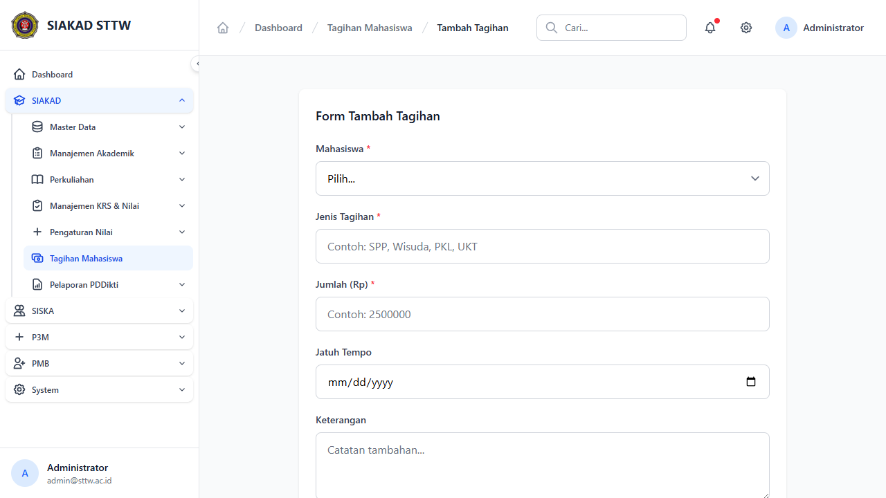
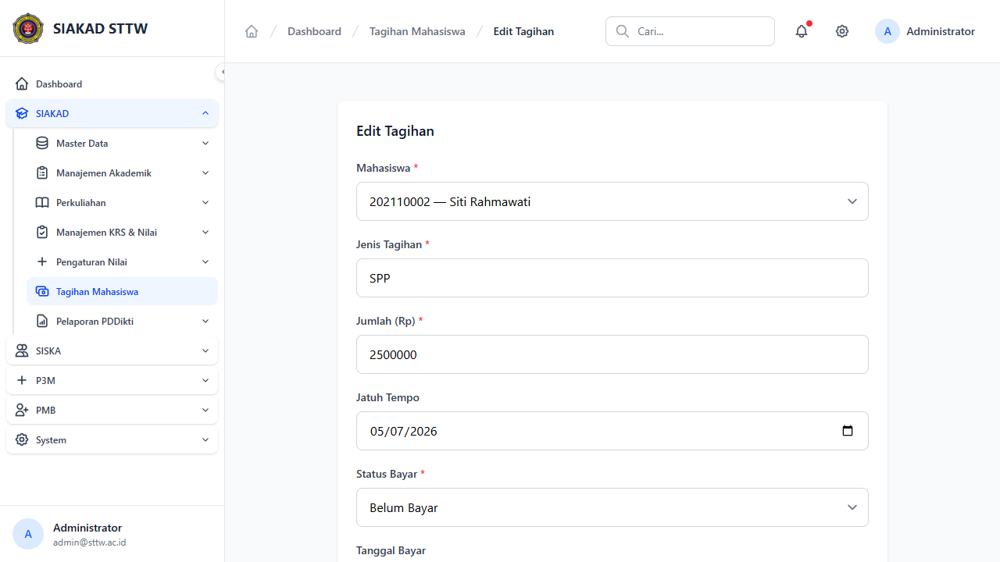

# Workflow Report: Phase 2 — Surat Edaran & Tagihan Mahasiswa

**Tanggal**: 14 April 2026
**Role**: Admin (`admin@sttw.ac.id`)
**Modul**: SIAKAD — Notifikasi SE Pembayaran & Block Nilai Pre-Bayar
**Status**: ✅ Berhasil
**Branch**: `dev/phase2-medium-features`

## Ringkasan

Report ini mendokumentasikan 2 fitur Phase 2 meeting feedback:

1. **Surat Edaran Pembayaran** (item #10) — CRUD surat edaran dengan broadcast notifikasi ke mahasiswa via email/database. Target bisa semua mahasiswa, per prodi, per angkatan, atau berdasarkan status tagihan.

2. **Block Rekap Nilai Pre-Bayar** (item #5d) — Manajemen tagihan mahasiswa dengan mekanisme blocking nilai bagi mahasiswa yang belum bayar. Admin bisa override per tagihan. Dosen tetap bisa input komponen nilai, tapi finalisasi nilai diblokir.

## Langkah-langkah

### 1. Login sebagai Admin

Masuk ke SIAKAD menggunakan akun admin (`admin@sttw.ac.id`).

### 2. Dashboard Admin

Setelah login, admin diarahkan ke dashboard utama SIAKAD.

### 3. Daftar Surat Edaran

Navigasi ke `/siakad/surat-edaran`. Halaman menampilkan daftar surat edaran yang sudah dibuat. Terdapat 2 dummy data: satu draft dan satu sudah terkirim. Admin bisa membuat SE baru, melihat detail, mengedit, atau menghapus.

### 4. Form Buat Surat Edaran

Klik "Buat Surat Edaran" untuk membuat SE baru. Form mencakup:
- **Judul** — Judul surat edaran
- **Isi** — Konten SE (textarea)
- **Target Penerima** — Dropdown: Semua Mahasiswa / Per Program Studi / Per Angkatan / Berdasarkan Status Tagihan
- **Channel Notifikasi** — Email dan/atau Database (in-app)

### 5. Detail Surat Edaran (Draft)

Detail SE yang berstatus Draft. Admin bisa:
- Melihat informasi SE (judul, isi, target, channel)
- Preview daftar penerima
- Mengirim SE (tombol "Kirim Notifikasi")
- Edit atau hapus SE

### 6. Detail Surat Edaran (Terkirim)

Detail SE yang sudah dikirim. Menampilkan:
- Status "Terkirim" dengan badge
- Statistik pengiriman (total, berhasil, gagal)
- Tabel log notifikasi per penerima (NIM, nama, channel, status, waktu)
- SE yang sudah terkirim tidak bisa diedit/dihapus

### 7. Daftar Tagihan Mahasiswa

Navigasi ke `/siakad/tagihan-mahasiswa`. Halaman menampilkan daftar tagihan dengan filter:
- **Jenis Tagihan** — SPP, PKL, Praktikum, dll
- **Status** — Belum Bayar, Lunas, Cicilan

Tabel menampilkan NIM, Nama, Jenis, Jumlah, Jatuh Tempo, dan Status. Admin bisa tandai lunas, edit, atau hapus tagihan.

### 8. Form Tambah Tagihan

Form untuk menambahkan tagihan baru. Field mencakup:
- **Mahasiswa** — Pencarian by NIM/nama (Select2)
- **Jenis Tagihan** — Dropdown (SPP, Praktikum, PKL, dll)
- **Jumlah** — Nominal tagihan
- **Jatuh Tempo** — Tanggal batas bayar (H-1 warning akan dikirim otomatis)
- **Keterangan** — Catatan tambahan

### 9. Form Edit Tagihan

Form edit menampilkan data tagihan yang ada. Admin bisa mengubah data dan juga terdapat toggle **Override Nilai** untuk mengizinkan dosen menginput nilai meskipun mahasiswa belum bayar.

## Arsitektur Teknis

### Surat Edaran (c2-notifikasi-se)

| Komponen | File |
|----------|------|
| Controller | `app/Http/Controllers/SuratEdaranController.php` |
| Model | `app/Models/SuratEdaran.php` (UUID, SoftDeletes) |
| Model | `app/Models/NotificationLog.php` (UUID) |
| Job | `app/Jobs/SendSuratEdaranJob.php` |
| Notification | `app/Notifications/SuratEdaranNotification.php` |
| FormRequest | `app/Http/Requests/StoreSuratEdaranRequest.php` |
| Views | `resources/views/siakad/surat-edaran/{index,create,edit,show}.blade.php` |
| Migration | `database/migrations/2026_04_14_210705_create_surat_edaran_and_notification_logs_tables.php` |
| Enums | `TargetType`, `NotificationChannel`, `NotificationStatus` |

### Block Nilai Pre-Bayar (c3-block-nilai-bayar)

| Komponen | File |
|----------|------|
| Controller | `app/Http/Controllers/TagihanMahasiswaController.php` |
| Views | `resources/views/siakad/tagihan-mahasiswa/{index,create,edit}.blade.php` |
| Migration | `database/migrations/2026_04_14_200000_add_nilai_override_to_tagihan_mahasiswa.php` |
| Config | `config/siakad.php` → `tagihan.block_nilai` toggle |

### Mekanisme Block Nilai

- **Soft-block**: Dosen masih bisa input `NilaiKomponen` (per komponen) untuk semua mahasiswa
- **Yang diblokir**: Hanya finalisasi `NilaiMahasiswa` (grade akhir) yang diblokir
- **Kriteria blocking**: `status_bayar != 'lunas'` AND `jatuh_tempo < today()` AND `nilai_override = false`
- **Override**: Admin bisa toggle `nilai_override` per tagihan (ada audit trail: siapa, kapan)

## Test Coverage

| Test File | Tests | Assertions |
|-----------|-------|------------|
| `tests/Feature/SuratEdaranTest.php` | 12 | 33 |
| `tests/Feature/Admin/TagihanMahasiswaTest.php` | 7 | 22 |
| **Total Phase 2** | **19** | **55** |

Semua test passing ✅

## Catatan

- Permission `siakad.surat-edaran.manage` dan `siakad.tagihan.manage` perlu di-reseed setelah deploy (`php artisan db:seed --class=RolePermissionSeeder --force`)
- Surat Edaran menggunakan Laravel Queue untuk pengiriman async — pastikan queue worker berjalan di production
- Config `siakad.tagihan.block_nilai` default `true` — bisa dinonaktifkan di `.env` dengan `TAGIHAN_BLOCK_NILAI=false`
- Sidebar menu untuk kedua fitur ini belum ditambahkan — perlu ditambahkan ke navigation sesuai kebutuhan
