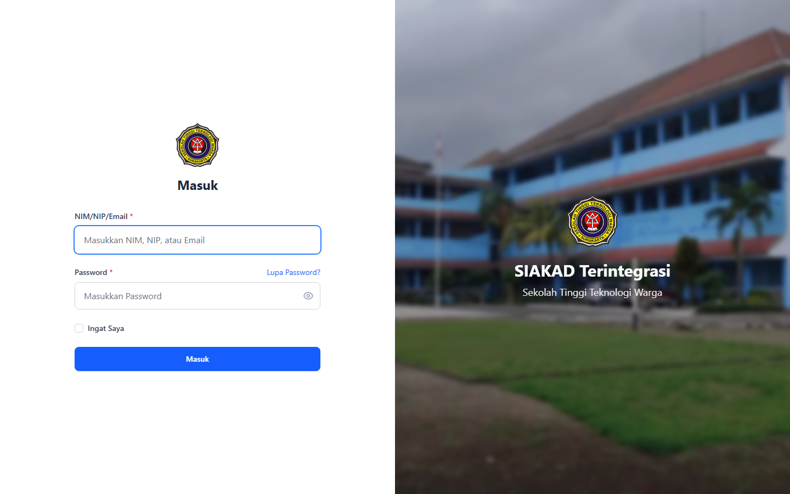
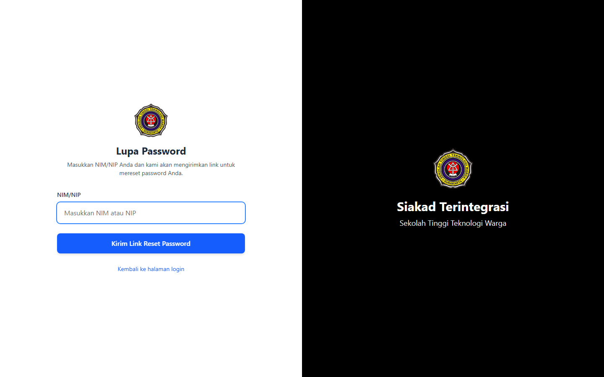

# Auth — Login / Register / Forgot Password (Public)

- **Tanggal:** 2026-04-22
- **Role:** guest (no auth)
- **Modul:** Authentication entry points
- **Status:** ✅ Pass — semua halaman publik render 200

## Ringkasan

Scan halaman publik autentikasi:

- **Login utama** untuk seluruh pengguna SIAKAD/HRM/SISKA/PMB-admin.
- **Forgot Password** flow Breeze.
- **PMB Login & PMB Register** untuk calon mahasiswa.

Halaman `reset-password/{token}` membutuhkan token aktif sehingga tidak di-scan langsung — flow lengkap perlu integrasi mailer (di-defer ke iterasi berikutnya).

## Halaman

| # | Halaman | URL | Status |
|---|---|---|---|
| 1 | Login | `/login` | 200 |
| 2 | Forgot Password | `/forgot-password` | 200 |
| 3 | PMB Login | `/pmb/login` | 200 |
| 4 | PMB Register | `/pmb/register` | 200 |

## Screenshots

### 01 Login

### 02 Forgot Password

### 03 PMB Login

### 04 PMB Register

## Temuan & Masalah

Tidak ditemukan masalah render pada halaman publik autentikasi. Form login utama menggunakan field `name="login"` (NIM/NIP/Email) — kompatibel dengan dokumentasi internal.

### 🛈 Follow-up tidak diuji

- **Reset password** dengan token nyata (membutuhkan trigger forgot-password + akses mailbox).
- **PMB Register submit** end-to-end (uji kode Breeze + custom PMB).
- **Login throttle** & rate-limit.

## Catatan Skenario

- Recorder dijalankan dengan flag `skipLogin: true`.
