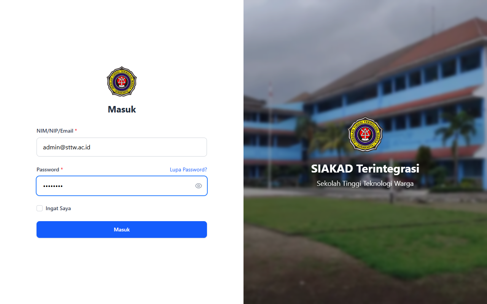
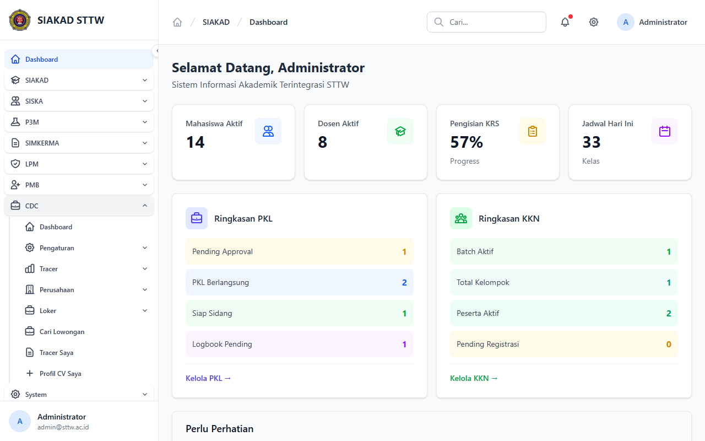
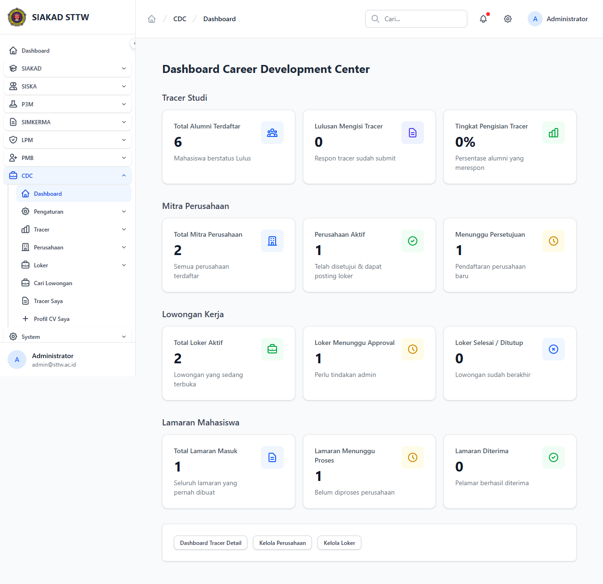

# Workflow Report: CDC Admin Dashboard

**Scenario:** admin-dashboard  
**Date:** 2026-04-27  
**Role:** Admin  
**URL Base:** http://127.0.0.1:8000

## Steps & Screenshots

### 1. Login

Admin logs in via `/login`.

### 2. Sidebar CDC Expanded

CDC menu group is expanded in the sidebar showing all sub-modules.

### 3. CDC Dashboard

Combined CDC dashboard at `/cdc/admin/dashboard` showing stats cards: total perusahaan, loker aktif, lamaran, and tracer responses.

## Result
✅ Dashboard loads with stat cards. Role-based permission `cdc.dashboard.view` is enforced.
