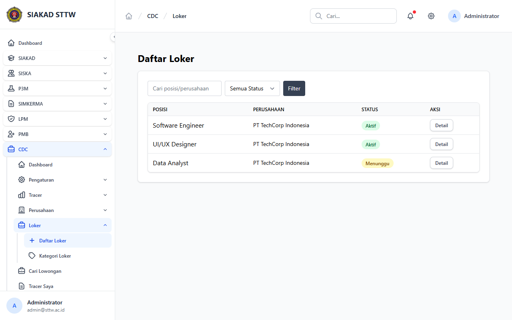
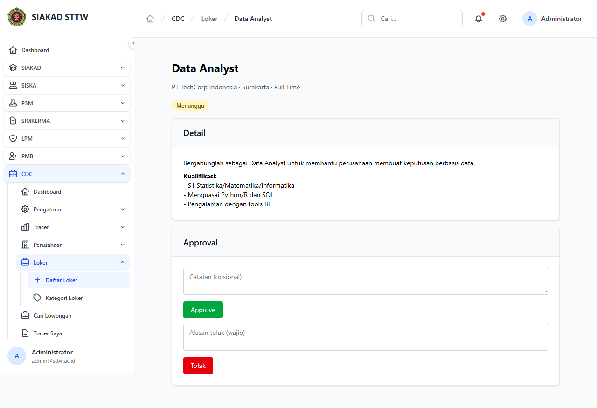

# Workflow Report: CDC Admin Loker

**Scenario:** admin-loker  
**Date:** 2026-04-27  
**Role:** Admin  
**URL Base:** http://127.0.0.1:8000

## Steps & Screenshots

### 1. Loker List

Admin views all job postings at `/cdc/admin/loker`. Status badges distinguish Aktif/Menunggu/Ditolak.

### 2. Loker Menunggu Detail

Admin reviews a pending loker and can approve or reject.

## Result
✅ Admin can moderate loker submissions. Permission `cdc.loker.manage` is enforced.
