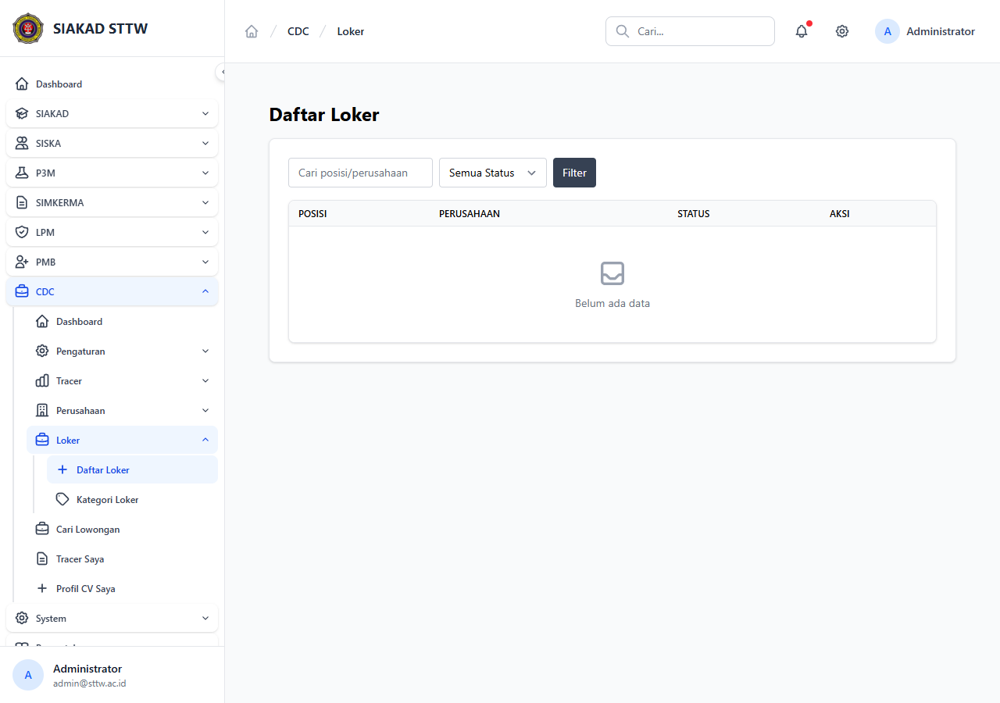

# Workflow Report: Daftar Loker Admin CDC (Refresh)

**Tanggal**: 2026-05-12
**Role**: admin
**Modul**: cdc
**Fitur**: admin-loker
**Status**: ✅ Berhasil

## Deskripsi Workflow

Refresh halaman Daftar Loker CDC setelah commit pertengahan April yang meningkatkan filter & kolom tabel (tanggal posting, batas pendaftaran, status verifikasi).

## Ringkasan

- Halaman `/cdc/admin/loker` HTTP 200, judul `Daftar Loker - SIAKAD STTW`.
- Filter periode + status + perusahaan tampil.
- Tabel index menggunakan komponen, tombol aksi via `<x-button>`.

## Langkah-langkah

### 1. Login admin & buka Daftar Loker

**Deskripsi**: Login `admin@sttw.ac.id`, sidebar CDC → Loker. Tampilan menyajikan tabel loker dengan filter di atas dan tombol "Tambah Loker" di kanan atas.

**URL**: `http://127.0.0.1:8000/cdc/admin/loker`

## Temuan & Masalah

| # | Halaman | URL | Kategori | Deskripsi | Prioritas |
|---|---------|-----|----------|-----------|-----------|
| 1 | Loker Index | /cdc/admin/loker | `no-data` | Belum ada seeder loker; tabel kosong. | Low |

## Catatan

- Snapshot lama diarsipkan: `2026-04-27_REPORT.md`.
