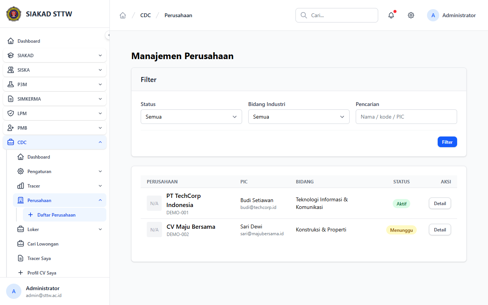
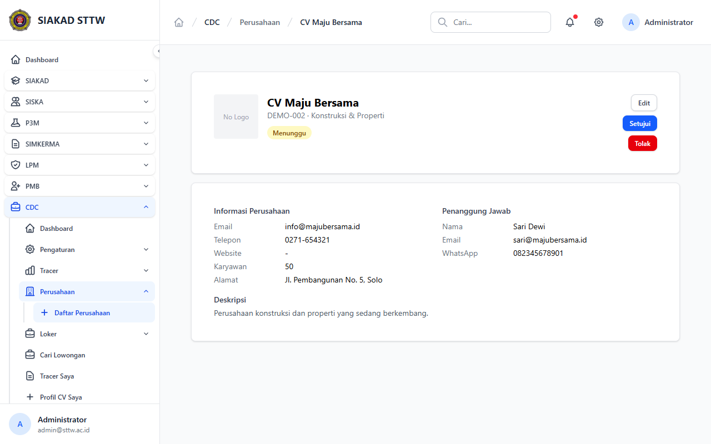

# Workflow Report: CDC Admin Perusahaan

**Scenario:** admin-perusahaan  
**Date:** 2026-04-27  
**Role:** Admin  
**URL Base:** http://127.0.0.1:8000

## Steps & Screenshots

### 1. Perusahaan List

Admin views all perusahaan at `/cdc/admin/perusahaan`. Shows status badges (Aktif / Menunggu).

### 2. Perusahaan Menunggu Detail

Admin views a pending perusahaan and can approve or reject.

## Result
✅ Admin can manage perusahaan approvals. Permission `cdc.perusahaan.manage` is enforced.
