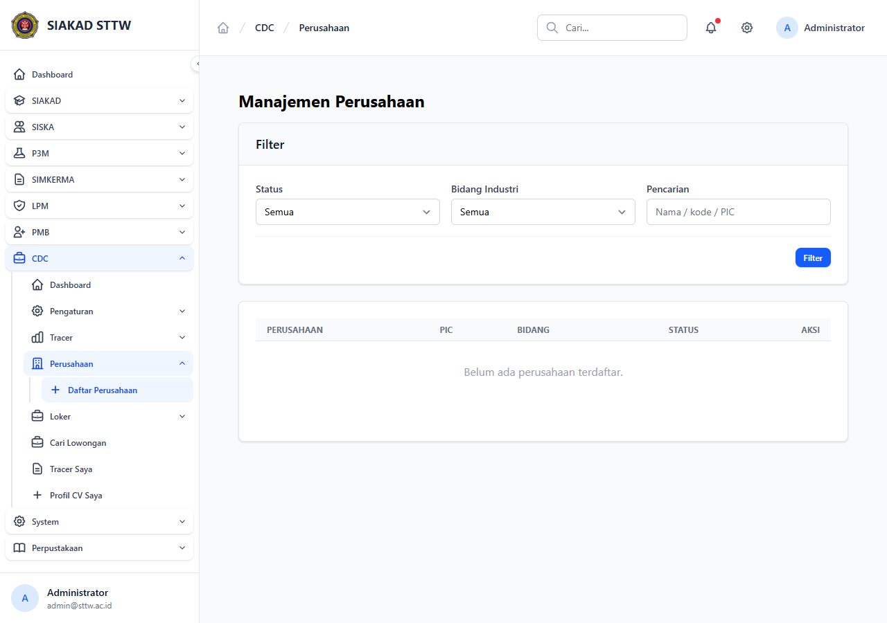

# Workflow Report: Manajemen Perusahaan Admin CDC (Refresh)

**Tanggal**: 2026-05-12
**Role**: admin
**Modul**: cdc
**Fitur**: admin-perusahaan
**Status**: ✅ Berhasil

## Deskripsi Workflow

Refresh halaman Manajemen Perusahaan CDC setelah commit pertengahan April terkait normalisasi field (NPWP, alamat, kontak PIC).

## Ringkasan

- Halaman `/cdc/admin/perusahaan` HTTP 200, judul `Manajemen Perusahaan - SIAKAD STTW`.
- Tabel index dirender dengan kolom standar; tombol Tambah tersedia.

## Langkah-langkah

### 1. Login admin & buka Manajemen Perusahaan

**Deskripsi**: Sidebar CDC → Perusahaan. Tabel menampilkan daftar perusahaan mitra dengan kolom Nama, Bidang, PIC, Status, dan aksi.

**URL**: `http://127.0.0.1:8000/cdc/admin/perusahaan`

## Temuan & Masalah

| # | Halaman | URL | Kategori | Deskripsi | Prioritas |
|---|---------|-----|----------|-----------|-----------|
| 1 | Perusahaan Index | /cdc/admin/perusahaan | `no-data` | Belum ada seeder perusahaan; tabel kosong. | Low |

## Catatan

- Snapshot lama diarsipkan: `2026-04-27_REPORT.md`.
