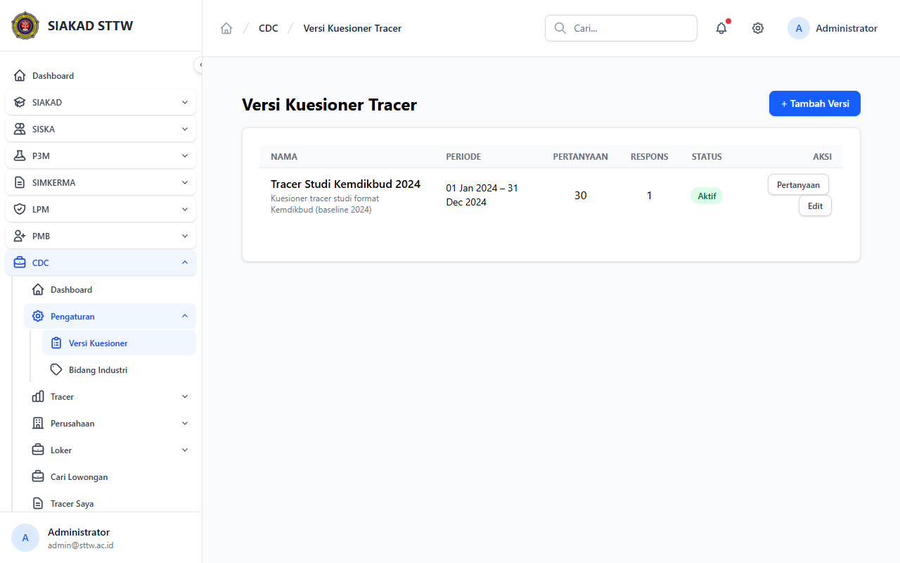
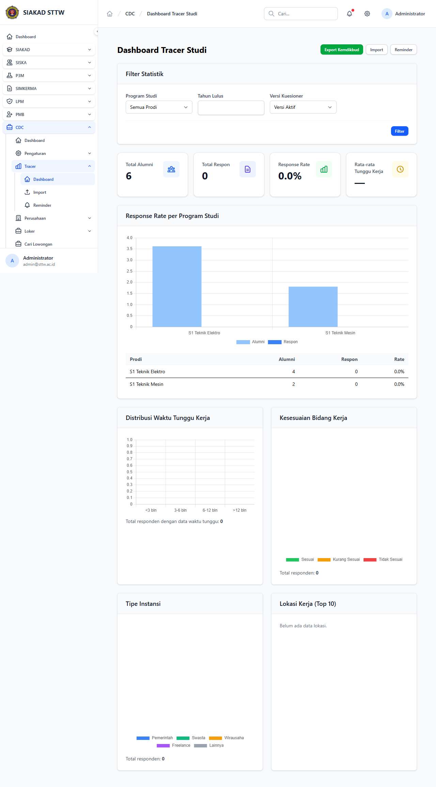
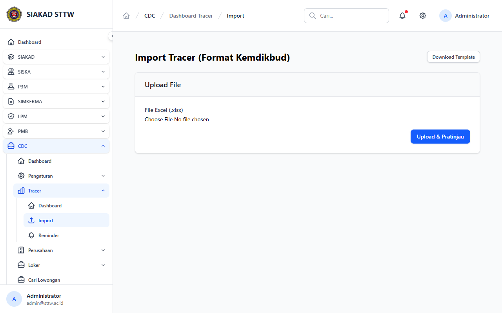
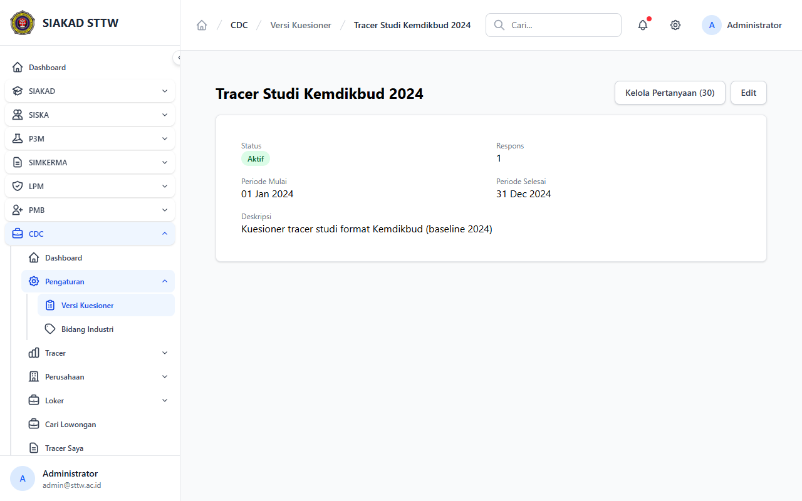

# Workflow Report: CDC Admin Tracer

**Scenario:** admin-tracer  
**Date:** 2026-04-27  
**Role:** Admin  
**URL Base:** http://127.0.0.1:8000

## Steps & Screenshots

### 1. Tracer Version List

Admin views all tracer survey versions at `/cdc/admin/tracer/versions`.

### 2. Tracer Dashboard

Admin views tracer analytics and response statistics at `/cdc/admin/tracer/dashboard`.

### 3. Tracer Import

Admin can import legacy tracer data via JSON at `/cdc/admin/tracer/import`.

### 4. Tracer Version Detail

Admin views a specific survey version with its questions.

## Result
✅ Admin can manage tracer surveys end-to-end including legacy import. Permission `cdc.tracer.manage` is enforced.
