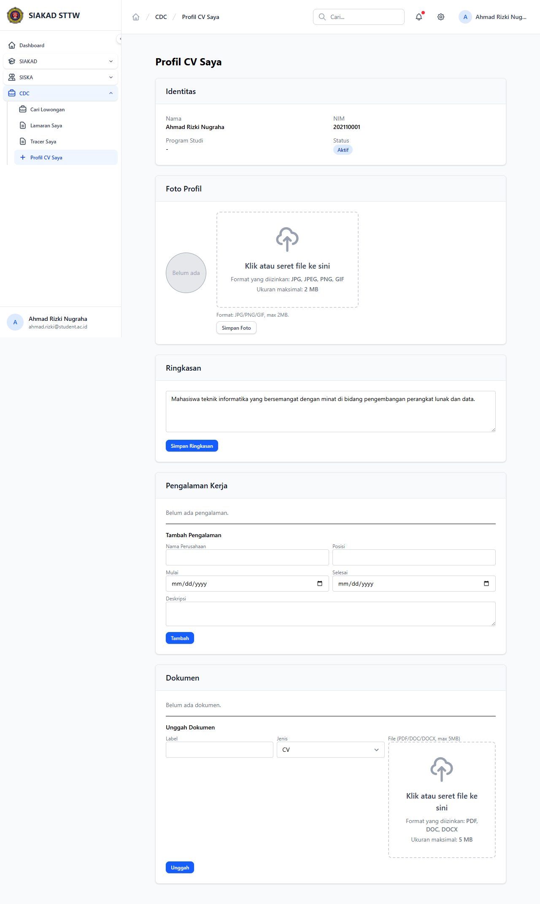

# Workflow Report: CDC Mahasiswa CV Profile

**Scenario:** mahasiswa-cv  
**Date:** 2026-04-27  
**Role:** Mahasiswa  
**URL Base:** http://127.0.0.1:8000

## Steps & Screenshots

### 1. CV Profile Page

Mahasiswa manages their CV at `/cdc/profil-cv`. Includes photo upload, bio, skills, education, and experience sections.

## Result
✅ CV profile page loads and allows mahasiswa to build/update their CV. Files stored on `public` disk for correct URL resolution.
