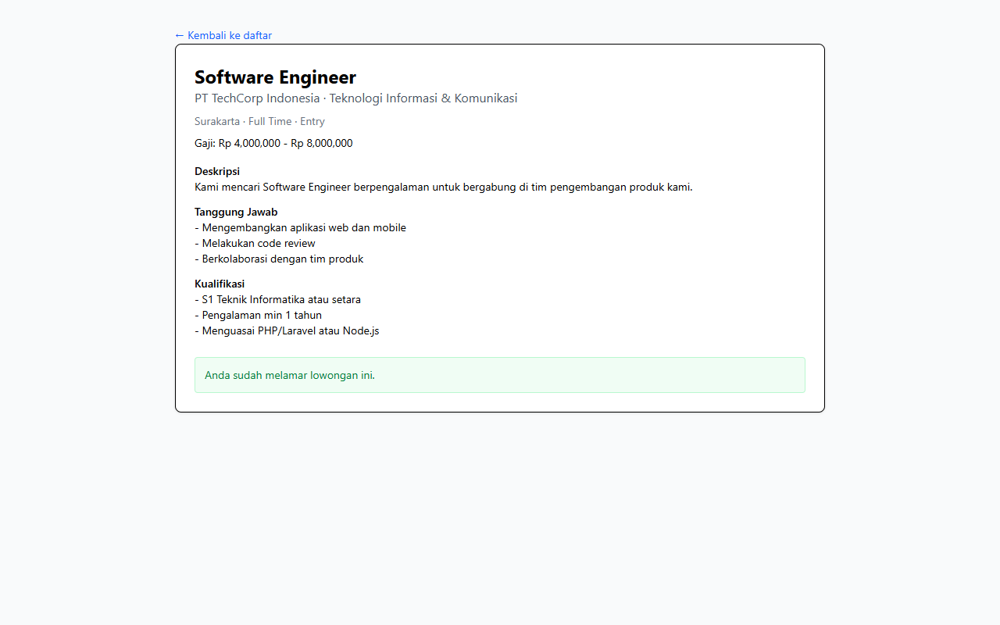

# Workflow Report: CDC Mahasiswa Browse Loker

**Scenario:** mahasiswa-loker  
**Date:** 2026-04-27  
**Role:** Mahasiswa  
**URL Base:** http://127.0.0.1:8000

## Steps & Screenshots

### 1. Browse Loker

Mahasiswa browses active job postings at `/cdc/loker` with filter by bidang industri.

### 2. Loker Detail & Apply

Mahasiswa views full loker detail at `/cdc/loker/{slug}` and can apply with one click (requires CV profile).

## Result
✅ Mahasiswa can browse and apply to loker. Application status tracked in `cdc_lamaran` table with status flow: Diajukan → Diterima/Ditolak.
