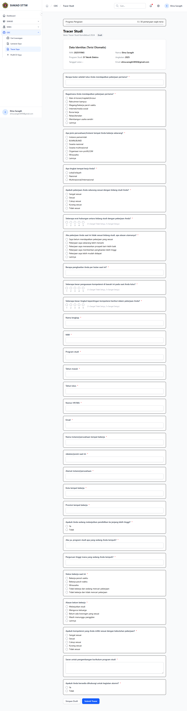

# Workflow Report: CDC Mahasiswa Tracer

**Scenario:** mahasiswa-tracer  
**Date:** 2026-04-27  
**Role:** Mahasiswa (lulus)  
**URL Base:** http://127.0.0.1:8000

## Steps & Screenshots

### 1. Tracer Form

Graduated mahasiswa accesses the tracer study survey at `/cdc/tracer`. Form shows all active questions for the current version.

## Result
✅ Tracer accessible only for mahasiswa with `Lulus` status. Alumni complete the survey and responses are saved per version.
