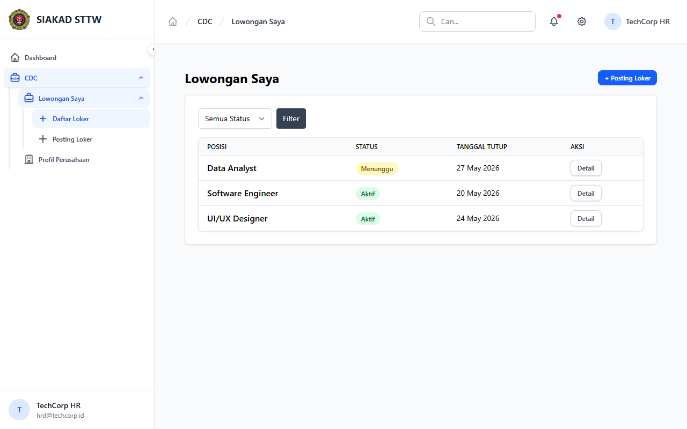
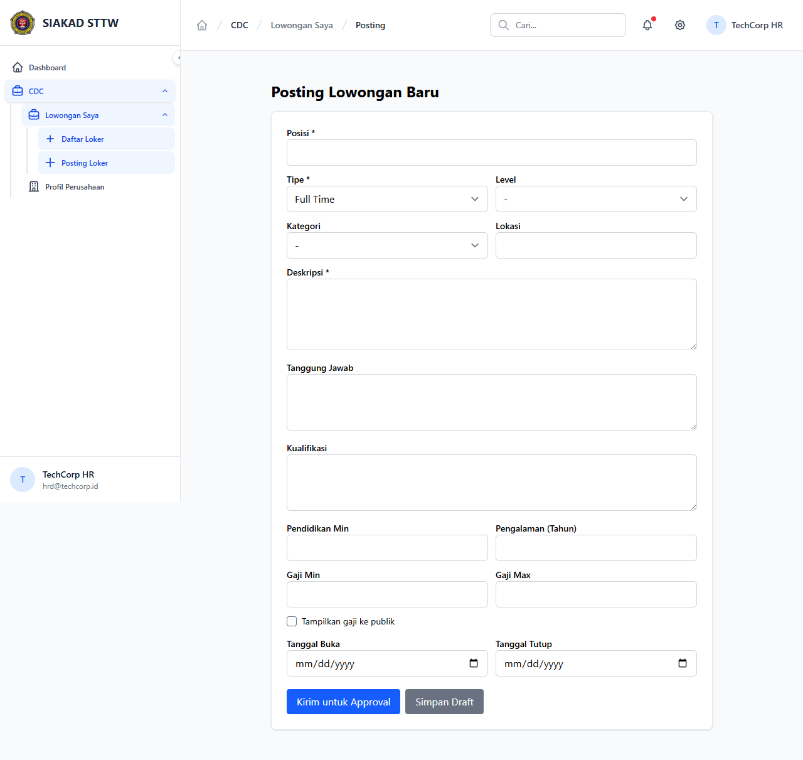
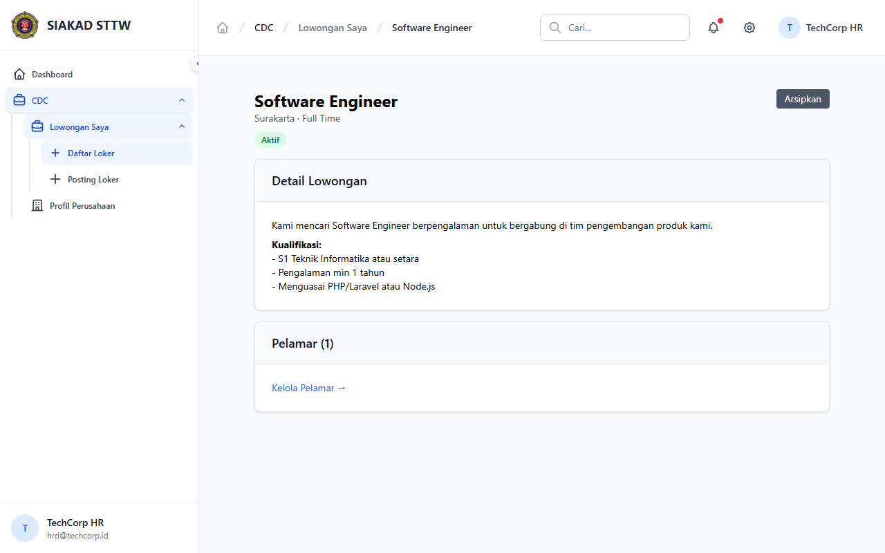
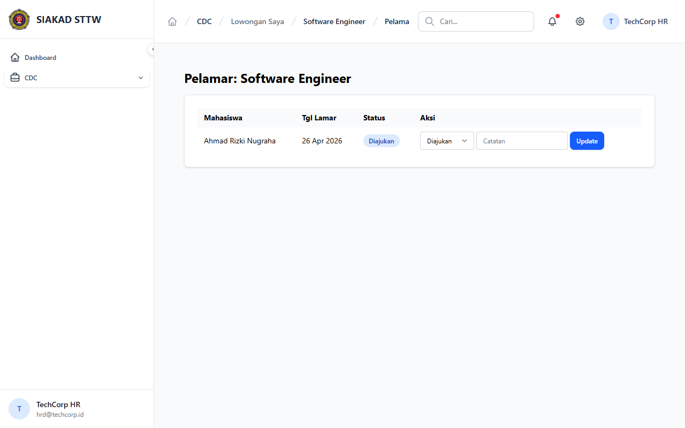

# Workflow Report: CDC Perusahaan Portal

**Scenario:** perusahaan-portal  
**Date:** 2026-04-27  
**Role:** Perusahaan (hrd@techcorp.id)  
**URL Base:** http://127.0.0.1:8000

## Steps & Screenshots

### 1. My Loker List

Perusahaan views their own job postings at `/cdc/portal/perusahaan/loker`.

### 2. Create Loker

Perusahaan creates a new job posting at `/cdc/portal/perusahaan/loker/create`.

### 3. Loker Detail

Perusahaan views full detail of one loker at `/cdc/portal/perusahaan/loker/{id}`.

### 4. Applicant List

Perusahaan reviews applicants for a loker at `/cdc/portal/perusahaan/loker/{id}/lamaran`.

## Result
✅ Perusahaan portal fully functional: post loker, manage, view applicants. Auth guard + perusahaan middleware enforced.
