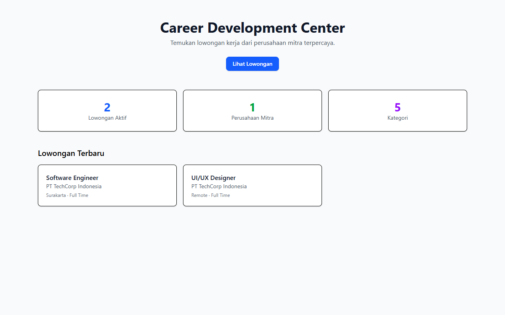
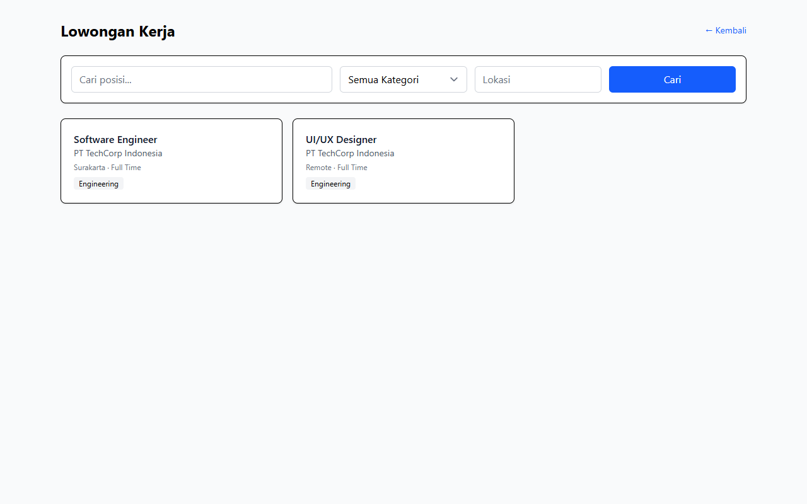
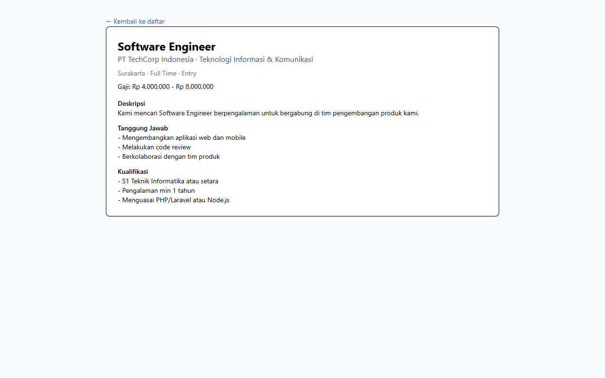

# Workflow Report: CDC Public Landing

**Scenario:** public-landing  
**Date:** 2026-04-27  
**Role:** Public (unauthenticated)  
**URL Base:** http://127.0.0.1:8000

## Steps & Screenshots

### 1. Landing Page

Public CDC landing page at `/cdc` showing featured loker and call-to-action.

### 2. Public Loker List

All active job postings browseable at `/cdc/loker` without login.

### 3. Loker Detail

Full loker detail at `/cdc/loker/{slug}` with company info and apply button.

## Result
✅ Public CDC pages are accessible without authentication and display active loker correctly.
