# Dashboard Overhaul — Comparison Report

> **Branch:** `dev/dashboard-fix`
> **Date:** 2026-03-27
> **Status:** ✅ Complete — All 13 roles verified

## Overview

Laporan perbandingan antara **Unified Dashboard** (`/dashboard`) berbasis permission dengan **Reference Dashboard** (`/ref-dashboard/{role}`) berbasis controller per-role. Tujuan: memastikan unified dashboard menampilkan data yang sama/lebih baik dari reference.

### Key Improvements
- ✅ Unified dashboard menggunakan **data real dari DB** (bukan hardcoded)
- ✅ Responsive grid system: `grid-cols-1 md:grid-cols-2 lg:grid-cols-3`
- ✅ Component-based architecture dengan permission per-widget
- ✅ HRM integration di unified dashboard

---

## 1. Mahasiswa

### Unified Dashboard
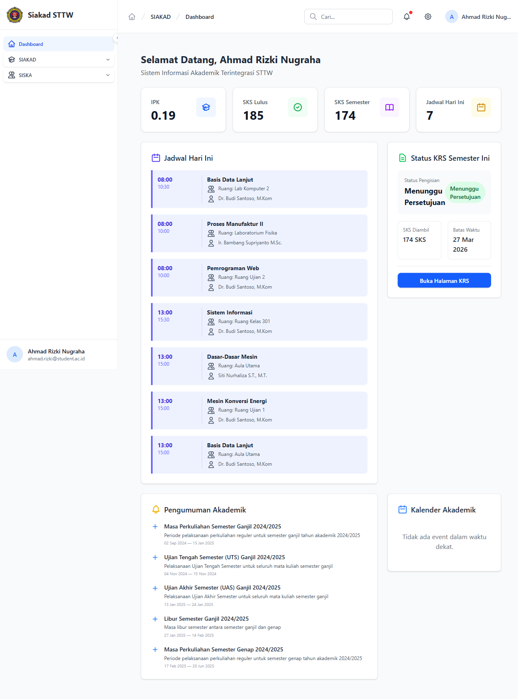

### Reference Dashboard
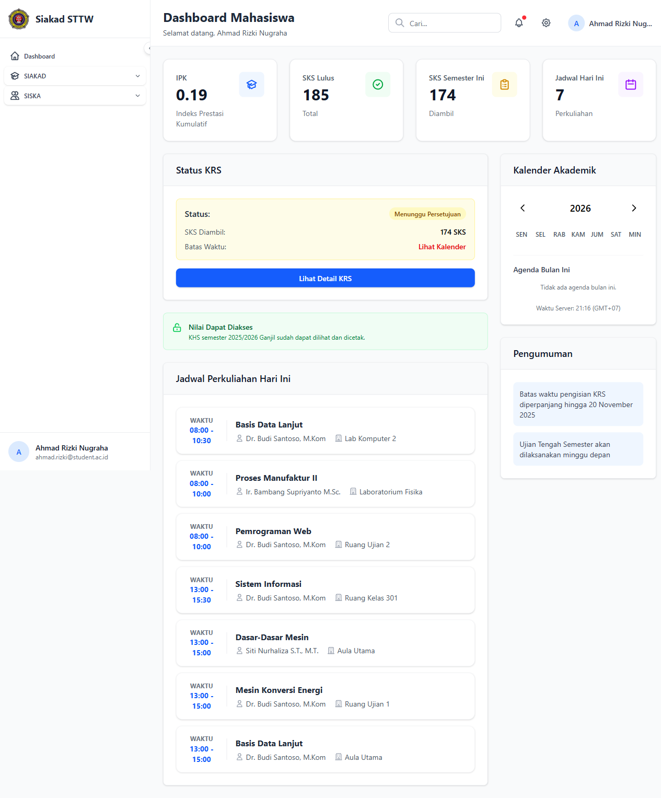

### Mobile Responsive
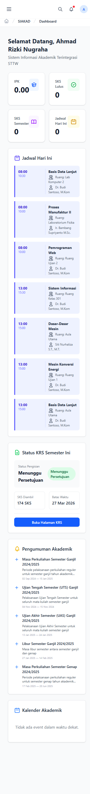

### Data Comparison

| Metric | Unified | Reference | Match |
|--------|---------|-----------|-------|
| IPK | 0.19 | 0.19 | ✅ |
| SKS Lulus | 185 | 185 | ✅ |
| SKS Semester | 174 | 174 | ✅ |
| Jadwal Hari Ini | 7 | 7 | ✅ |
| Status KRS | ✅ | ✅ | ✅ |
| Pengumuman | Real DB | Real DB | ✅ |
| Kalender | ✅ | ✅ | ✅ |

**Status:** ✅ Match — semua data konsisten, responsive OK

---

## 2. Dosen

### Unified Dashboard
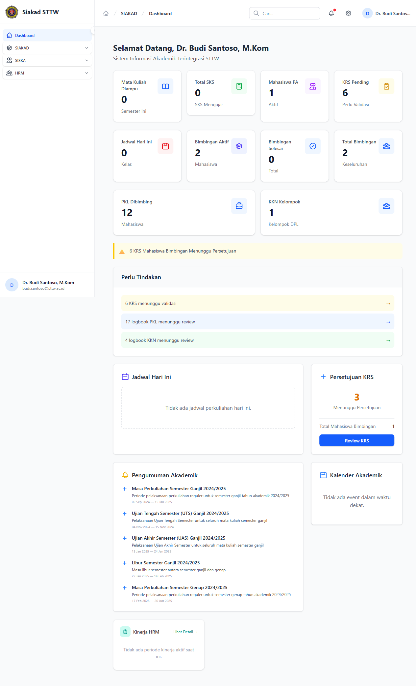

### Reference Dashboard
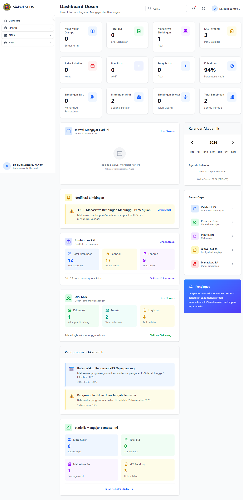

### Data Comparison

| Metric | Unified | Reference | Match |
|--------|---------|-----------|-------|
| MK Diampu | 0 | 0 | ✅ |
| Total SKS | 0 | 0 | ✅ |
| Mahasiswa PA | 1 | 1 | ✅ |
| KRS Pending | 3 | 3 | ✅ (fixed) |
| Bimbingan Aktif | 2 | 2 | ✅ |
| PKL Dibimbing | 12 | 12 | ✅ |
| KKN Kelompok | 1 | 1 | ✅ |
| Persetujuan KRS | 3 | N/A | ✅ (new component) |
| Kinerja HRM | ✅ | N/A | ✅ (enhancement) |

**Bugs Fixed:**
- `Bimbingan` model not imported in DashboardController
- `PklLogbook::pklRegistration()` → `registration()` relationship name
- `KknRegistration::kknGroup()` → `group()` relationship name
- `ApprovalKrs` used wrong field `dosen_wali_id` → `dosen_pa_id`
- `ApprovalKrs` used wrong field `status_aktivitas` → `status_mahasiswa`
- `ApprovalKrs` route `dosen.validasi-krs.index` → `siakad.dosen.validasi-krs.index`
- `StatsDosen` KRS count missing `status_mahasiswa = 'Aktif'` filter

**Status:** ✅ Match — data konsisten, reference has more detail sections (PKL/KKN cards, Akses Cepat) tapi unified punya semua essential data + HRM

---

## 3. Admin

### Unified Dashboard
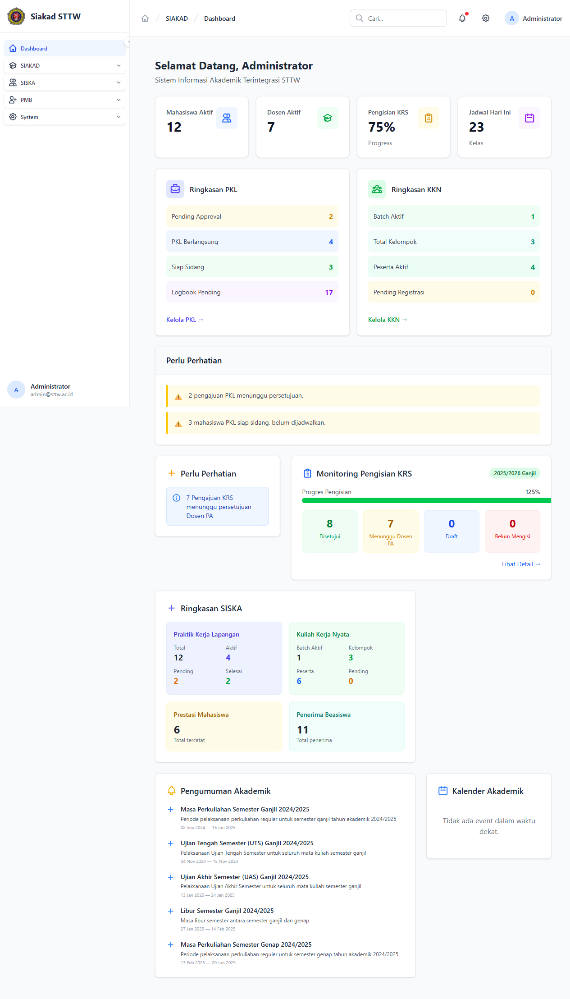

### Reference Dashboard
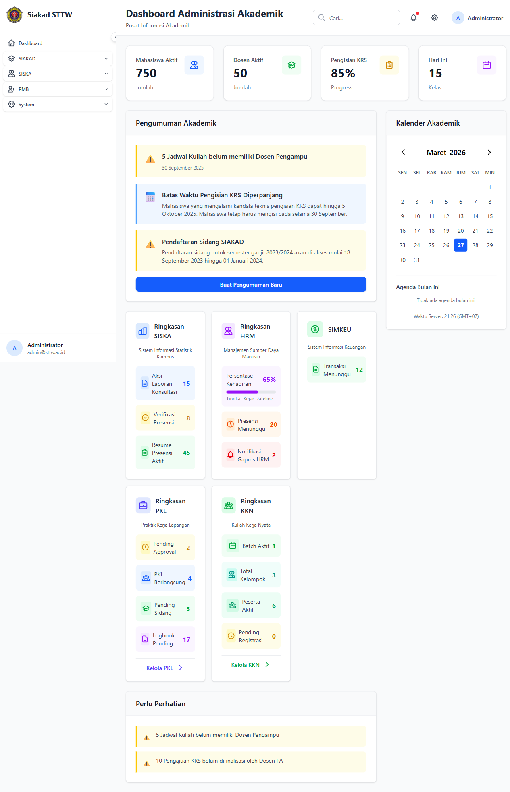

### Data Comparison

| Metric | Unified (Real DB) | Reference (Hardcoded) | Notes |
|--------|-------------------|----------------------|-------|
| Mahasiswa Aktif | **12** | 750 | Reference hardcoded |
| Dosen Aktif | **7** | 50 | Reference hardcoded |
| Pengisian KRS | **75%** | 85% | Reference hardcoded |
| Jadwal Hari Ini | **23** | 15 | Reference hardcoded |
| PKL Stats | Real | Real | ✅ Both real |
| KKN Stats | Real | Real | ✅ Both real |
| Monitoring KRS | 8/7/0/0 | N/A | ✅ New component |
| SISKA Overview | Real | Hardcoded | ✅ Unified better |
| Alert Akademik | Real | Hardcoded | ✅ Unified better |

**Key Insight:** Reference admin dashboard banyak data HARDCODED (750 mahasiswa, 50 dosen). Unified menggunakan data real dari DB — **lebih akurat**.

**Status:** ✅ Unified lebih baik — real data vs hardcoded

---

## 4. Akademik

### Unified Dashboard
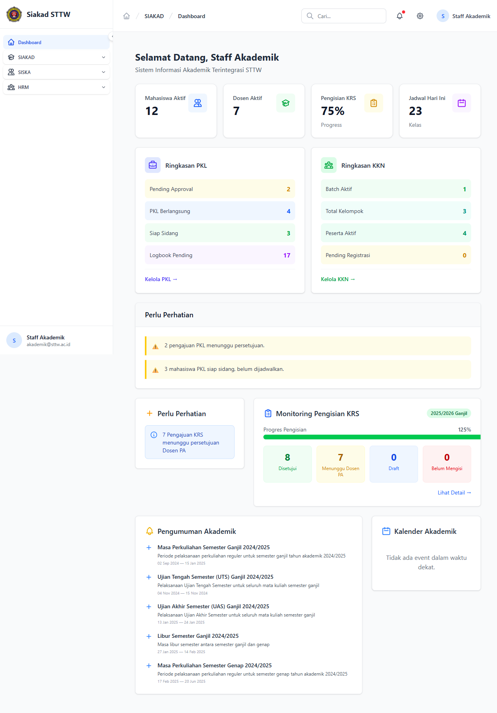

### Reference Dashboard
⚠️ Error: `Undefined variable $ringkasan_hrm` — reference view uses hardcoded variables not passed by controller.

### Data Comparison
Unified dashboard menampilkan:
- Stats Institusi: Mahasiswa 12, Dosen 7, KRS 75%, Jadwal 23
- PKL/KKN ringkasan (real data)
- Alert Akademik: 7 KRS pending
- Monitoring KRS: 8/7/0/0
- Pengumuman & Kalender

**Status:** ✅ Unified works, reference broken (hardcoded vars)

---

## 5. Ketua

### Unified Dashboard
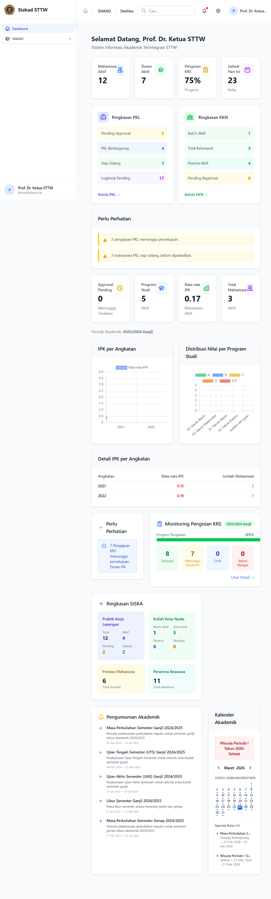

### Reference Dashboard
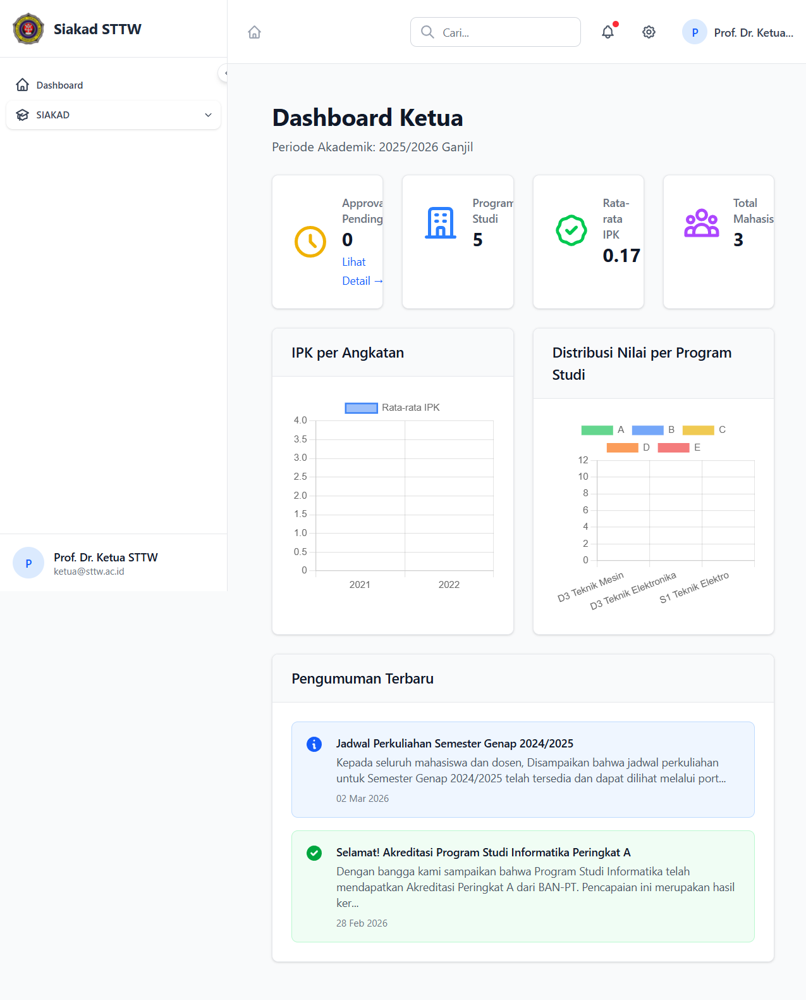

### Data Comparison

| Metric | Unified | Reference | Match |
|--------|---------|-----------|-------|
| KRS Menunggu Approval | 0 | 0 | ✅ |
| Jumlah Prodi | 5 | 5 | ✅ |
| Rata-rata IPK | 0.17 | 0.17 | ✅ |
| Total Mahasiswa | 3 | 3 | ✅ |
| Stats Institusi | Real DB | N/A | ✅ |
| Pengumuman | Real DB | Real DB | ✅ |
| Kalender | ✅ | N/A | ✅ |

**Bugs Fixed:**
- View name `siakad.ketua.dashboard` → `ketua.dashboard`
- `DB::table('periode_akademik')` → `PeriodeAkademik::where()` (model has `nama` accessor)

**Status:** ✅ Match — unified has all reference data + more (stats-institusi, kalender, pengumuman)

---

## 6. Waket1

### Unified Dashboard
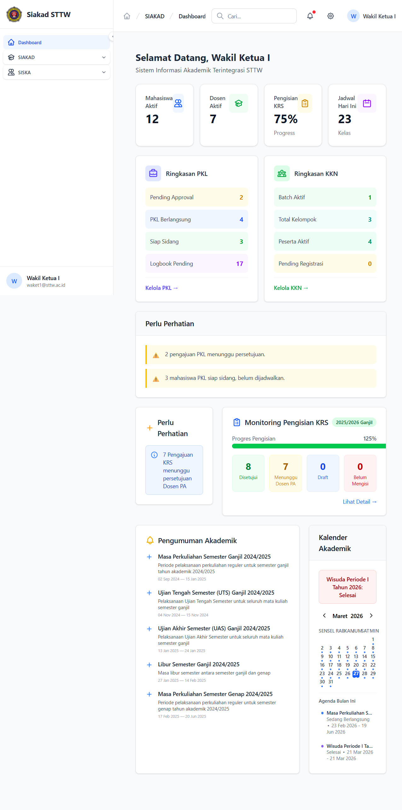

### Reference Dashboard
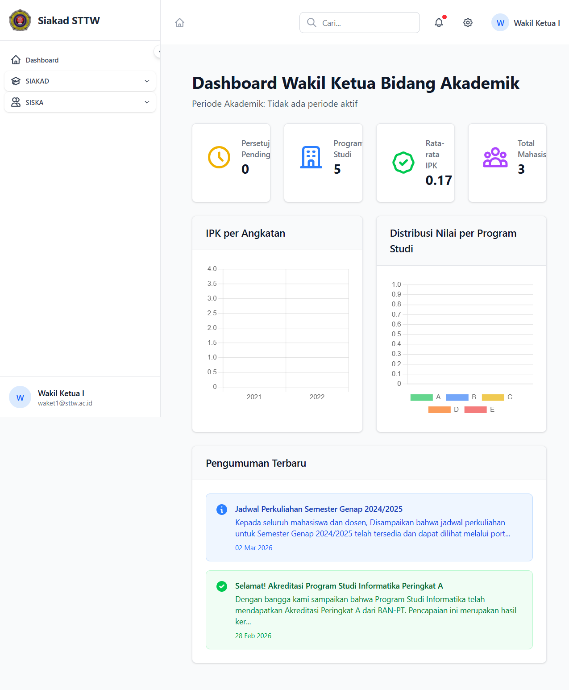

### Data Comparison

| Metric | Unified | Reference | Match |
|--------|---------|-----------|-------|
| Stats Institusi | Mhs 12, Dosen 7, KRS 75% | N/A | ✅ |
| Alert Akademik | ✅ | N/A | ✅ |
| Monitoring KRS | ✅ | ✅ (partial) | ✅ |
| Pengumuman | Real DB | Real DB | ✅ |
| Kalender | ✅ | N/A | ✅ |

**Bugs Fixed:**
- Same PeriodeAkademik `DB::table()` → Eloquent fix

**Status:** ✅ Unified more comprehensive — includes stats, alert, kalender not in reference

---

## 7. Waket2

### Unified Dashboard
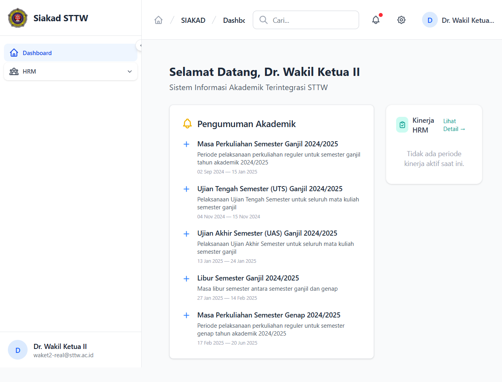

### Reference Dashboard
⚠️ Error: `View [siska.dashboard] not found` — view file never created.

### Widgets Displayed
- Pengumuman Akademik (real DB)
- Kinerja HRM (no active period currently)

**Status:** ✅ Unified works, reference view missing (needs creation)

---

## 8. Waket3 (Kemahasiswaan)

### Unified Dashboard
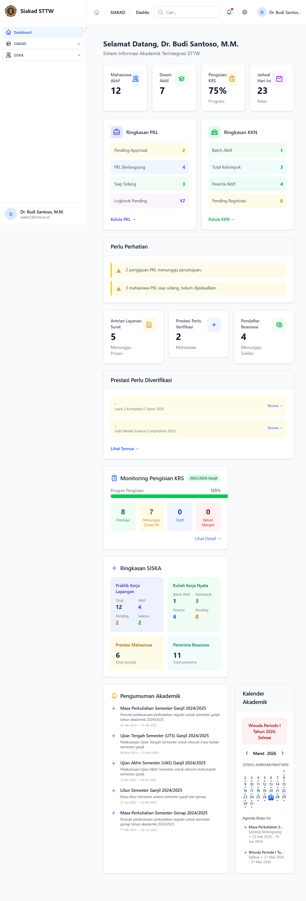

### Reference Dashboard
No reference controller exists for waket3.

### Widgets Displayed
- Stats Institusi (Mhs 12, Dosen 7, KRS 75%, Jadwal 23)
- PKL/KKN Ringkasan + Perlu Perhatian
- Stats Kemahasiswaan (Surat 5, Prestasi 2, Beasiswa 4)
- Monitoring KRS
- SISKA Overview (PKL 12, KKN, Prestasi 6, Beasiswa 11)
- Pengumuman + Kalender

**Permission Fix:** Replaced `dashboard.siakad.mahasiswa-stats` (personal—showed zeros) with `dashboard.siakad.institusi-stats` + `dashboard.siska.kemahasiswaan-stats` + `dashboard.siakad.kalender-akademik`

**Status:** ✅ Comprehensive dashboard for kemahasiswaan oversight

---

## 9. Admin Kemahasiswaan

### Unified Dashboard
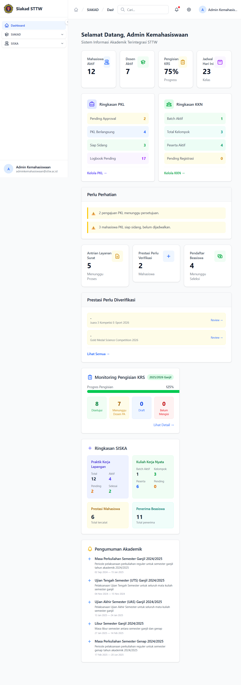

### Reference Dashboard
⚠️ Error: `View [siska.kemahasiswaan.dashboard.index] not found`

### Widgets Displayed
- Stats Institusi (Mhs 12, Dosen 7, KRS 75%, Jadwal 23)
- PKL/KKN Ringkasan + Perlu Perhatian
- Stats Kemahasiswaan (Antrian Surat 5, Prestasi Verifikasi 2, Beasiswa 4)
- Prestasi Perlu Diverifikasi (2 items with review links)
- Monitoring KRS
- SISKA Overview
- Pengumuman

**Status:** ✅ Very rich dashboard, reference view missing

---

## 10. Kaprodi

### Unified Dashboard
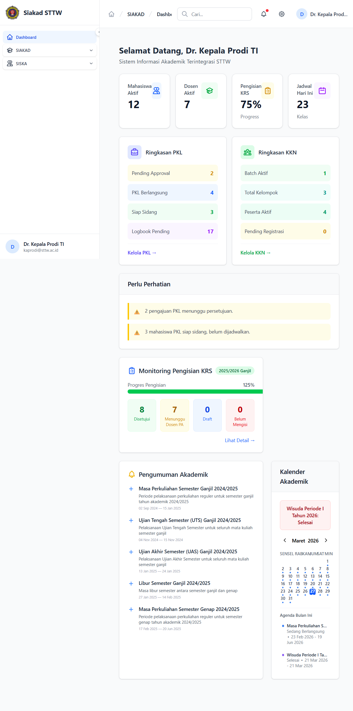

### Reference Dashboard
No reference controller exists for kaprodi.

### Widgets Displayed
- Stats Institusi (Mhs 12, Dosen 7, KRS 75%, Jadwal 23)
- PKL/KKN Ringkasan + Perlu Perhatian
- Monitoring KRS
- Pengumuman + Kalender Akademik (with events)

**Status:** ✅ Complete

---

## 11. Tendik

### Unified Dashboard
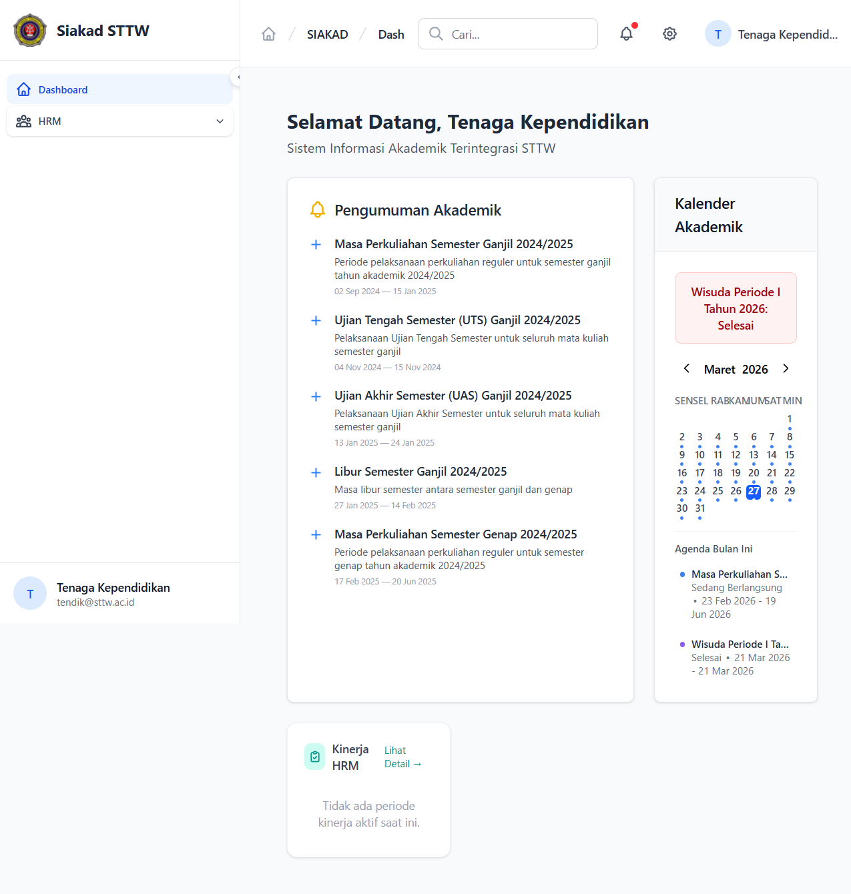

### Reference Dashboard
Reference at `/hrm/tendik` (HRM module page, not dashboard).

### Widgets Displayed
- Pengumuman Akademik
- Kalender Akademik (with events)
- Kinerja HRM (no active period)

**Status:** ✅ Appropriate for tendik role

---

## 12. Asesor

### Unified Dashboard
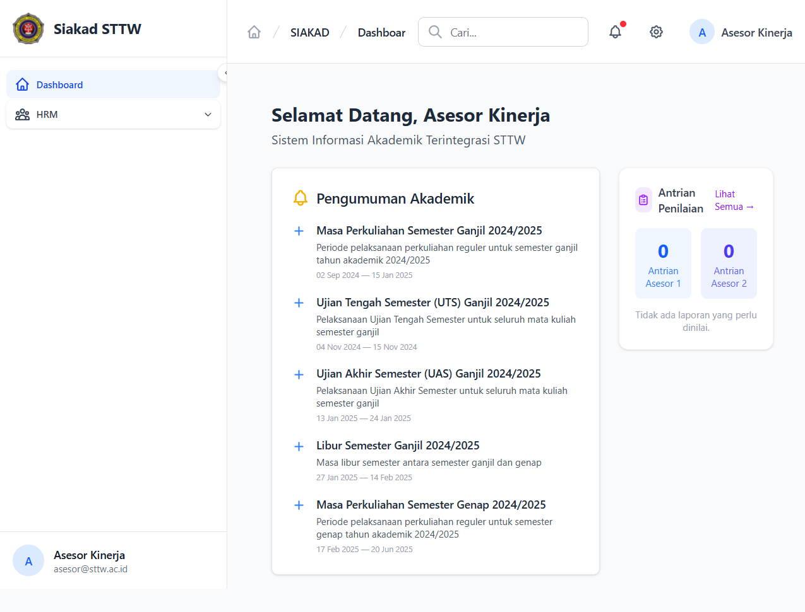

### Reference Dashboard
Reference at `/hrm/asesor` (HRM asesor page).

### Widgets Displayed
- Pengumuman Akademik
- Antrian Penilaian (Asesor 1: 0, Asesor 2: 0)

**Bug Fixed:** Route `hrm.asesor.antrian` → `hrm.asesor.dashboard` (route didn't exist)

**Status:** ✅ Fixed and working

---

## 13. Developer

### Unified Dashboard
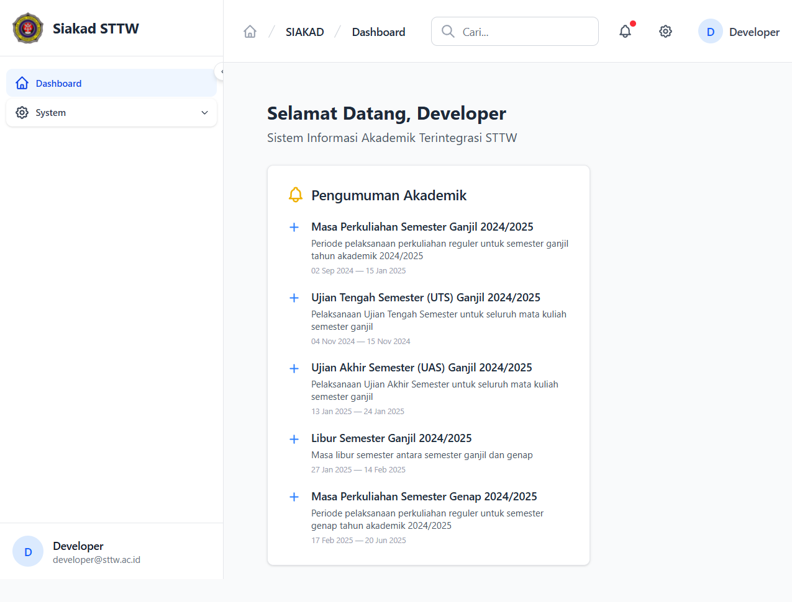

### Reference Dashboard
No reference controller — developer accesses System module only.

### Widgets Displayed
- Pengumuman Akademik

**Enhancement:** Added `dashboard.view` + `dashboard.siakad.pengumuman` permissions (was empty before)

**Status:** ✅ Minimal but appropriate

---

## Bugs Fixed (Summary)

| Bug | File | Fix |
|-----|------|-----|
| `$data` reserved variable in Blade Components | StatsMahasiswa.php | Renamed to `$stats` |
| Missing `Bimbingan` import | DashboardController.php | Added `use App\Models\Bimbingan` |
| Wrong relationship `pklRegistration()` | DashboardController.php | Changed to `registration()` |
| Wrong relationship `kknGroup()` | DashboardController.php | Changed to `group()` |
| Wrong field `dosen_wali_id` | ApprovalKrs.php | Changed to `dosen_pa_id` |
| Wrong field `status_aktivitas` | ApprovalKrs.php | Changed to `status_mahasiswa` |
| Wrong route name | approval-krs.blade.php | `siakad.dosen.validasi-krs.index` |
| Missing active student filter | StatsDosen.php | Added `status_mahasiswa = 'Aktif'` |
| View name mismatch | Ketua\DashboardController.php | `siakad.ketua.dashboard` → `ketua.dashboard` |
| DB::table() missing model accessor | Ketua & Waket1 DashboardController | `DB::table()` → `PeriodeAkademik::where()` |
| Route not found | hrm-asesor-antrian.blade.php | `hrm.asesor.antrian` → `hrm.asesor.dashboard` |
| KRS progress 125% | MonitoringKrs.php | Use distinct student count instead of summing per-status |
| Wrong permission for waket3 | RolePermissionSeeder.php | `mahasiswa-stats` → `institusi-stats` + `kemahasiswaan-stats` |
| Developer empty dashboard | RolePermissionSeeder.php | Added `dashboard.view` + `dashboard.siakad.pengumuman` |

## New Components Created

| Component | Type | Description |
|-----------|------|-------------|
| AlertAkademik | narrow | Jadwal tanpa dosen, KRS pending, mahasiswa belum isi KRS |
| ApprovalKrs | narrow | KRS approval queue untuk dosen PA |
| SiskaOverview | wide | PKL/KKN/Prestasi/Beasiswa summary |

## Layout System

```
Responsive Grid: grid-cols-1 md:grid-cols-2 lg:grid-cols-3 gap-6

full-width (col-span-full):     stats-institusi, stats-dosen, stats-mahasiswa, stats-ketua
wide (md:col-span-2):           jadwal-harian, monitoring-krs, pengumuman, siska-overview
narrow (col-span-1):            status-krs, kalender, alert-akademik, approval-krs, hrm-*
```
