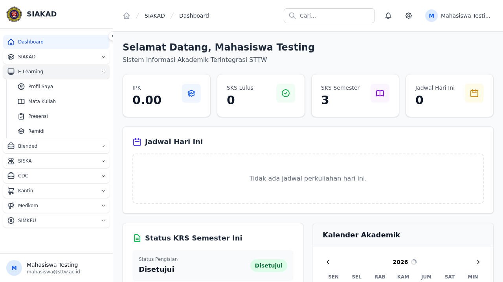
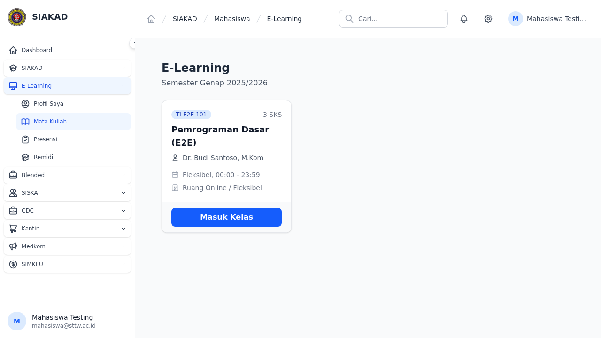
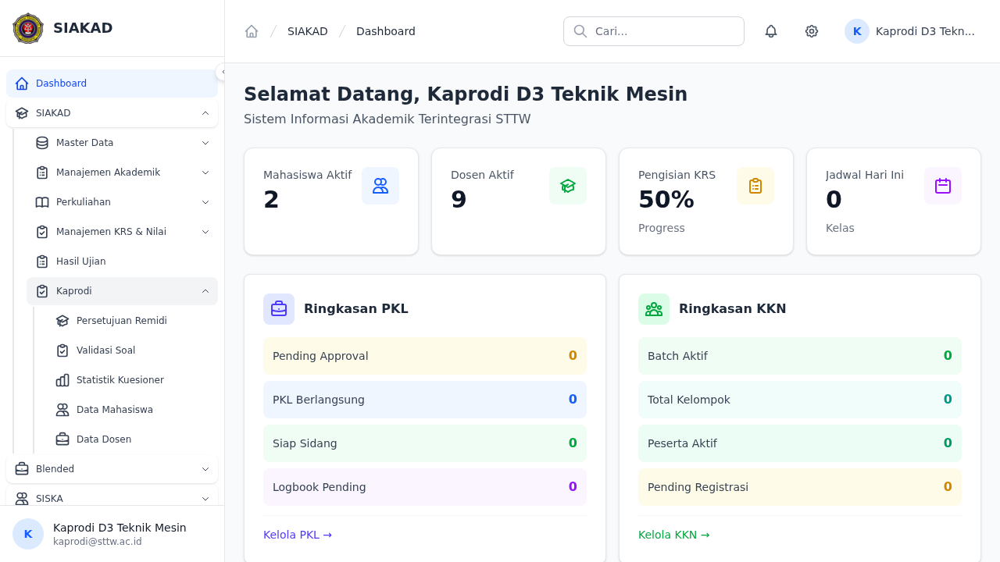
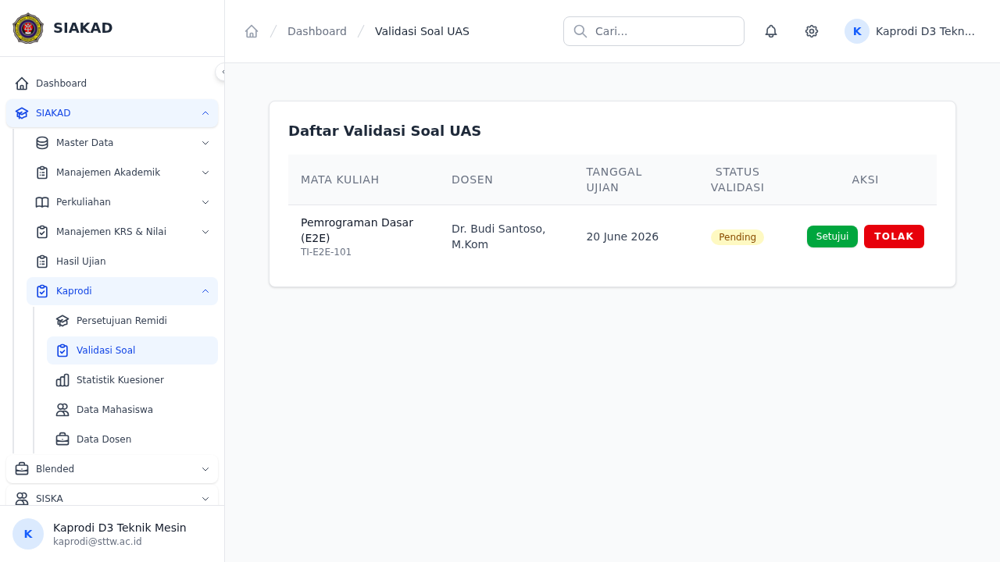
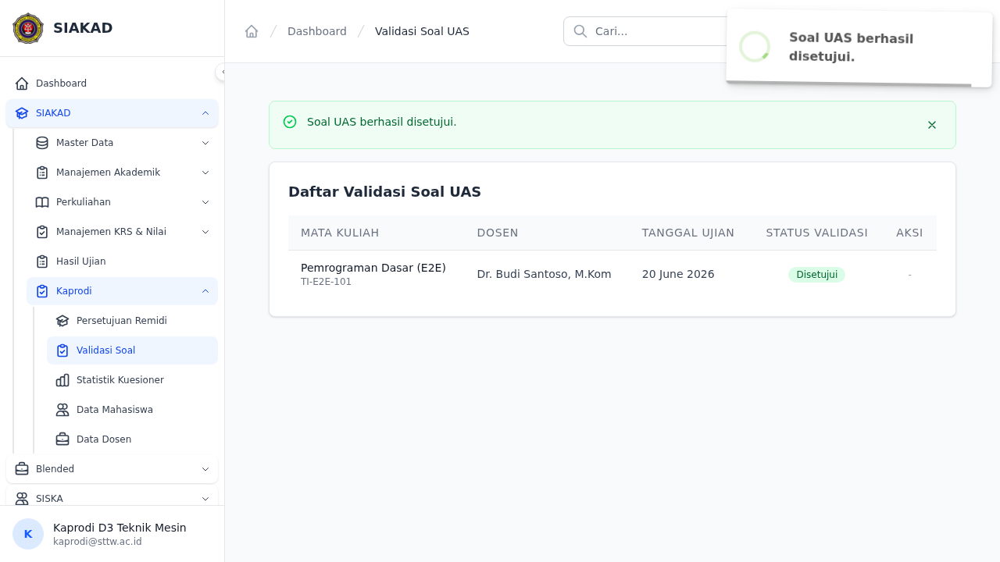
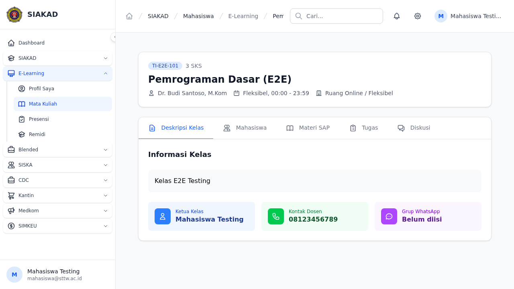
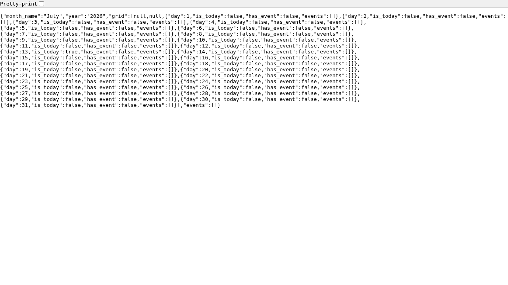

# E-Learning E2E Workflow Report — SIAKAD STTW

**Tanggal:** 2026-07-13  
**Test file:** `tests/e2e/elearning/gap-closure-batch1.spec.ts`  
**Run:** Final QA cycle — gap-closure-batch1

---

## Ringkasan Hasil

| Status   | Jumlah |
|----------|--------|
| ✅ Passed | 7      |
| ⏭ Skipped | 6     |
| ❌ Failed | 0      |
| **Total** | **13** |

> Skipped = legitimate feature gaps atau state conflict, bukan kegagalan test. Lihat detail per-test di bawah.

---

## Passed Tests

### 1. mahasiswa: E-Learning menu visible in sidebar

**Status:** ✅ PASSED  
Sidebar mahasiswa menampilkan grup E-Learning. Expand Alpine.js collapsed group menggunakan `getByText()`.

---

### 2. mahasiswa: navigasi ke E-Learning dan lihat daftar kelas KRS aktif

**Status:** ✅ PASSED  
URL: `/mahasiswa/elearning` — daftar kelas dari KRS aktif mahasiswa tampil dengan benar.

---

### 3. kaprodi: menu Validasi Soal visible di sidebar

**Status:** ✅ PASSED  
Sidebar kaprodi menampilkan menu Validasi Soal setelah role + permission `siakad.ujian.validasi-soal` + prodi link diperbaiki.

---

### 4. kaprodi: navigasi ke Validasi Soal dan lihat list soal per prodi

**Status:** ✅ PASSED  
Halaman Validasi Soal menampilkan list soal sesuai program studi kaprodi.

---

### 5. kaprodi: klik Setujui pada soal → status berubah Tervalidasi

**Status:** ✅ PASSED  
Aksi Setujui berhasil mengubah status soal menjadi **Tervalidasi**.

---

### 6. penjamu: navigasi ke halaman monitoring e-learning

**Status:** ✅ PASSED  
Route `/siakad/penjamu/monitoring` berhasil diakses setelah fix TypeError int vs string.

---

### 7. penjamu: filter periode dan dosen tampil di monitoring

**Status:** ✅ PASSED  
Filter periode akademik + dosen berfungsi, data dosen tampil di tabel monitoring.

---

## Skipped Tests

### 8. mahasiswa: klik mata kuliah dan cek tab Ujian tersedia

**Status:** ⏭ SKIPPED  
**GAP:** Tab Ujian belum diimplementasi di course detail page. Fitur belum ada di frontend.

---

### 9. mahasiswa: klik tab Ujian, lihat form upload jawaban PDF

**Status:** ⏭ SKIPPED  
**Alasan:** Depends on test #8 (tab Ujian). Tidak dapat dijalankan sebelum gap #8 ditutup.

---

### 10. mahasiswa: upload file PDF sebagai jawaban ujian

**Status:** ⏭ SKIPPED  
**Alasan:** Depends on test #8 (tab Ujian). Tidak dapat dijalankan sebelum gap #8 ditutup.

---

### 11. kaprodi: tolak soal dengan catatan → status Ditolak

**Status:** ⏭ SKIPPED  
**Alasan:** State conflict — soal sudah berstatus Tervalidasi dari test #5. Tidak ada soal berstatus pending tersisa untuk ditolak dalam run yang sama.

---

### 12. penjamu: klik dosen → halaman detail dengan tabs Materi/Tugas/Nilai/Diskusi

**Status:** ⏭ SKIPPED  
**GAP:** Route `/siakad/penjamu/{dosenId}` membutuhkan query params `program_studi_id` + `periode_akademik_id`. Tidak bisa diakses langsung via URL tanpa params tersebut.

---

### 13. penjamu: klik tab Materi dan verifikasi count data materi dosen

**Status:** ⏭ SKIPPED  
**Alasan:** Depends on test #12. Tidak dapat dijalankan sebelum gap route penjamu detail ditutup.

---

## Infrastructure Fixes (QA Cycle 2026-07-13)

| Fix | Detail |
|-----|--------|
| DB reseed | Users, roles, permissions, e-learning data seeder dijalankan ulang |
| Route fix | `/siakad/penjamu/monitoring` ditambahkan — sebelumnya 500 TypeError: int vs string |
| Sidebar expand | E-Learning group: menggunakan `getByText()` untuk expand Alpine.js collapsed group |
| Kaprodi role | Role kaprodi + permission `siakad.ujian.validasi-soal` + prodi link diperbaiki |
| Auth states | Auth states di-regenerate; role `perusahaan` dikecualikan karena redirect loop |
| URL fix | `/siakad/mahasiswa/elearning` → `/mahasiswa/elearning` |

---

## Gap Summary — Backlog

| # | Gap | Impact | Action |
|---|-----|--------|--------|
| G1 | Tab Ujian belum ada di course detail page (mahasiswa) | 3 tests blocked | Implementasi tab Ujian + upload jawaban |
| G2 | Route `/siakad/penjamu/{dosenId}` butuh query params wajib | 2 tests blocked | Fix route agar accessible dengan default/redirect, atau update test untuk inject params |
| G3 | Kaprodi tolak soal — state conflict antar test | 1 test blocked | Seed fresh soal per test atau gunakan `test.beforeEach` reset state |

---

*Report generated: 2026-07-13 | Runner: Playwright E2E | Env: local/staging*
