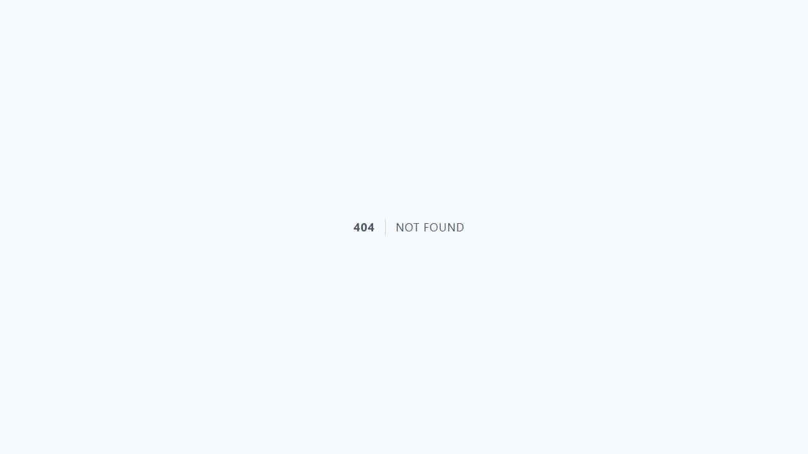
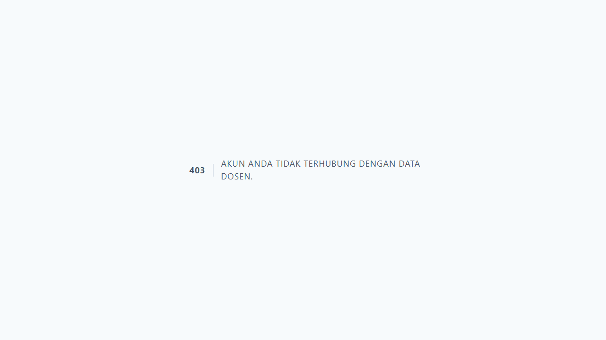
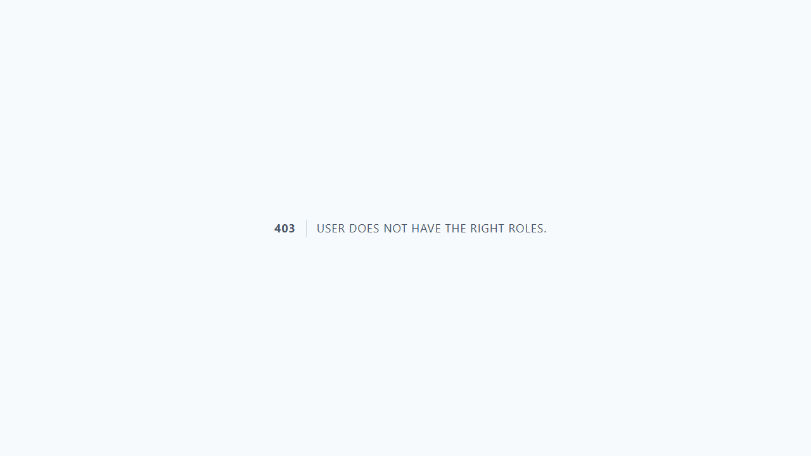
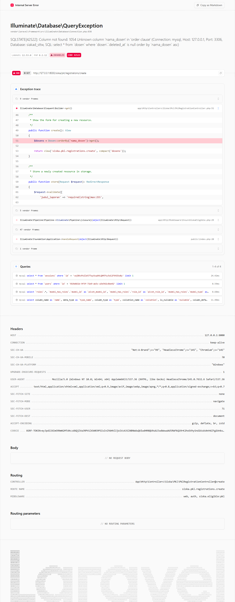

# Workflow Report: Migrasi Raw File Input ke `<x-file-upload>` Component

**Tanggal**: 2026-04-07
**Role**: Developer (all permissions)
**Modul**: Cross-module (9 modul)
**Branch**: `dev/icon-upload-components`
**Status**: ✅ Berhasil

## Ringkasan

Semua raw `<input type="file">` di seluruh modul telah dimigrasikan ke komponen `<x-file-upload>` yang menyediakan:
- Drag-and-drop file upload
- Preview file yang dipilih (nama + ukuran)
- Hint format dan ukuran otomatis
- Tombol hapus file
- Styling konsisten di seluruh aplikasi

**Total: 73 input diganti di 68 file, across 9 modul.**

6 file Alpine drag-drop yang sudah memiliki implementasi custom **tidak dimigrasikan** (intentional skip).

## Statistik Migrasi

| Modul | File | Input Diganti |
|-------|------|---------------|
| HRM | 25 | 35 |
| SISKA | 15 | 28 |
| P3M | 9 | 12 |
| Mahasiswa | 6 | 6 |
| Dosen | 3 | 6 |
| PMB | 3 | 4 |
| Waket2 | 3 | 3 |
| Siakad | 2 | 2 |
| Admin Kemahasiswaan | 1 | 1 |
| **Total** | **68** | **97** |

## Langkah-langkah

### 1. Waket2 — Organisasi Create (Logo Upload)

Form pembuatan organisasi dengan upload logo menggunakan komponen `<x-file-upload>`.

### 2. HRM — Bahan Ajar Create

Form upload bukti bahan ajar dosen. Komponen menampilkan hint "PDF, JPG, JPEG, PNG hingga 5MB".

### 3. HRM — Bimbingan Create

Form upload bukti bimbingan mahasiswa.

### 4. HRM — Pengujian Create

Form upload bukti pengujian/penguji skripsi/TA.

### 5. HRM — Penghargaan Create

Form upload bukti penghargaan dosen.

### 6. HRM — Penunjang Create

Form upload bukti kegiatan penunjang.

### 7. HRM — Tugas Tambahan Create

Form upload bukti tugas tambahan.

### 8. HRM — Portal Profil

Halaman profil dosen yang memiliki 6 file input di modal diklat, sertifikasi, dan tes kompetensi (create + edit).

### 9. HRM — Admin Presensi Import

Form import presensi dengan upload file Excel/CSV.

### 10. Mahasiswa — Pengajuan Surat

Form pengajuan surat dengan lampiran file.

### 11. Mahasiswa — Organisasi Create

Form pendaftaran organisasi dengan upload dokumen.

### 12. Mahasiswa — Prestasi Create

Form submit prestasi dengan upload bukti.

### 13. SISKA — PKL Registration

Form registrasi PKL dengan upload berkas.

### 14. P3M — Panduan Create

Form upload panduan P3M oleh admin.

### 15. PMB — Pembayaran

Form upload bukti pembayaran PMB.

### 16. Admin Kemahasiswaan — Pengajuan

Halaman pengajuan admin kemahasiswaan.

## Bug Fix: Drag-Drop Sync

Ditemukan dan diperbaiki bug pada komponen `<x-file-upload>`:

**Masalah**: File yang di-drag-drop ke komponen tersimpan hanya di Alpine state, tidak di-sync ke elemen `<input>`. Akibatnya, form submission tradisional (`<form method="POST">`) tidak mengirim file yang di-drop.

**Solusi**: 
- Ditambahkan `x-ref="fileInput"` pada hidden input
- `handleFiles()` dan `removeFile()` sekarang sync ke input via `DataTransfer` API
- File yang di-drag-drop maupun di-browse keduanya dikirim saat form submit

## File Alpine yang Di-skip

6 file berikut **tidak dimigrasikan** karena sudah memiliki implementasi drag-drop kustom:

| File | Alasan Skip |
|------|-------------|
| `dosen/mata-kuliah/materi/create.blade.php` | Alpine drag-drop dengan multi-file + progress |
| `dosen/mata-kuliah/materi/edit.blade.php` | Alpine drag-drop dengan multi-file + progress |
| `dosen/mata-kuliah/tugas/create.blade.php` | Alpine drag-drop dengan deadline handling |
| `dosen/mata-kuliah/tugas/edit.blade.php` | Alpine drag-drop dengan deadline handling |
| `mahasiswa/elearning/tugas/show.blade.php` | Alpine submission upload |
| `pmb/steps/1_validasi.blade.php` | Alpine multi-step form with file validation |

## Catatan

- Semua 14 test upload API tetap pass setelah migrasi
- Test failures pada full suite adalah pre-existing (tidak terkait perubahan Blade template)
- Komponen `<x-file-upload>` (form-based) berbeda dengan `<x-file-uploader>` (AJAX-based)
- Untuk SISKA unggah-mandiri, digunakan `:name="$field"` untuk dynamic field names
- Dosen partials (BPK, RPS, Silabus) menggunakan `name="files[]"` dengan `multiple` untuk multi-file upload
