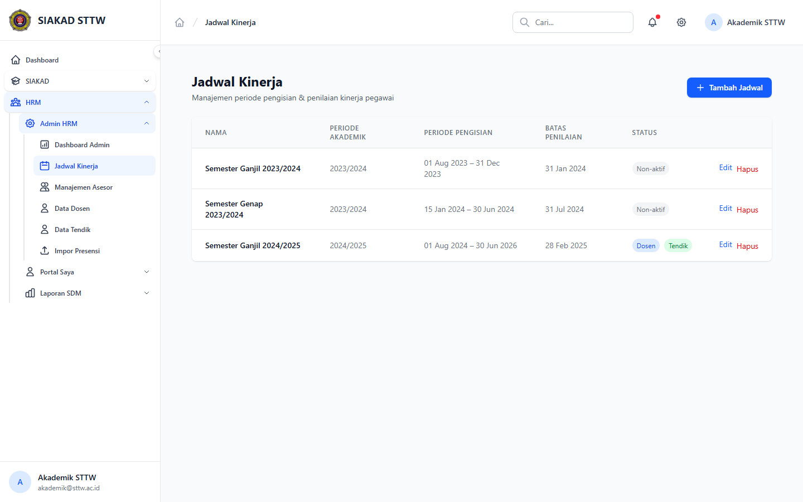
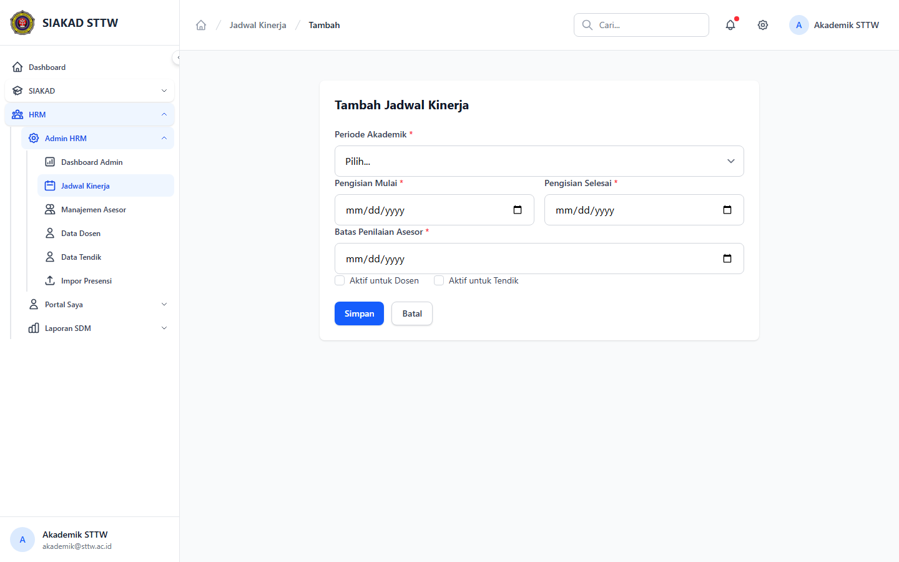

# Workflow Report: Admin Jadwal Kinerja

**Tanggal**: 2026-04-02
**Role**: Akademik (Akademik STTW / akademik@sttw.ac.id)
**Modul**: HRM — Admin Jadwal Kinerja
**Status**: ✅ Berhasil

## Ringkasan

Workflow pengelolaan jadwal kinerja oleh admin akademik, termasuk:

- Melihat daftar jadwal kinerja (semester, tahun, status)
- Membuat jadwal kinerja baru dengan pengaturan periode pengisian

## Langkah-langkah

### 1. Halaman Daftar Jadwal Kinerja

Admin membuka menu Admin HRM > Jadwal Kinerja. Terlihat tabel daftar jadwal kinerja dengan kolom nama, semester, tahun, tanggal pengisian, status aktif, dan aksi.

### 2. Form Tambah Jadwal Kinerja

Admin mengklik tombol tambah. Form berisi field: Nama Periode, Semester, Tahun Akademik, Tanggal Mulai Pengisian, Tanggal Selesai Pengisian, Status Aktif Dosen, dan Status Aktif Tendik.

## Fitur yang Diuji

| Fitur | Status | Keterangan |
| --- | --- | --- |
| Daftar jadwal | ✅ | Tabel semua jadwal kinerja |
| Tambah jadwal | ✅ | Form lengkap pengaturan periode |
| Status aktif | ✅ | Toggle aktif dosen/tendik terpisah |
| Kontrol periode | ✅ | Pengisian mulai/selesai mengontrol akses form |

## Catatan

- Hanya satu jadwal yang boleh aktif dalam satu waktu
- Tanggal pengisian selesai menentukan kapan form input ditutup
- Admin perlu permission hrm.admin.manage dan hrm.jadwal.manage
