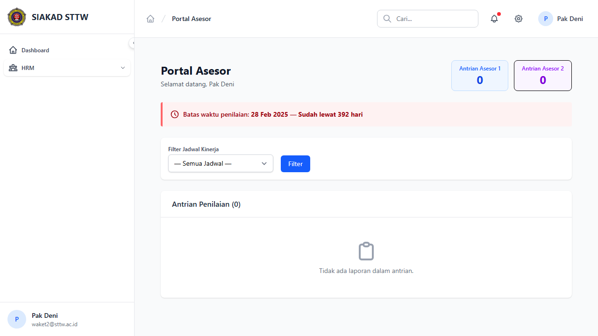

# Workflow Report: Portal Asesor — Penilaian Kinerja

**Tanggal**: 2026-04-01
**Role**: Waket2 (Pak Deni / waket2@sttw.ac.id)
**Modul**: HRM — Portal Asesor
**Status**: ✅ Berhasil

## Ringkasan

Menampilkan portal asesor untuk menilai kinerja dosen dan tendik.
- Dashboard dengan antrian penilaian per tahap asesor
- Filter berdasarkan jadwal kinerja

## Langkah-langkah

### 1. Dashboard Portal Asesor

Asesor membuka Portal Asesor. Terlihat header "Portal Asesor" dengan statistik Antrian Asesor 1 (0) dan Antrian Asesor 2 (0). Alert merah menunjukkan "Batas waktu penilaian: 28 Feb 2025 — Sudah lewat 392 hari". Filter Jadwal Kinerja tersedia. Bagian "Antrian Penilaian (0)" menampilkan pesan "Tidak ada laporan dalam antrian".

## Fitur yang Diuji

| Fitur | Status | Keterangan |
|-------|--------|------------|
| Dashboard asesor | ✅ | Menampilkan antrian penilaian per tahap |
| Statistik antrian | ✅ | Asesor 1 dan Asesor 2 terpisah |
| Alert deadline | ✅ | Peringatan batas waktu penilaian |
| Filter jadwal | ✅ | Dropdown filter berdasarkan jadwal kinerja |
| Antrian penilaian | ✅ | Daftar laporan yang perlu dinilai |

## Catatan

- Asesor harus terdaftar di tabel hrm_asesors untuk mengakses portal
- Penilaian 2 tahap: Asesor 1 (atasan langsung) dan Asesor 2 (pimpinan)
- Saat ini antrian kosong karena belum ada laporan yang disubmit
- Batas waktu sudah lewat — asesor tidak bisa menilai sampai jadwal baru dibuat
