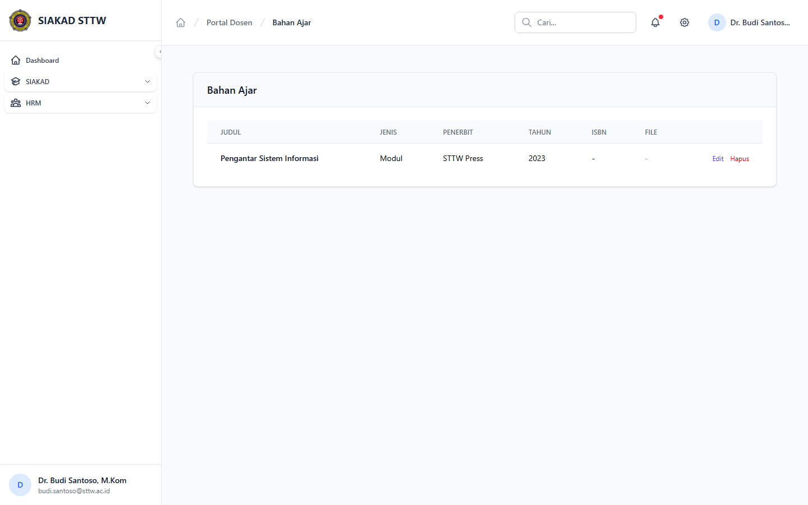
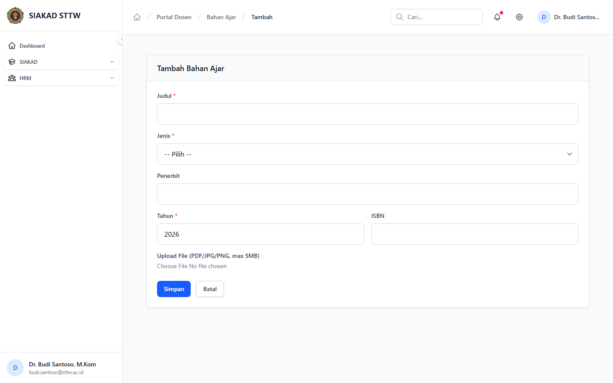

# Workflow Report: Input Kinerja Bahan Ajar Dosen

**Tanggal**: 2026-04-02
**Role**: Dosen (Dr. Budi Santoso, M.Kom / budi.santoso@sttw.ac.id)
**Modul**: HRM — Bahan Ajar
**Status**: ✅ Berhasil

## Ringkasan

Workflow input kinerja bahan ajar oleh dosen, termasuk:

- Melihat daftar bahan ajar yang sudah diinput
- Mengisi form tambah bahan ajar baru
- Skenario periode ditutup: form tidak dapat diakses

## Langkah-langkah

### 1. Halaman Index Bahan Ajar

Dosen membuka halaman Bahan Ajar. Terlihat daftar bahan ajar dalam tabel dengan kolom judul, jenis, mata kuliah, dan tahun.

### 2. Form Tambah Bahan Ajar (Periode Buka)

Dosen mengklik tombol tambah. Form berisi field: Judul, Jenis (Modul/Diktat/Buku Ajar/dll), Mata Kuliah, Tahun, dan Keterangan.

### 3. Form Tambah Bahan Ajar (Periode Tutup)

Ketika periode pengisian ditutup, form menampilkan halaman 403 "Periode pengisian sudah tutup."

## Fitur yang Diuji

| Fitur | Status | Keterangan |
| --- | --- | --- |
| Daftar bahan ajar | ✅ | Tabel data bahan ajar yang sudah diinput |
| Tambah bahan ajar | ✅ | Form input judul, jenis, mata kuliah |
| Periode tutup | ✅ | Form tidak bisa diakses saat periode ditutup |

## Catatan

- Bahan ajar adalah catatan mandiri dosen
- Jenis: Modul, Diktat, Buku Ajar, dll
- Data masuk ke penilaian kinerja dosen
