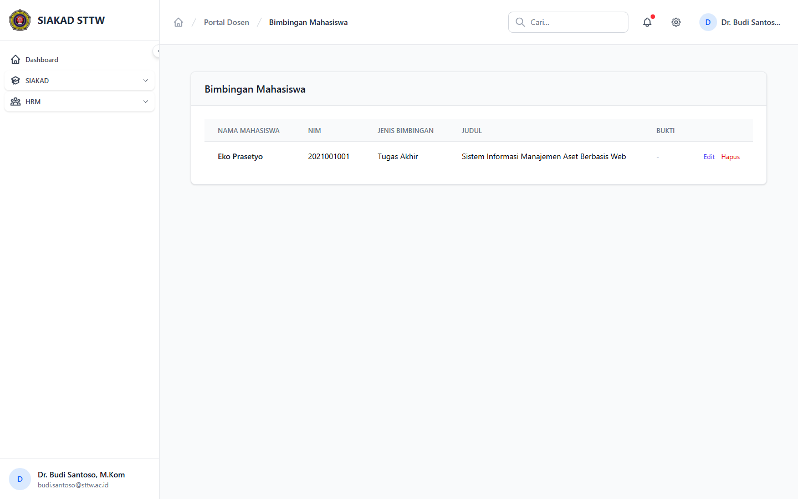
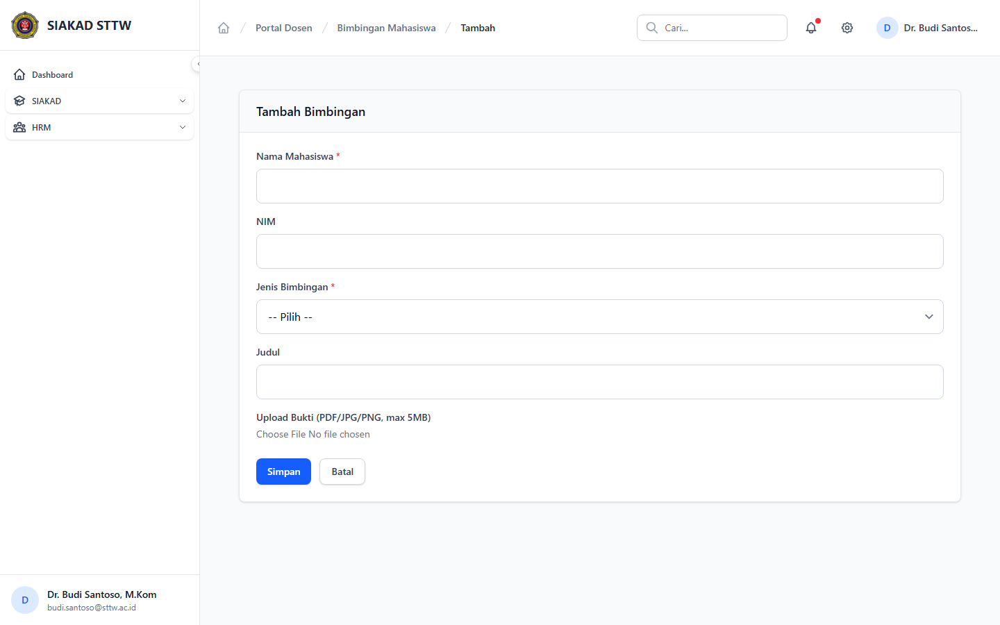

# Workflow Report: Input Kinerja Bimbingan Dosen

**Tanggal**: 2026-04-02
**Role**: Dosen (Dr. Budi Santoso, M.Kom / budi.santoso@sttw.ac.id)
**Modul**: HRM — Bimbingan Mahasiswa
**Status**: ✅ Berhasil

## Ringkasan

Workflow input kinerja bimbingan mahasiswa oleh dosen, termasuk:

- Melihat daftar bimbingan yang sudah diinput
- Mengisi form tambah bimbingan baru (jenis, mahasiswa, topik, tanggal)
- Skenario periode ditutup: form tidak dapat diakses

## Langkah-langkah

### 1. Halaman Index Bimbingan

Dosen membuka halaman Bimbingan. Terlihat daftar bimbingan yang sudah diinput dalam tabel dengan kolom jenis, mahasiswa, topik, tanggal, dan aksi. Tombol "+ Tambah Bimbingan" tersedia di kanan atas.

### 2. Form Tambah Bimbingan (Periode Buka)

Dosen mengklik tombol tambah. Form berisi field: Jenis Bimbingan (PKL/TA/Skripsi/KKN/Lainnya), Nama Mahasiswa, Topik/Judul, Tanggal Bimbingan, dan Keterangan.

### 3. Form Tambah Bimbingan (Periode Tutup)

Ketika periode pengisian sudah ditutup, dosen tidak dapat mengakses form tambah. Sistem menampilkan halaman 403 "Periode pengisian sudah tutup."

## Fitur yang Diuji

| Fitur | Status | Keterangan |
| --- | --- | --- |
| Daftar bimbingan | ✅ | Tabel dengan data bimbingan yang sudah diinput |
| Tambah bimbingan | ✅ | Form input dengan jenis, mahasiswa, topik, tanggal |
| Jenis bimbingan | ✅ | Dropdown: PKL, TA, Skripsi, KKN, Lainnya |
| Periode tutup | ✅ | Form tidak bisa diakses saat periode ditutup |

## Catatan

- Bimbingan adalah catatan mandiri dosen, bukan data dari SISKA
- Jenis bimbingan: PKL, TA, Skripsi, KKN, Lainnya (sesuai enum DB)
- Data bimbingan masuk ke penilaian kinerja dosen
