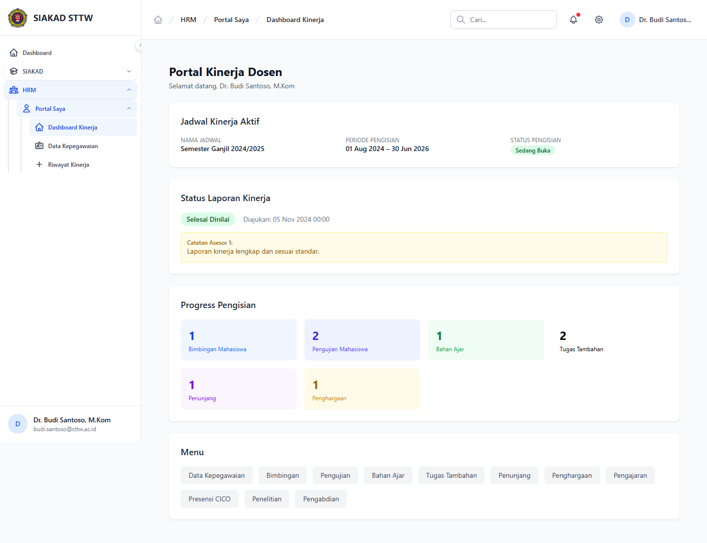

# Workflow Report: Dashboard Kinerja Dosen

**Tanggal**: 2026-04-02
**Role**: Dosen (Dr. Budi Santoso, M.Kom / budi.santoso@sttw.ac.id)
**Modul**: HRM — Portal Dosen
**Status**: ✅ Berhasil

## Ringkasan

Dashboard kinerja dosen menampilkan ringkasan status pengisian kinerja pada periode aktif.

- Melihat status pengisian dan progres kinerja
- Akses cepat ke menu input kinerja (bimbingan, pengujian, dll)
- Informasi jadwal kinerja yang sedang aktif

## Langkah-langkah

### 1. Halaman Dashboard Kinerja Dosen

Dosen membuka menu Portal Saya > Dashboard Kinerja. Terlihat ringkasan status pengisian kinerja, progres input, dan tautan cepat ke fitur-fitur input kinerja.

## Fitur yang Diuji

| Fitur | Status | Keterangan |
| --- | --- | --- |
| Ringkasan kinerja | ✅ | Status progres input kinerja dosen |
| Navigasi cepat | ✅ | Tautan ke modul bimbingan, pengujian, dll |
| Info jadwal aktif | ✅ | Menampilkan periode kinerja yang sedang berjalan |

## Catatan

- Dashboard menampilkan data dari periode kinerja aktif
- Hanya terlihat jika dosen sudah terdaftar di sistem HRM
