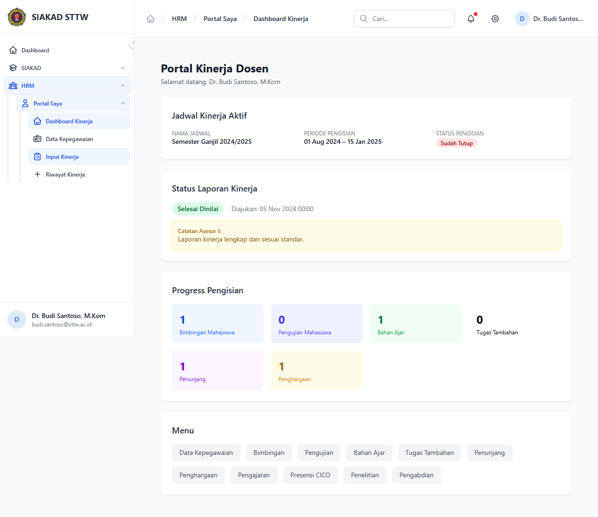

# Workflow Report: Dashboard HRM Dosen

**Tanggal**: 2026-04-01
**Role**: Dosen (Budi Santoso / budi.santoso@sttw.ac.id)
**Modul**: HRM — Portal Dosen
**Status**: ✅ Berhasil

## Ringkasan

Menampilkan dashboard HRM dosen yang berisi ringkasan kinerja, navigasi ke semua fitur portal, dan informasi jadwal kinerja aktif.

## Langkah-langkah

### 1. Dashboard Portal Dosen

Dosen membuka halaman HRM Portal. Terlihat menu sidebar dengan semua fitur kinerja (Bimbingan, Pengujian, Bahan Ajar, dll). Dashboard menampilkan ringkasan statistik dan informasi periode pengisian aktif.

## Fitur yang Diuji

| Fitur | Status | Keterangan |
|-------|--------|------------|
| Dashboard portal dosen | ✅ | Menampilkan ringkasan kinerja dan navigasi fitur |
| Menu sidebar HRM | ✅ | Semua sub-menu Portal Saya tersedia |
| Info periode aktif | ✅ | Menampilkan jadwal kinerja yang sedang berjalan |

## Catatan

- Dashboard dosen menampilkan statistik berdasarkan jadwal kinerja aktif
- Navigasi ke semua fitur kinerja tersedia melalui sidebar
