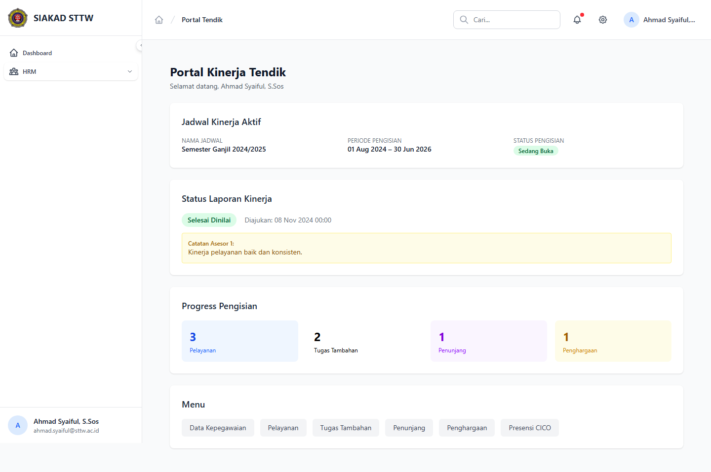

# Workflow Report: Dashboard Kinerja Tendik

**Tanggal**: 2026-04-02
**Role**: Tendik (Ahmad Syaiful, S.Sos / ahmad.syaiful@sttw.ac.id)
**Modul**: HRM — Portal Tendik
**Status**: ✅ Berhasil

## Ringkasan

Dashboard kinerja tendik menampilkan ringkasan status pengisian kinerja pada periode aktif.

- Melihat status pengisian dan progres kinerja
- Akses cepat ke menu input kinerja (pelayanan, penunjang, dll)
- Informasi jadwal kinerja yang sedang aktif

## Langkah-langkah

### 1. Halaman Dashboard Kinerja Tendik

Tendik membuka menu Portal Saya > Dashboard Kinerja. Terlihat ringkasan status pengisian kinerja dan tautan cepat ke fitur input.

## Fitur yang Diuji

| Fitur | Status | Keterangan |
| --- | --- | --- |
| Ringkasan kinerja | ✅ | Status progres input kinerja tendik |
| Navigasi cepat | ✅ | Tautan ke modul pelayanan, penunjang, dll |
| Info jadwal aktif | ✅ | Menampilkan periode kinerja yang sedang berjalan |

## Catatan

- Dashboard menampilkan data dari periode kinerja aktif
- Tendik memiliki modul berbeda dari dosen (pelayanan vs bimbingan/pengujian)
