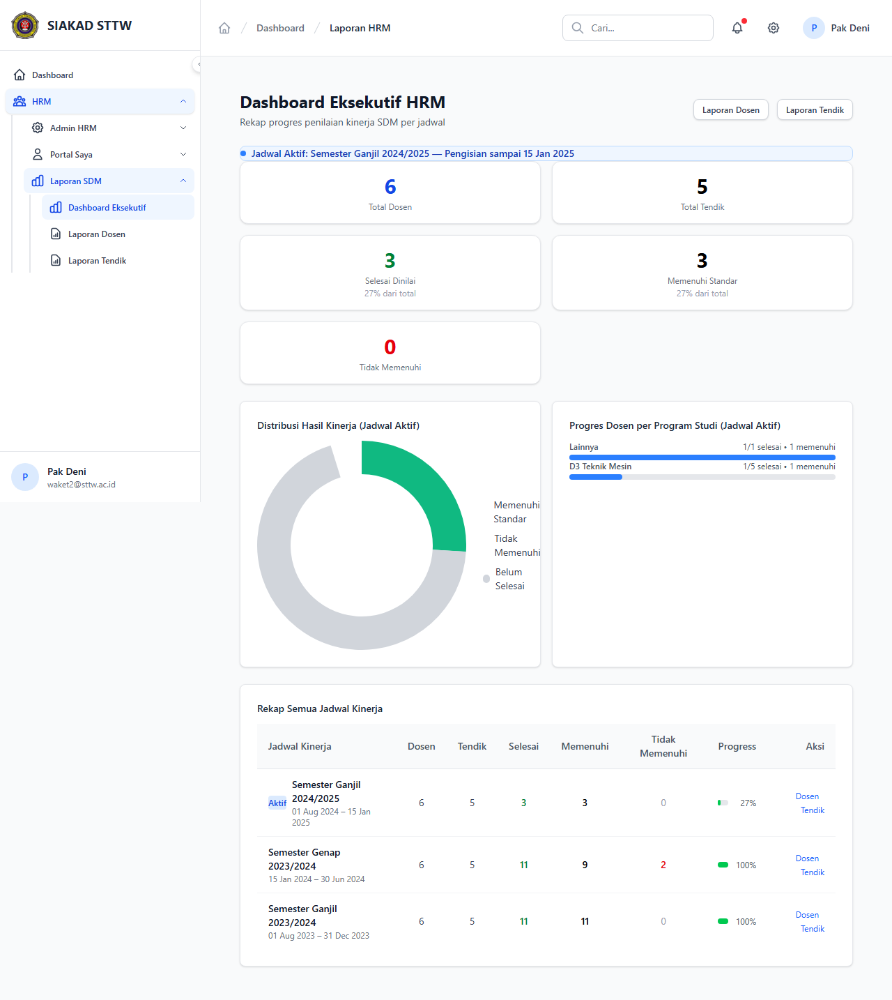

# Workflow Report: Dashboard Eksekutif & Laporan HRM

**Tanggal**: 2026-04-01
**Role**: Waket2 (Pak Deni / waket2@sttw.ac.id)
**Modul**: HRM — Laporan SDM
**Status**: ✅ Berhasil

## Ringkasan

Dashboard eksekutif HRM yang menampilkan rekap progres penilaian kinerja SDM per jadwal, termasuk:
- Statistik total dosen, tendik, selesai dinilai, memenuhi standar
- Chart distribusi hasil kinerja (pie chart)
- Progres per program studi (bar chart)
- Rekap semua jadwal kinerja (tabel)

## Langkah-langkah

### 1. Dashboard Eksekutif HRM

Waket2 membuka halaman Laporan SDM > Dashboard Eksekutif. Terlihat:
- Info jadwal aktif: "Semester Ganjil 2024/2025 — Pengisian sampai 15 Jan 2025"
- Statistik cards: 6 Total Dosen, 5 Total Tendik, 3 Selesai Dinilai (27%), 3 Memenuhi Standar (27%), 0 Tidak Memenuhi
- Pie chart "Distribusi Hasil Kinerja" (Memenuhi Standar, Tidak Memenuhi, Belum Selesai)
- Bar chart "Progres Dosen per Program Studi" (Lainnya 1/1, D3 Teknik Mesin 1/5)
- Tabel rekap semua jadwal: Sem Ganjil 2024/2025 (27%), Sem Genap 2023/2024 (100%), Sem Ganjil 2023/2024 (100%)
- Tombol navigasi: Laporan Dosen, Laporan Tendik

## Fitur yang Diuji

| Fitur | Status | Keterangan |
|-------|--------|------------|
| Statistik ringkasan | ✅ | Total dosen, tendik, dinilai, memenuhi standar |
| Pie chart distribusi | ✅ | Visualisasi hasil kinerja (hijau/merah/abu) |
| Bar chart per prodi | ✅ | Progres dosen per program studi |
| Tabel rekap jadwal | ✅ | Semua jadwal dengan progress bar |
| Navigasi detail | ✅ | Link ke Laporan Dosen dan Laporan Tendik |
| Menu sidebar lengkap | ✅ | Dashboard Eksekutif, Laporan Dosen, Laporan Tendik |

## Catatan

- Dashboard hanya tersedia untuk role waket2 dan akademik
- Data otomatis terhitung berdasarkan penilaian asesor
- Progress 100% berarti semua dosen/tendik sudah dinilai
- Chart menggunakan data dari jadwal kinerja yang aktif
