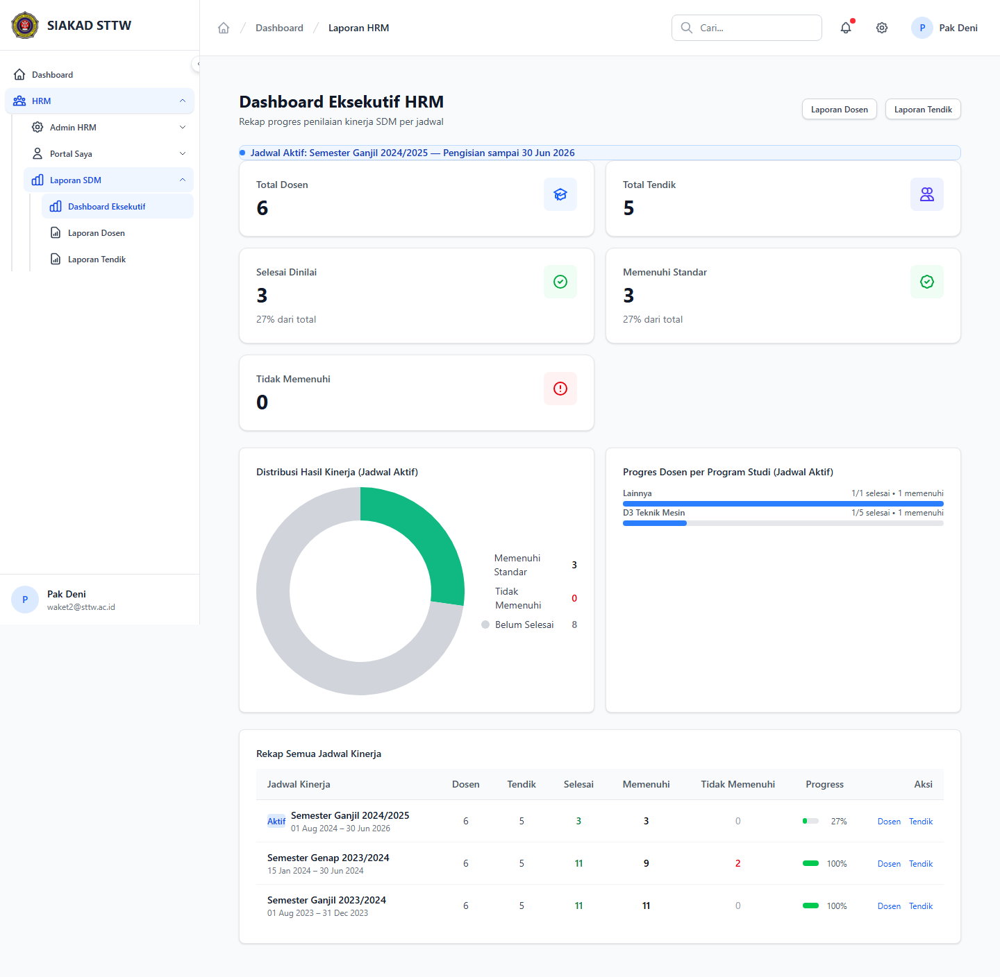
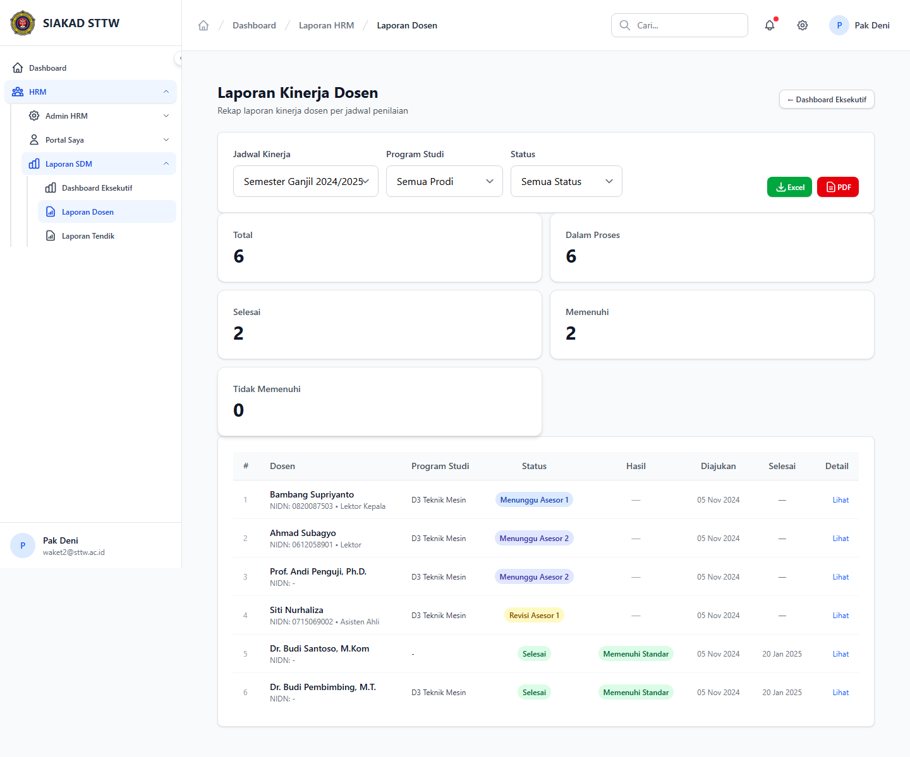
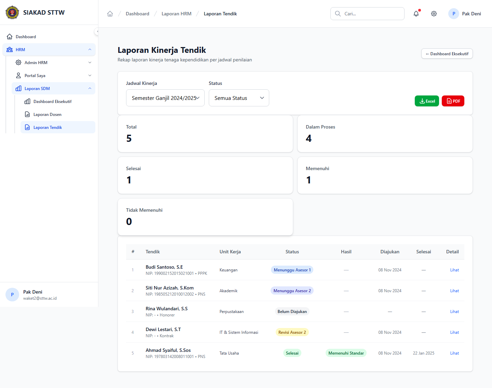

# Workflow Report: Dashboard Eksekutif & Laporan SDM

**Tanggal**: 2026-04-02
**Role**: Waket2 (Pak Deni / waket2@sttw.ac.id)
**Modul**: HRM — Laporan SDM
**Status**: ✅ Berhasil

## Ringkasan

Dashboard eksekutif dan laporan SDM untuk Wakil Ketua 2, termasuk:

- Dashboard ringkasan kinerja (total dosen/tendik, selesai dinilai, memenuhi standar)
- Laporan detail per dosen
- Laporan detail per tendik
- Export ke Excel dan PDF

## Langkah-langkah

### 1. Dashboard Eksekutif

Waket2 membuka menu Laporan SDM > Dashboard. Terlihat statistik ringkasan: total dosen, total tendik, selesai dinilai, memenuhi standar, dan tidak memenuhi standar. Menggunakan card statistik berwarna.

### 2. Laporan Kinerja Dosen

Waket2 membuka tab Laporan Dosen. Terlihat tabel semua dosen dengan kolom nama, NIDN, status kinerja, hasil penilaian, dan aksi (lihat detail, export). Tersedia filter dan tombol export Excel/PDF.

### 3. Laporan Kinerja Tendik

Waket2 membuka tab Laporan Tendik. Terlihat tabel semua tendik dengan kolom nama, jabatan, status kinerja, dan hasil penilaian. Tersedia filter dan tombol export.

## Fitur yang Diuji

| Fitur | Status | Keterangan |
| --- | --- | --- |
| Dashboard statistik | ✅ | Ringkasan total, selesai, memenuhi standar |
| Laporan dosen | ✅ | Tabel detail kinerja per dosen |
| Laporan tendik | ✅ | Tabel detail kinerja per tendik |
| Export Excel/PDF | ✅ | Download laporan dalam format Excel dan PDF |

## Catatan

- Dashboard menggunakan komponen x-stats-card untuk konsistensi UI
- Waket2 perlu permission hrm.laporan.view
- Export tersedia dalam format Excel dan PDF
