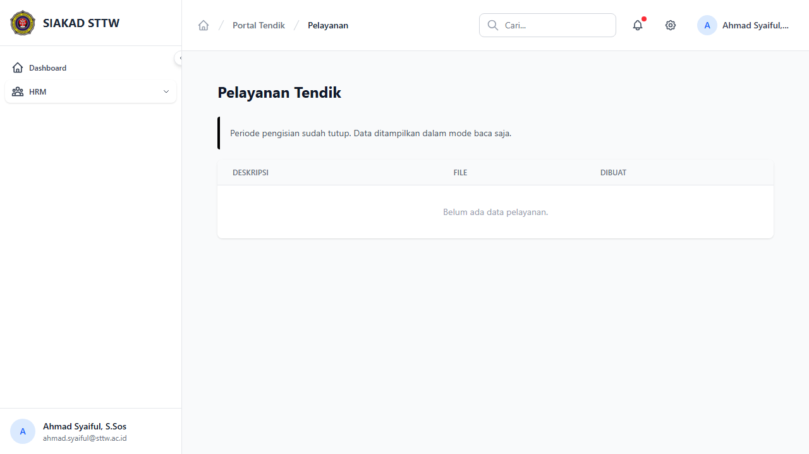
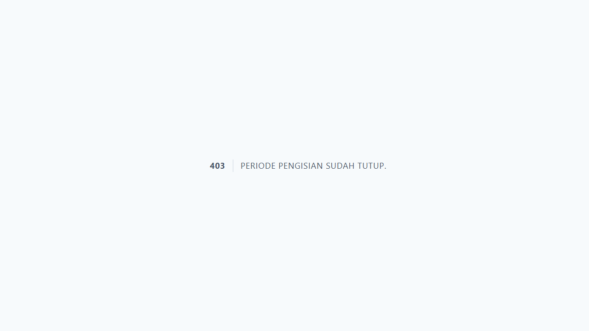

# Workflow Report: Input Kinerja Pelayanan Tendik

**Tanggal**: 2026-04-01
**Role**: Tendik (Ahmad Syaiful / ahmad.syaiful@sttw.ac.id)
**Modul**: HRM — Pelayanan
**Status**: ✅ Berhasil

## Ringkasan

Workflow input kinerja pelayanan oleh tendik, termasuk:
- Melihat daftar pelayanan yang sudah diinput
- Form tambah pelayanan baru (judul, deskripsi, tanggal, bukti)

## Langkah-langkah

### 1. Halaman Index Pelayanan

Tendik membuka halaman Pelayanan. Terlihat daftar pelayanan yang sudah diinput dalam tabel. Tombol "+ Tambah Pelayanan" tersedia di kanan atas.

### 2. Form Tambah Pelayanan

Tendik mengklik tombol tambah. Form berisi field: Judul Pelayanan, Deskripsi, Tanggal, dan Upload Bukti. Semua field wajib diisi.

## Fitur yang Diuji

| Fitur | Status | Keterangan |
|-------|--------|------------|
| Daftar pelayanan | ✅ | Tabel data pelayanan yang sudah diinput |
| Tambah pelayanan | ✅ | Form input dengan judul, deskripsi, tanggal, bukti |
| Upload bukti | ✅ | Field upload file untuk bukti pelayanan |
| Validasi form | ✅ | Field wajib ditandai asterisk merah |

## Catatan

- Pelayanan adalah fitur khusus tendik (tidak ada di portal dosen)
- Mencakup kegiatan administrasi, layanan mahasiswa, dll
- Bukti pelayanan diupload sebagai file lampiran
