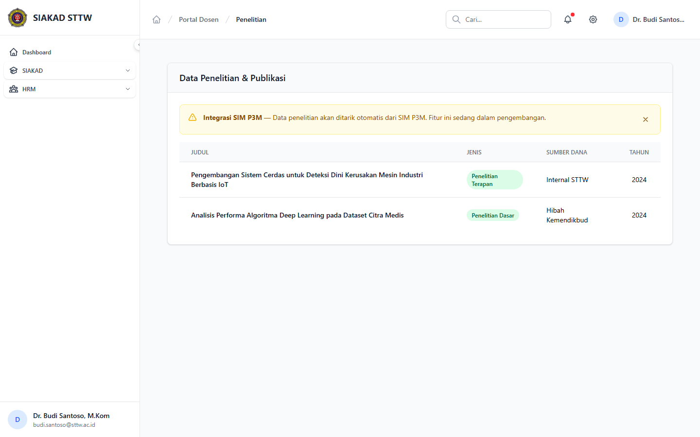

# Workflow Report: Data Penelitian Dosen

**Tanggal**: 2026-04-02
**Role**: Dosen (Dr. Budi Santoso, M.Kom / budi.santoso@sttw.ac.id)
**Modul**: HRM — Penelitian (P3M)
**Status**: ✅ Berhasil

## Ringkasan

Halaman data penelitian dosen menampilkan daftar penelitian yang terdaftar.

- Data placeholder dari SIM P3M
- Mencakup judul, jenis, sumber dana, dan tahun pelaksanaan

## Langkah-langkah

### 1. Halaman Data Penelitian

Dosen membuka halaman Penelitian. Terlihat daftar penelitian dalam tabel dengan kolom judul, jenis, sumber dana, dan tahun pelaksanaan.

## Fitur yang Diuji

| Fitur | Status | Keterangan |
| --- | --- | --- |
| Daftar penelitian | ✅ | Tabel data penelitian dosen |
| Info sumber dana | ✅ | Internal, Hibah Kemendikbud, dll |

## Catatan

- Data bersumber dari SIM P3M (placeholder)
- Akan diintegrasikan dengan SIM P3M nantinya
- Dosen tidak bisa input manual — data otomatis dari P3M
