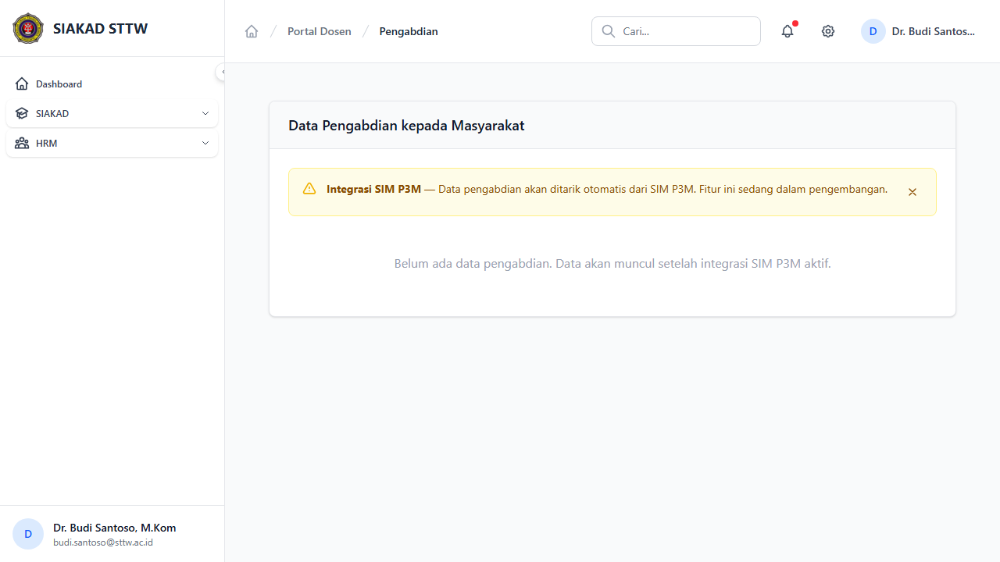

# Workflow Report: Data Pengabdian Dosen (Placeholder P3M)

**Tanggal**: 2026-04-01
**Role**: Dosen (Budi Santoso / budi.santoso@sttw.ac.id)
**Modul**: HRM — Pengabdian Masyarakat
**Status**: ✅ Berhasil

## Ringkasan

Menampilkan halaman pengabdian masyarakat dosen. Saat ini berisi placeholder karena data akan disinkronisasi dari SIM P3M (belum terintegrasi).

## Langkah-langkah

### 1. Halaman Pengabdian Masyarakat (Placeholder)

Dosen membuka halaman Pengabdian. Saat ini menampilkan data placeholder karena integrasi dengan SIM P3M belum tersedia. Data pengabdian masyarakat nantinya akan ditarik otomatis dari sistem P3M.

## Fitur yang Diuji

| Fitur | Status | Keterangan |
|-------|--------|------------|
| Halaman pengabdian | ✅ | Halaman tersedia dengan layout yang sesuai |
| Placeholder P3M | ⏳ | Menunggu integrasi SIM P3M |
| Read-only | ✅ | Data akan di-sync dari P3M, bukan input manual |

## Catatan

- Data pengabdian akan disinkronisasi dari SIM P3M saat integrasi tersedia
- Saat ini menampilkan data placeholder/kosong
