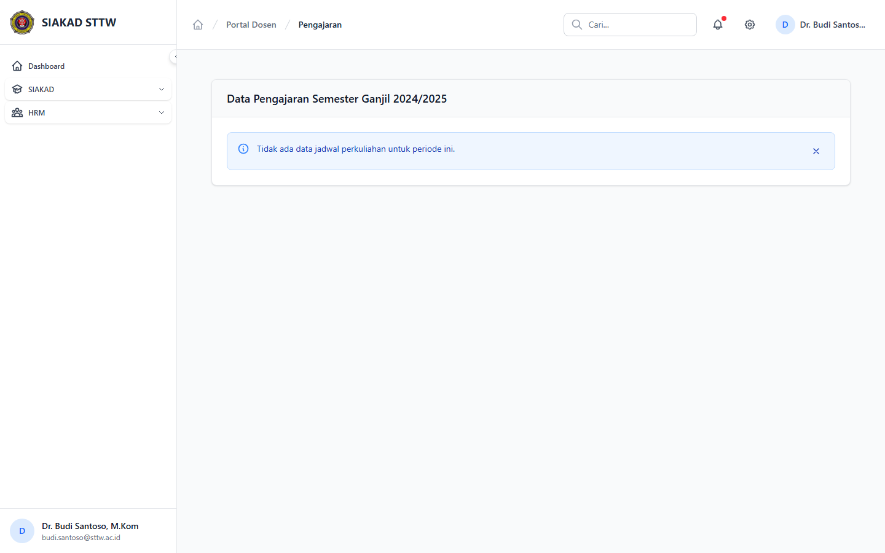

# Workflow Report: Data Pengajaran Dosen

**Tanggal**: 2026-04-02
**Role**: Dosen (Dr. Budi Santoso, M.Kom / budi.santoso@sttw.ac.id)
**Modul**: HRM — Pengajaran
**Status**: ✅ Berhasil

## Ringkasan

Halaman data pengajaran dosen menampilkan daftar mata kuliah yang diampu berdasarkan jadwal kuliah yang sudah diinput oleh admin.

- Data bersifat read-only (tidak bisa ditambah/edit oleh dosen)
- Bersumber dari jadwal kuliah SIAKAD

## Langkah-langkah

### 1. Halaman Data Pengajaran

Dosen membuka halaman Pengajaran. Terlihat daftar mata kuliah yang diampu pada semester aktif beserta informasi kelas, SKS, dan jadwal.

## Fitur yang Diuji

| Fitur | Status | Keterangan |
| --- | --- | --- |
| Daftar mata kuliah diampu | ✅ | Tabel berisi data jadwal pengajaran |
| Read-only | ✅ | Data dari jadwal kuliah, tidak bisa diedit dosen |

## Catatan

- Data bersumber dari jadwal kuliah SIAKAD
- Dosen tidak bisa menambah/mengedit data pengajaran
- Otomatis masuk ke perhitungan kinerja
