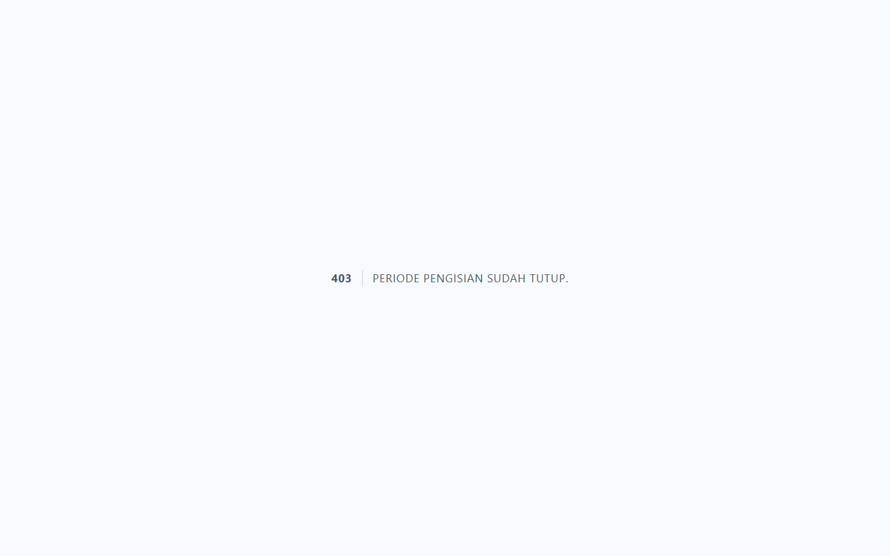

# Workflow Report: Input Kinerja Penghargaan Dosen

**Tanggal**: 2026-04-02
**Role**: Dosen (Dr. Budi Santoso, M.Kom / budi.santoso@sttw.ac.id)
**Modul**: HRM — Penghargaan
**Status**: ✅ Berhasil

## Ringkasan

Workflow input data penghargaan oleh dosen, termasuk:

- Melihat daftar penghargaan yang sudah diinput
- Mengisi form tambah penghargaan baru
- Skenario periode ditutup

## Langkah-langkah

### 1. Halaman Index Penghargaan

Dosen membuka halaman Penghargaan. Terlihat daftar penghargaan dalam tabel dengan kolom nama penghargaan, tingkat, pemberi, dan tahun.

### 2. Form Tambah Penghargaan (Periode Buka)

Dosen mengklik tombol tambah. Form berisi field: Nama Penghargaan, Tingkat (Institusi/Regional/Nasional/Internasional), Pemberi, Tahun, dan Keterangan.

### 3. Form Tambah Penghargaan (Periode Tutup)

Ketika periode pengisian ditutup, form menampilkan halaman 403 "Periode pengisian sudah tutup."

## Fitur yang Diuji

| Fitur | Status | Keterangan |
| --- | --- | --- |
| Daftar penghargaan | ✅ | Tabel data penghargaan dosen |
| Tambah penghargaan | ✅ | Form input nama, tingkat, pemberi, tahun |
| Periode tutup | ✅ | Form tidak bisa diakses saat periode ditutup |

## Catatan

- Penghargaan mencakup sertifikasi, piagam, award, dll
- Tingkat: Institusi, Regional, Nasional, Internasional
