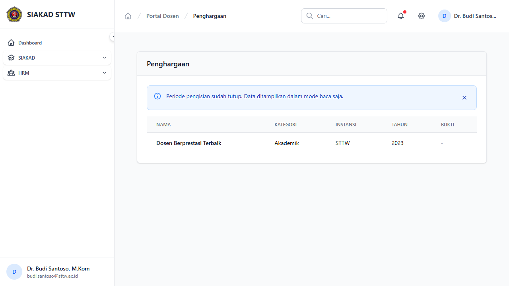
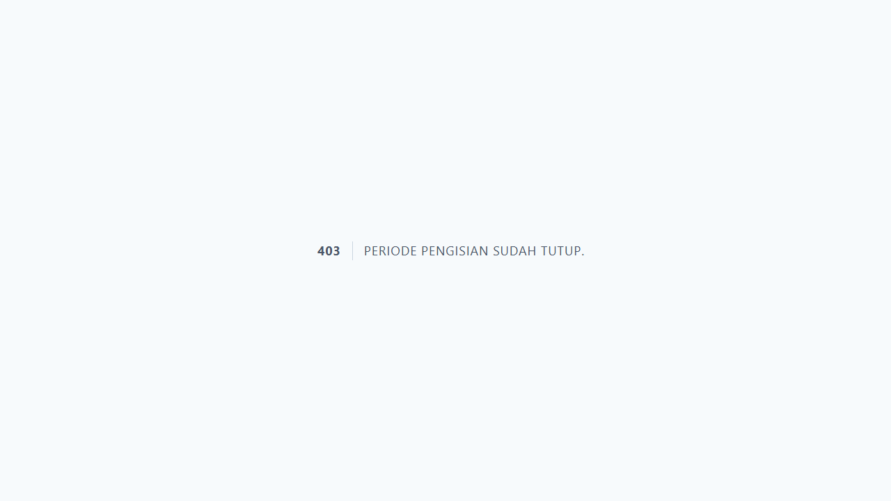

# Workflow Report: Input Penghargaan Dosen

**Tanggal**: 2026-04-01
**Role**: Dosen (Budi Santoso / budi.santoso@sttw.ac.id)
**Modul**: HRM — Penghargaan
**Status**: ✅ Berhasil

## Ringkasan

Workflow input penghargaan/prestasi dosen, termasuk:
- Melihat daftar penghargaan yang sudah diinput
- Form tambah penghargaan (ditampilkan saat periode tutup)

## Langkah-langkah

### 1. Halaman Index Penghargaan

Dosen membuka halaman Penghargaan. Terlihat alert periode tutup dan daftar penghargaan yang sudah diinput.

### 2. Form Tambah Penghargaan (Periode Tutup)

Dosen mencoba tambah penghargaan. Halaman menampilkan 403 karena periode sudah tutup.

## Fitur yang Diuji

| Fitur | Status | Keterangan |
|-------|--------|------------|
| Daftar penghargaan | ✅ | Tabel data penghargaan yang sudah diinput |
| Alert periode tutup | ✅ | Notifikasi visual |
| Blokir input saat tutup | ✅ | Form mengembalikan 403 |

## Catatan

- Penghargaan mencakup prestasi akademik, sertifikat, awards, dll
- Bukti penghargaan dapat diupload sebagai lampiran
