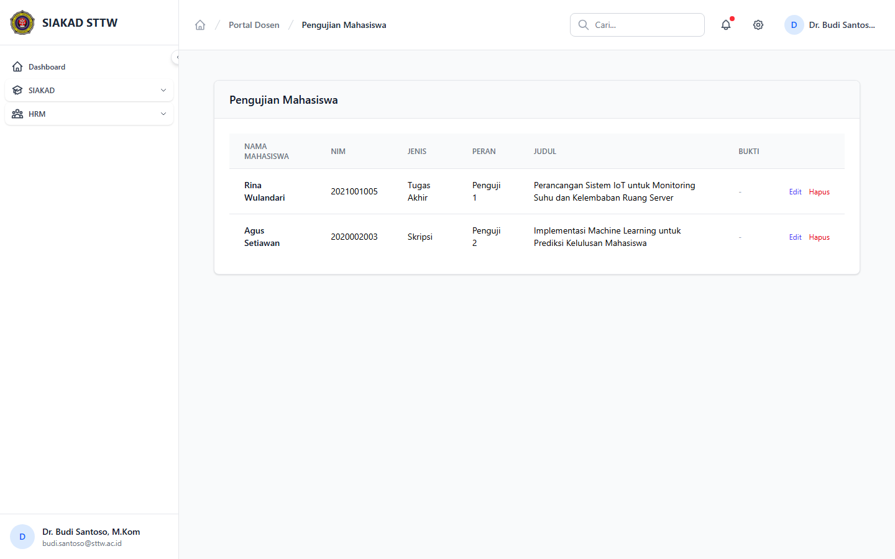
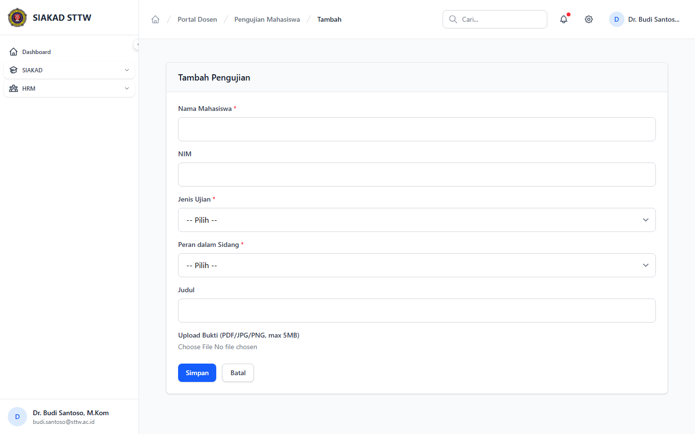

# Workflow Report: Input Kinerja Pengujian Dosen

**Tanggal**: 2026-04-02
**Role**: Dosen (Dr. Budi Santoso, M.Kom / budi.santoso@sttw.ac.id)
**Modul**: HRM — Pengujian Mahasiswa
**Status**: ✅ Berhasil

## Ringkasan

Workflow input kinerja pengujian mahasiswa oleh dosen, termasuk:

- Melihat daftar pengujian (sebagai penguji TA/Skripsi)
- Mengisi form tambah pengujian baru
- Skenario periode ditutup

## Langkah-langkah

### 1. Halaman Index Pengujian

Dosen membuka halaman Pengujian. Terlihat daftar pengujian dalam tabel dengan kolom jenis (TA/Skripsi), peran (Penguji 1/2), nama mahasiswa, NIM, dan judul.

### 2. Form Tambah Pengujian (Periode Buka)

Dosen mengklik tombol tambah. Form berisi field: Jenis (TA/Skripsi), Peran (Penguji 1/2/Ketua), Nama Mahasiswa, NIM, dan Judul.

### 3. Form Tambah Pengujian (Periode Tutup)

Ketika periode pengisian ditutup, form menampilkan halaman 403 "Periode pengisian sudah tutup."

## Fitur yang Diuji

| Fitur | Status | Keterangan |
| --- | --- | --- |
| Daftar pengujian | ✅ | Tabel data pengujian mahasiswa |
| Tambah pengujian | ✅ | Form input jenis, peran, mahasiswa, judul |
| Periode tutup | ✅ | Form tidak bisa diakses saat periode ditutup |

## Catatan

- Pengujian adalah catatan mandiri dosen sebagai penguji TA/Skripsi
- Data pengujian masuk ke penilaian kinerja dosen
