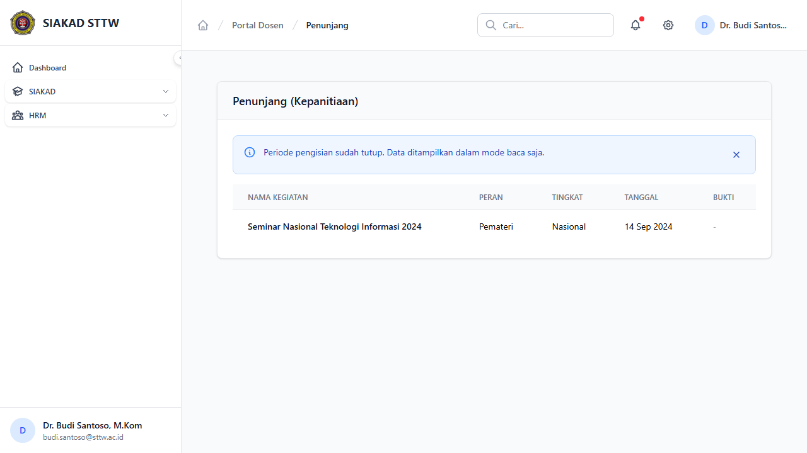
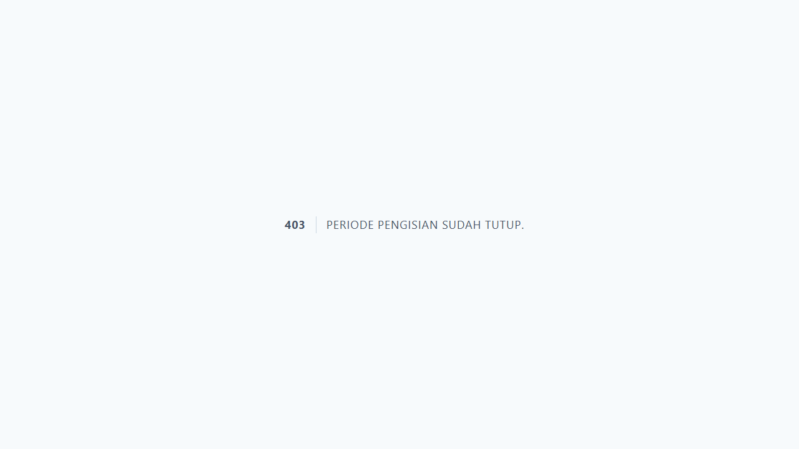

# Workflow Report: Input Kinerja Penunjang Dosen

**Tanggal**: 2026-04-01
**Role**: Dosen (Budi Santoso / budi.santoso@sttw.ac.id)
**Modul**: HRM — Kegiatan Penunjang
**Status**: ✅ Berhasil

## Ringkasan

Workflow input kegiatan penunjang dosen (seminar, pelatihan, sertifikasi, dll), termasuk:
- Melihat daftar kegiatan penunjang yang sudah diinput
- Form tambah kegiatan penunjang (ditampilkan saat periode tutup)

## Langkah-langkah

### 1. Halaman Index Kegiatan Penunjang

Dosen membuka halaman Kegiatan Penunjang. Terlihat alert periode tutup dan daftar kegiatan yang sudah diinput.

### 2. Form Tambah Kegiatan Penunjang (Periode Tutup)

Dosen mencoba tambah kegiatan penunjang. Halaman menampilkan 403 karena periode sudah tutup.

## Fitur yang Diuji

| Fitur | Status | Keterangan |
|-------|--------|------------|
| Daftar kegiatan penunjang | ✅ | Tabel data kegiatan yang sudah diinput |
| Alert periode tutup | ✅ | Notifikasi visual |
| Blokir input saat tutup | ✅ | Form mengembalikan 403 |

## Catatan

- Kegiatan penunjang mencakup seminar, pelatihan, sertifikasi, dll
- Bukti kegiatan dapat diupload sebagai lampiran
