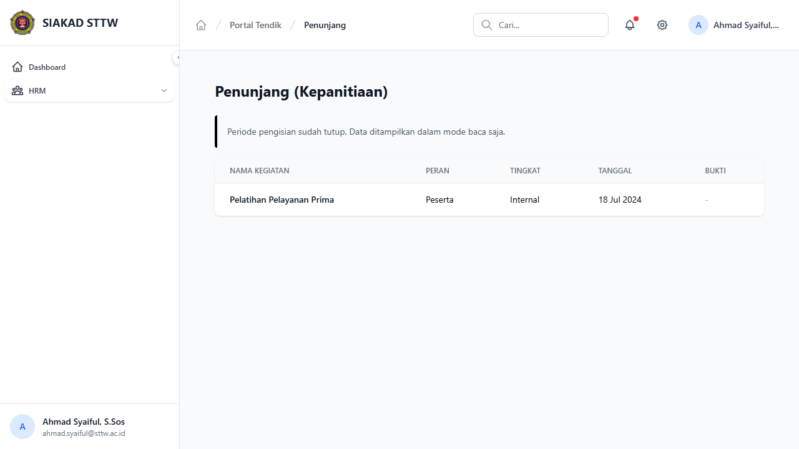
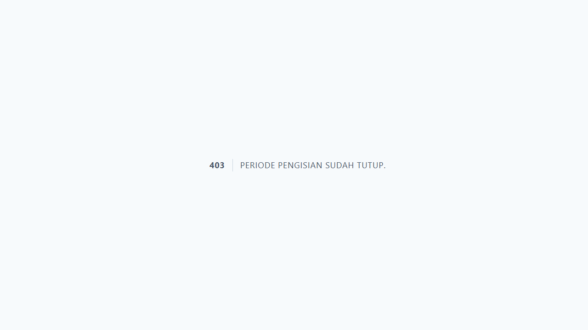

# Workflow Report: Input Kinerja Penunjang Tendik

**Tanggal**: 2026-04-01
**Role**: Tendik (Ahmad Syaiful / ahmad.syaiful@sttw.ac.id)
**Modul**: HRM — Kegiatan Penunjang
**Status**: ✅ Berhasil

## Ringkasan

Workflow input kegiatan penunjang tendik (pelatihan, sertifikasi, dll), termasuk:
- Melihat daftar kegiatan penunjang yang sudah diinput
- Form tambah kegiatan penunjang baru

## Langkah-langkah

### 1. Halaman Index Kegiatan Penunjang

Tendik membuka halaman Kegiatan Penunjang. Terlihat daftar kegiatan yang sudah diinput.

### 2. Form Tambah Kegiatan Penunjang

Tendik mengklik tombol tambah. Form berisi field untuk mengisi data kegiatan penunjang.

## Fitur yang Diuji

| Fitur | Status | Keterangan |
|-------|--------|------------|
| Daftar kegiatan penunjang | ✅ | Tabel data kegiatan yang sudah diinput |
| Tambah kegiatan penunjang | ✅ | Form input kegiatan baru |

## Catatan

- Kegiatan penunjang tendik mencakup pelatihan, seminar, sertifikasi, dll
