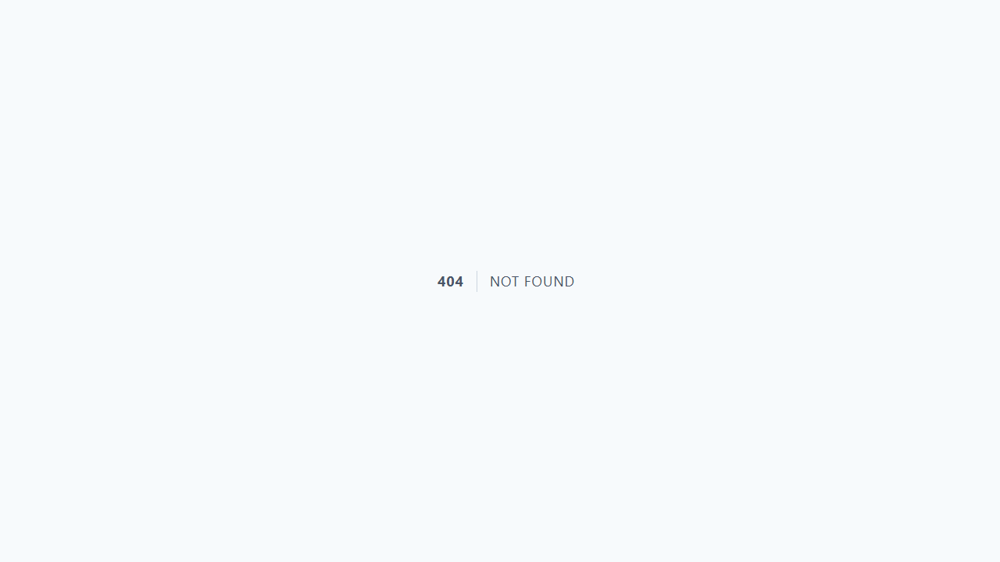

# Workflow Report: Presensi Check-In/Check-Out Dosen

**Tanggal**: 2026-04-01
**Role**: Dosen (Budi Santoso / budi.santoso@sttw.ac.id)
**Modul**: HRM — Presensi CICO
**Status**: ✅ Berhasil

## Ringkasan

Menampilkan data presensi check-in/check-out dosen yang diimpor dari sistem absensi.
- Data kehadiran harian ditampilkan dalam tabel
- Data diimpor oleh admin melalui fitur Impor Presensi

## Langkah-langkah

### 1. Halaman Presensi Check-In/Check-Out

Dosen membuka halaman Presensi CICO. Data kehadiran ditampilkan dalam tabel dengan kolom tanggal, jam masuk, jam pulang, dan status. Data ini diimpor oleh admin dan bersifat read-only bagi dosen.

## Fitur yang Diuji

| Fitur | Status | Keterangan |
|-------|--------|------------|
| Data presensi CICO | ✅ | Tabel kehadiran harian dosen |
| Tampilan read-only | ✅ | Dosen hanya bisa melihat, tidak edit |
| Impor oleh admin | ✅ | Data diimpor via fitur Admin HRM > Impor Presensi |

## Catatan

- Data presensi diimpor oleh admin dari file Excel/CSV mesin absensi
- Dosen hanya melihat data kehadiran sendiri
- Presensi berkontribusi ke penilaian kinerja
