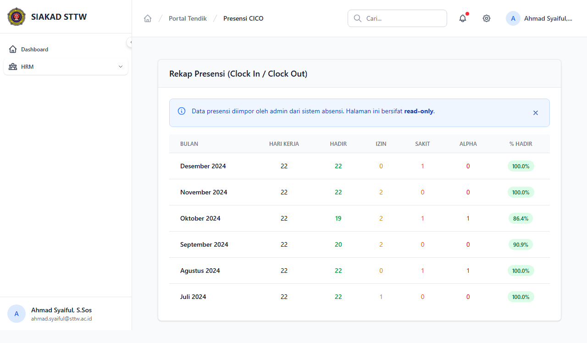

# Workflow Report: Presensi Check-In/Check-Out Tendik

**Tanggal**: 2026-04-01
**Role**: Tendik (Ahmad Syaiful / ahmad.syaiful@sttw.ac.id)
**Modul**: HRM — Presensi CICO
**Status**: ✅ Berhasil

## Ringkasan

Menampilkan data presensi check-in/check-out tendik yang diimpor dari sistem absensi.

## Langkah-langkah

### 1. Halaman Presensi Check-In/Check-Out

Tendik membuka halaman Presensi CICO. Data kehadiran ditampilkan dalam tabel. Data ini diimpor oleh admin dan bersifat read-only bagi tendik.

## Fitur yang Diuji

| Fitur | Status | Keterangan |
|-------|--------|------------|
| Data presensi CICO | ✅ | Tabel kehadiran harian tendik |
| Tampilan read-only | ✅ | Tendik hanya bisa melihat, tidak edit |

## Catatan

- Data presensi diimpor oleh admin dari file Excel/CSV mesin absensi
- Tendik hanya melihat data kehadiran sendiri
