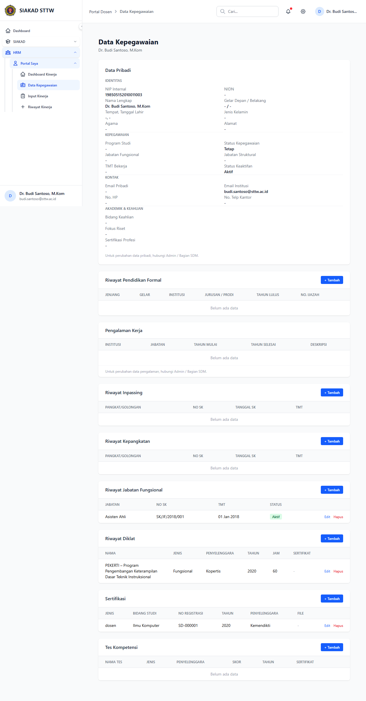

# Workflow Report: Profil Dosen di HRM

**Tanggal**: 2026-04-01
**Role**: Dosen (Budi Santoso / budi.santoso@sttw.ac.id)
**Modul**: HRM — Profil
**Status**: ✅ Berhasil

## Ringkasan

Menampilkan halaman profil dosen di modul HRM.
- Data profil ditarik dari SIAKAD (data dosen)
- Menampilkan informasi jabatan fungsional, pendidikan, dll

## Langkah-langkah

### 1. Halaman Profil Dosen

Dosen membuka halaman Profil di menu HRM. Menampilkan data profil lengkap yang disinkronisasi dari SIAKAD, termasuk nama, NIP, NIDN, jabatan fungsional, program studi, dan informasi lainnya.

## Fitur yang Diuji

| Fitur | Status | Keterangan |
|-------|--------|------------|
| Data profil dosen | ✅ | Menampilkan informasi dosen dari SIAKAD |
| Jabatan fungsional | ✅ | Data dari SIAKAD, read-only di HRM |
| Info program studi | ✅ | Menampilkan prodi dan fakultas |

## Catatan

- Data profil disinkronisasi dari modul SIAKAD (data dosen)
- Jabatan fungsional sudah tersedia di SIAKAD, tidak perlu duplikasi di HRM
