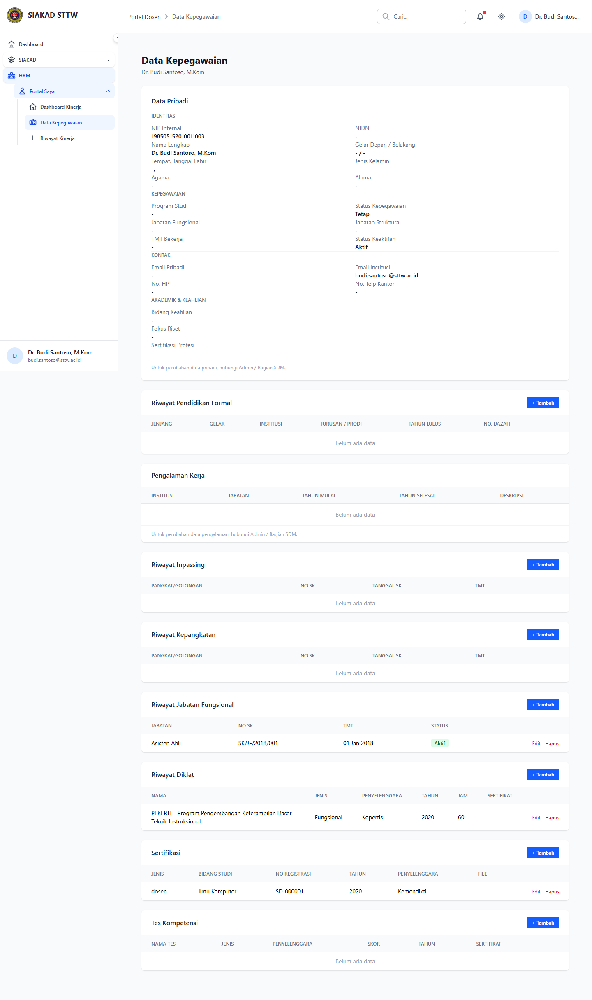

# Workflow Report: Data Kepegawaian Dosen

**Tanggal**: 2026-04-02
**Role**: Dosen (Dr. Budi Santoso, M.Kom / budi.santoso@sttw.ac.id)
**Modul**: HRM — Portal Dosen
**Status**: ✅ Berhasil

## Ringkasan

Halaman data kepegawaian menampilkan profil lengkap dosen termasuk:

- Data pribadi dan identitas
- Jabatan fungsional dan struktural
- Riwayat pendidikan

## Langkah-langkah

### 1. Halaman Data Kepegawaian

Dosen membuka menu Portal Saya > Data Kepegawaian. Ditampilkan data profil lengkap termasuk NIDN, nama, jabatan fungsional, program studi, dan informasi kepegawaian lainnya.

## Fitur yang Diuji

| Fitur | Status | Keterangan |
| --- | --- | --- |
| Data pribadi | ✅ | NIDN, nama, email, NIK, dll |
| Jabatan fungsional | ✅ | Lektor Kepala, dll |
| Status kepegawaian | ✅ | Status aktif dan jenis ikatan kerja |

## Catatan

- Data bersumber dari tabel dosen SIAKAD
- Dosen tidak bisa mengedit data kepegawaian sendiri
