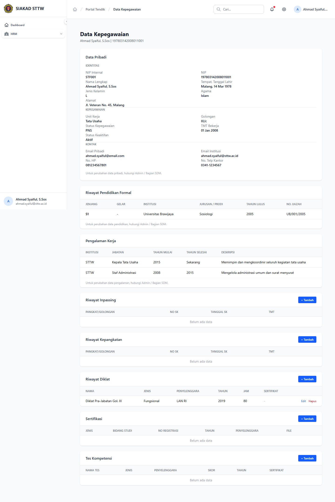

# Workflow Report: Data Kepegawaian Tendik

**Tanggal**: 2026-04-02
**Role**: Tendik (Ahmad Syaiful, S.Sos / ahmad.syaiful@sttw.ac.id)
**Modul**: HRM — Portal Tendik
**Status**: ✅ Berhasil

## Ringkasan

Halaman data kepegawaian menampilkan profil lengkap tenaga kependidikan termasuk:

- Data pribadi dan identitas
- Jabatan dan unit kerja
- Status kepegawaian

## Langkah-langkah

### 1. Halaman Data Kepegawaian

Tendik membuka menu Portal Saya > Data Kepegawaian. Ditampilkan data profil lengkap termasuk nama, jabatan, unit kerja, dan informasi kepegawaian lainnya.

## Fitur yang Diuji

| Fitur | Status | Keterangan |
| --- | --- | --- |
| Data pribadi | ✅ | Nama, NIP, email, dll |
| Jabatan | ✅ | Jabatan dan unit kerja |
| Status kepegawaian | ✅ | Status aktif dan jenis ikatan kerja |

## Catatan

- Data bersumber dari tabel staf SIAKAD
- Tendik tidak bisa mengedit data kepegawaian sendiri
