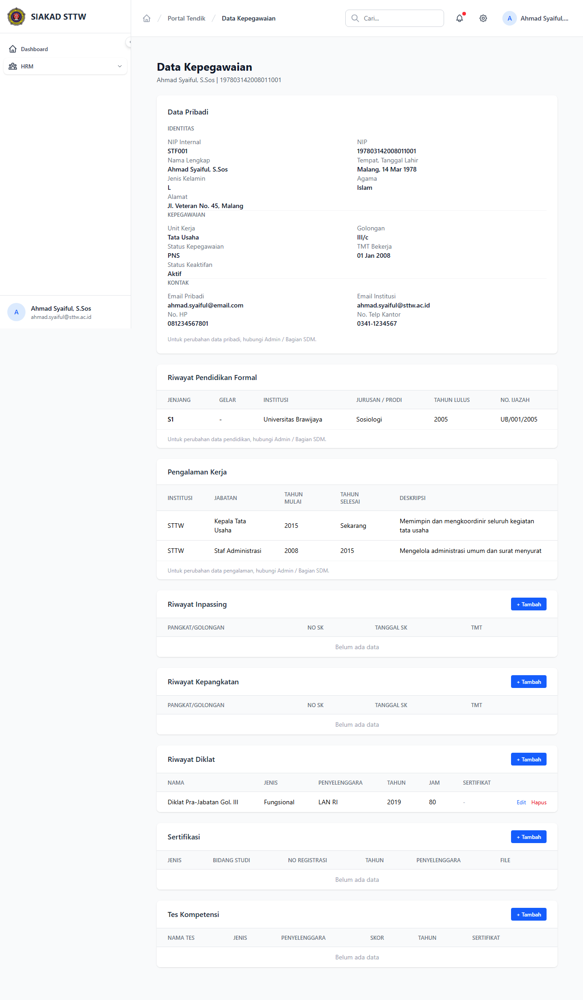

# Workflow Report: Profil Tendik di HRM

**Tanggal**: 2026-04-01
**Role**: Tendik (Ahmad Syaiful / ahmad.syaiful@sttw.ac.id)
**Modul**: HRM — Profil
**Status**: ✅ Berhasil

## Ringkasan

Menampilkan halaman profil tenaga kependidikan di modul HRM.

## Langkah-langkah

### 1. Halaman Profil Tendik

Tendik membuka halaman Profil di menu HRM. Menampilkan data profil lengkap termasuk nama, NIP, unit kerja, dan informasi lainnya.

## Fitur yang Diuji

| Fitur | Status | Keterangan |
|-------|--------|------------|
| Data profil tendik | ✅ | Menampilkan informasi tendik dari SIAKAD |
| Info unit kerja | ✅ | Menampilkan unit kerja/bagian |

## Catatan

- Data profil disinkronisasi dari data staf SIAKAD
