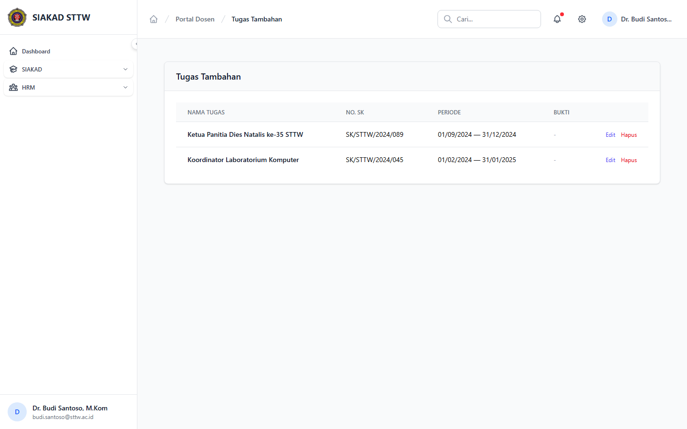
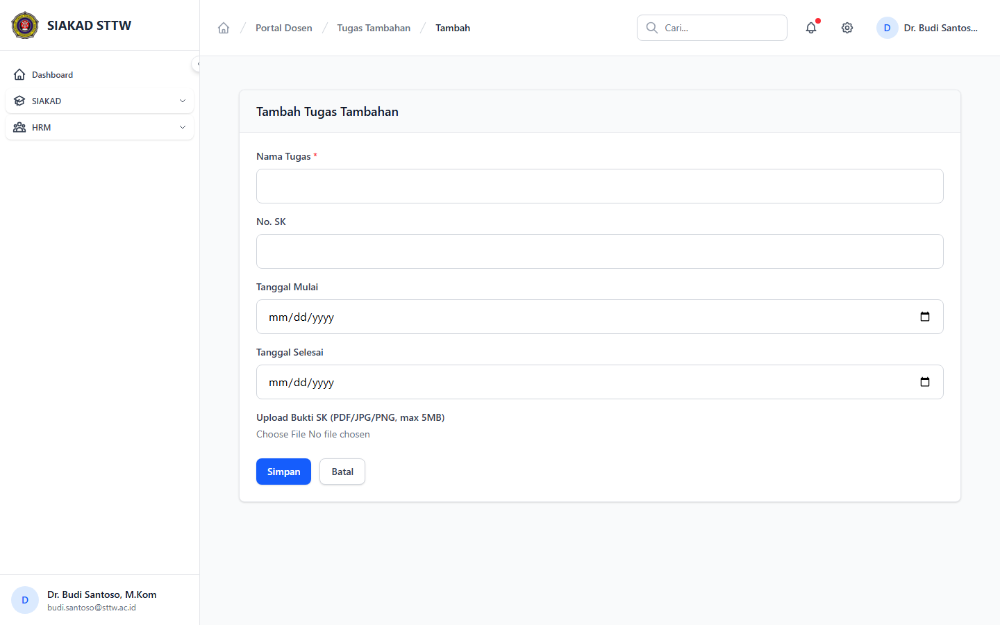

# Workflow Report: Input Kinerja Tugas Tambahan Dosen

**Tanggal**: 2026-04-02
**Role**: Dosen (Dr. Budi Santoso, M.Kom / budi.santoso@sttw.ac.id)
**Modul**: HRM — Tugas Tambahan
**Status**: ✅ Berhasil

## Ringkasan

Workflow input tugas tambahan oleh dosen, termasuk:

- Melihat daftar tugas tambahan (panitia, koordinator, dll)
- Mengisi form tambah tugas tambahan baru
- Skenario periode ditutup

## Langkah-langkah

### 1. Halaman Index Tugas Tambahan

Dosen membuka halaman Tugas Tambahan. Terlihat daftar tugas dalam tabel dengan kolom nama tugas, nomor SK, tanggal mulai, dan tanggal selesai.

### 2. Form Tambah Tugas Tambahan (Periode Buka)

Dosen mengklik tombol tambah. Form berisi field: Nama Tugas, Nomor SK, Tanggal Mulai, Tanggal Selesai, dan Keterangan.

### 3. Form Tambah Tugas Tambahan (Periode Tutup)

Ketika periode pengisian ditutup, form menampilkan halaman 403 "Periode pengisian sudah tutup."

## Fitur yang Diuji

| Fitur | Status | Keterangan |
| --- | --- | --- |
| Daftar tugas tambahan | ✅ | Tabel data tugas tambahan dosen |
| Tambah tugas | ✅ | Form input nama, SK, tanggal mulai/selesai |
| Periode tutup | ✅ | Form tidak bisa diakses saat periode ditutup |

## Catatan

- Tugas tambahan mencakup kepanitiaan, koordinator lab, dll
- Wajib menyertakan nomor SK sebagai bukti penugasan
