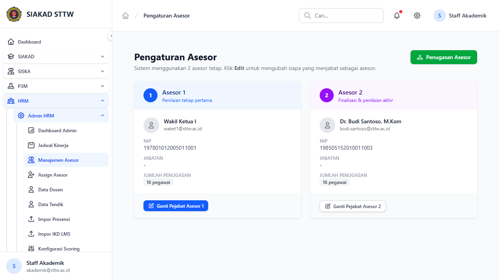
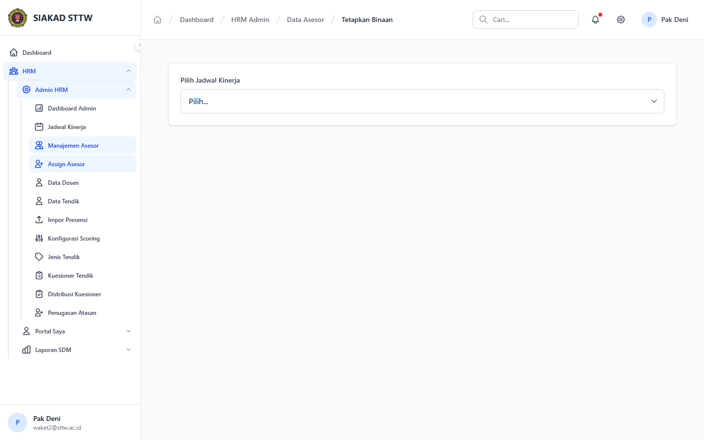

# Workflow Report: Manajemen Asesor HRM

**Tanggal**: 2026-04-18  
**Role**: Waket2 / Admin HRM  
**Modul**: HRM > Admin HRM  
**Fitur**: Manajemen Asesor HRM  
**Status**: ✅ Berhasil

## Deskripsi Workflow

Daftar asesor dan halaman assignment asesor ke pegawai.

## Ringkasan

Semua 2 langkah pada scan ini lolos tanpa error maupun warning.

## Langkah-langkah

### 1. Daftar Asesor

**Deskripsi**: Halaman ini merekam tampilan utama daftar asesor sebagai bagian dari alur manajemen asesor hrm.

**Akun**: Waket2 / Admin HRM

**URL**: `http://127.0.0.1:8000/hrm/admin/asesor`

### 2. Assign Asesor

**Deskripsi**: Daftar asesor dan halaman assignment asesor ke pegawai. Langkah ini difokuskan pada tampilan assign asesor.

**Akun**: Waket2 / Admin HRM

**URL**: `http://127.0.0.1:8000/hrm/admin/asesor-assign`

## Temuan & Masalah

Tidak ada temuan kritis maupun warning pada scan ini.

## Catatan

- Screenshot diambil otomatis menggunakan Playwright dengan full-page capture.
- Navigasi utama diprioritaskan melalui sidebar; jika sebuah halaman hanya bisa dicapai dari quick action atau tombol sekunder, report akan menandainya sebagai `missing-sidebar`.
- Form pada report ini dibuka untuk verifikasi visual dan field wajib, tidak disubmit secara destruktif agar hasil scan tidak memalsukan status sukses.
- Data yang tampil mengikuti seeder HRM yang aktif saat scan dijalankan.
