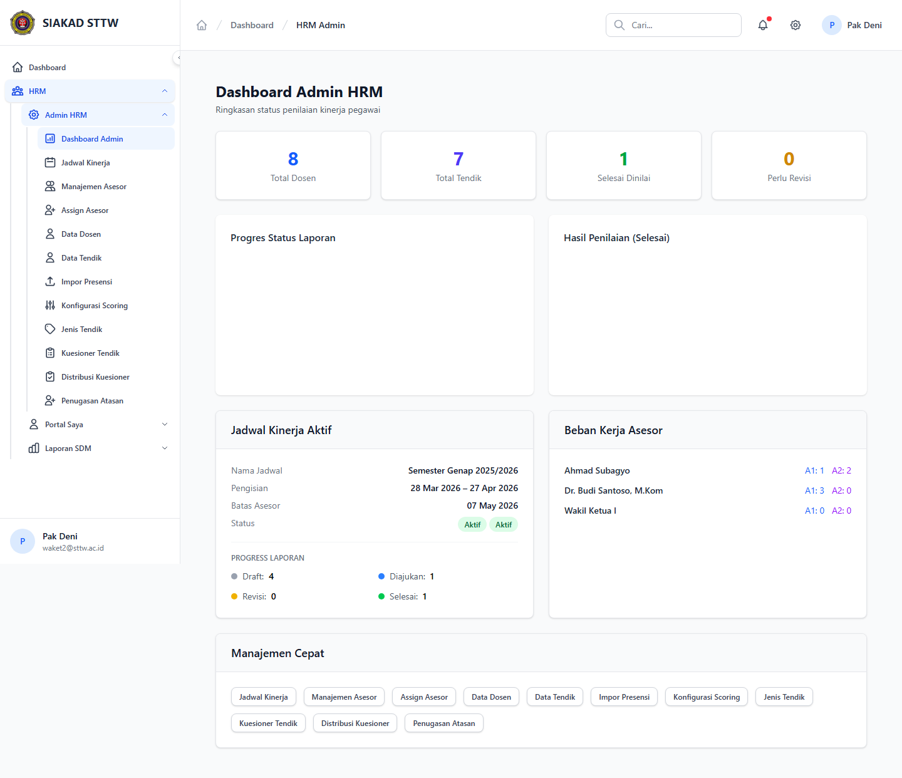

# Workflow Report: Audit Menyeluruh Modul HRM

**Tanggal**: 2026-04-18  
**Role**: Multi Role  
**Modul**: HRM  
**Fitur**: Audit Menyeluruh Modul HRM  
**Status**: ✅ Berhasil

## Deskripsi Workflow

Ringkasan visual lintas role untuk seluruh modul HRM.

## Ringkasan

Semua 5 langkah pada scan ini lolos tanpa error maupun warning.

## Langkah-langkah

### 1. Admin HRM

**Deskripsi**: Ringkasan visual lintas role untuk seluruh modul HRM. Langkah ini difokuskan pada tampilan admin hrm.

**Akun**: Waket2 / Admin HRM

**URL**: `http://127.0.0.1:8000/hrm/admin`

### 2. Laporan SDM

**Deskripsi**: Halaman ini merekam tampilan utama laporan sdm sebagai bagian dari alur audit menyeluruh modul hrm.

**Akun**: Waket2 / Admin HRM

**URL**: `http://127.0.0.1:8000/hrm/laporan`

### 3. Portal Asesor

**Deskripsi**: Ringkasan visual lintas role untuk seluruh modul HRM. Langkah ini difokuskan pada tampilan portal asesor.

**Akun**: Asesor

**URL**: `http://127.0.0.1:8000/hrm/asesor`

### 4. Portal Dosen

**Deskripsi**: Ringkasan visual lintas role untuk seluruh modul HRM. Langkah ini difokuskan pada tampilan portal dosen.

**Akun**: Portal Dosen

**URL**: `http://127.0.0.1:8000/hrm/portal`

### 5. Portal Tendik

**Deskripsi**: Ringkasan visual lintas role untuk seluruh modul HRM. Langkah ini difokuskan pada tampilan portal tendik.

**Akun**: Portal Tendik

**URL**: `http://127.0.0.1:8000/hrm/tendik`

## Temuan & Masalah

Tidak ada temuan kritis maupun warning pada scan ini.

## Catatan

- Screenshot diambil otomatis menggunakan Playwright dengan full-page capture.
- Navigasi utama diprioritaskan melalui sidebar; jika sebuah halaman hanya bisa dicapai dari quick action atau tombol sekunder, report akan menandainya sebagai `missing-sidebar`.
- Form pada report ini dibuka untuk verifikasi visual dan field wajib, tidak disubmit secara destruktif agar hasil scan tidak memalsukan status sukses.
- Data yang tampil mengikuti seeder HRM yang aktif saat scan dijalankan.
