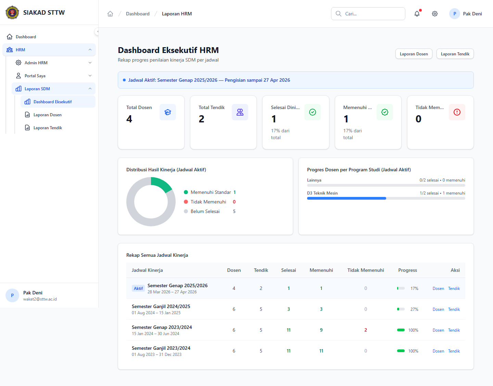
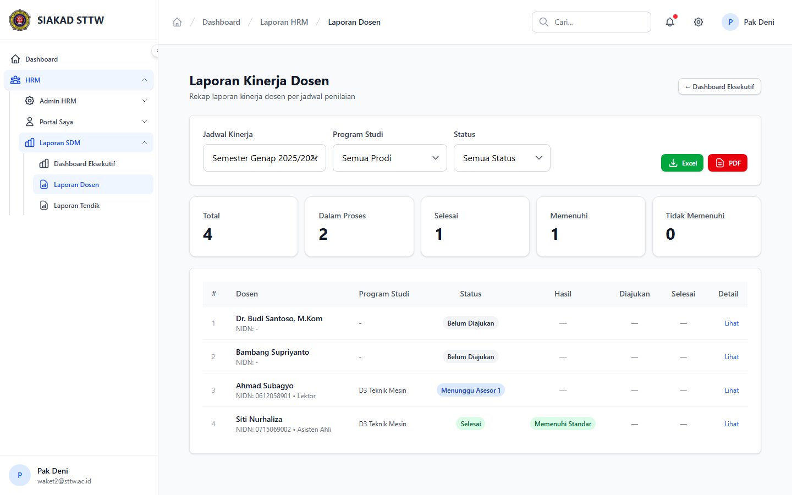
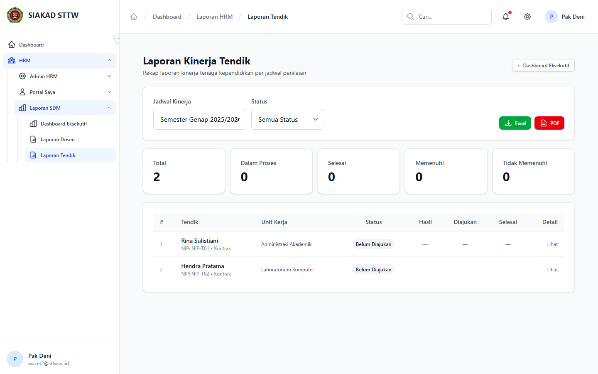

# Workflow Report: Laporan SDM HRM

**Tanggal**: 2026-04-18  
**Role**: Waket2 / Admin HRM  
**Modul**: HRM > Laporan SDM  
**Fitur**: Laporan SDM HRM  
**Status**: ✅ Berhasil

## Deskripsi Workflow

Dashboard eksekutif dan daftar laporan dosen serta tendik.

## Ringkasan

Semua 3 langkah pada scan ini lolos tanpa error maupun warning.

## Langkah-langkah

### 1. Dashboard Eksekutif

**Deskripsi**: Halaman dashboard untuk dashboard eksekutif dan daftar laporan dosen serta tendik. Screenshot diambil setelah halaman selesai dimuat penuh.

**Akun**: Waket2 / Admin HRM

**URL**: `http://127.0.0.1:8000/hrm/laporan`

### 2. Laporan Dosen

**Deskripsi**: Halaman ini merekam tampilan utama laporan dosen sebagai bagian dari alur laporan sdm hrm.

**Akun**: Waket2 / Admin HRM

**URL**: `http://127.0.0.1:8000/hrm/laporan/dosen`

### 3. Laporan Tendik

**Deskripsi**: Halaman ini merekam tampilan utama laporan tendik sebagai bagian dari alur laporan sdm hrm.

**Akun**: Waket2 / Admin HRM

**URL**: `http://127.0.0.1:8000/hrm/laporan/tendik`

## Temuan & Masalah

Tidak ada temuan kritis maupun warning pada scan ini.

## Catatan

- Screenshot diambil otomatis menggunakan Playwright dengan full-page capture.
- Navigasi utama diprioritaskan melalui sidebar; jika sebuah halaman hanya bisa dicapai dari quick action atau tombol sekunder, report akan menandainya sebagai `missing-sidebar`.
- Form pada report ini dibuka untuk verifikasi visual dan field wajib, tidak disubmit secara destruktif agar hasil scan tidak memalsukan status sukses.
- Data yang tampil mengikuti seeder HRM yang aktif saat scan dijalankan.
