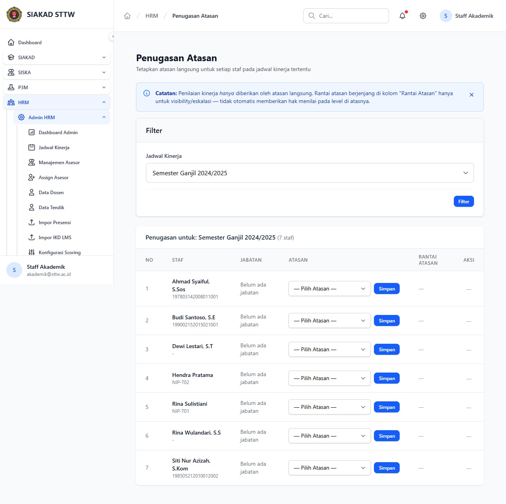

# Workflow Report: HRM Admin Penugasan Atasan

**Tanggal**: 2026-05-12
**Role**: akademik (akademik@sttw.ac.id)
**Modul**: hrm
**Fitur**: admin-penugasan-atasan
**Status**: ✅ Berhasil

## Deskripsi Workflow

Penugasan atasan langsung untuk pegawai.

## Ringkasan

Halaman diakses sebagai akademik (yang memegang permission HRM admin) pada delta scan pertengahan April 2026.

## Langkah-langkah

### 1. Buka halaman HRM Admin Penugasan Atasan

**Deskripsi**: Akademik membuka halaman `/hrm/admin/penugasan-atasan` melalui sidebar HRM Admin.

**URL**: `http://127.0.0.1:8000/hrm/admin/penugasan-atasan`

## Temuan & Masalah

_Tidak ada temuan signifikan._

## Catatan

- Diambil otomatis pada batch scan delta pertengahan April 2026.
- Role `akademik` ternyata pemegang permission HRM admin (bukan `ketua` / `admin-lpm`); periksa apakah pembagian role ini sudah sesuai desain modul HRM.
