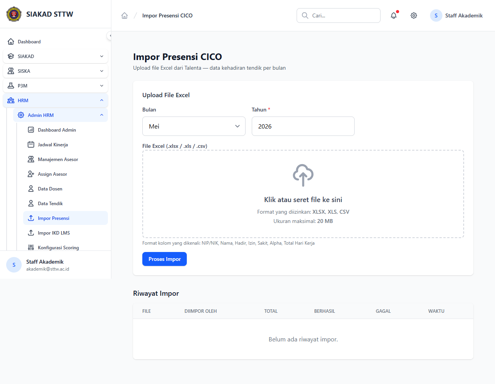

# Workflow Report: Impor Presensi CICO

**Tanggal**: 2026-04-18  
**Role**: Waket2 / Admin HRM  
**Modul**: HRM > Admin HRM  
**Fitur**: Impor Presensi CICO  
**Status**: ⚠️ Partial

## Deskripsi Workflow

Form impor presensi CICO dari file Talenta.

## Ringkasan

1 langkah berhasil, 0 langkah gagal, dan 1 temuan warning tercatat.

## Langkah-langkah

### 1. Halaman Impor Presensi

**Deskripsi**: Halaman ini merekam tampilan utama halaman impor presensi sebagai bagian dari alur impor presensi cico.

**Akun**: Waket2 / Admin HRM

**URL**: `http://127.0.0.1:8000/hrm/admin/presensi`

**Catatan langkah**: no-data: Halaman tampil tetapi data yang ditampilkan masih kosong atau belum tersedia.

## Temuan & Masalah

| # | Halaman | URL | Kategori | Deskripsi | Screenshot | Prioritas |
|---|---------|-----|----------|-----------|------------|-----------|
| 1 | Halaman Impor Presensi | `http://127.0.0.1:8000/hrm/admin/presensi` | `no-data` | Halaman tampil tetapi data yang ditampilkan masih kosong atau belum tersedia. | [Lihat](screenshots/01_index.png) | Low |

## Catatan

- Screenshot diambil otomatis menggunakan Playwright dengan full-page capture.
- Navigasi utama diprioritaskan melalui sidebar; jika sebuah halaman hanya bisa dicapai dari quick action atau tombol sekunder, report akan menandainya sebagai `missing-sidebar`.
- Form pada report ini dibuka untuk verifikasi visual dan field wajib, tidak disubmit secara destruktif agar hasil scan tidak memalsukan status sukses.
- Data yang tampil mengikuti seeder HRM yang aktif saat scan dijalankan.
