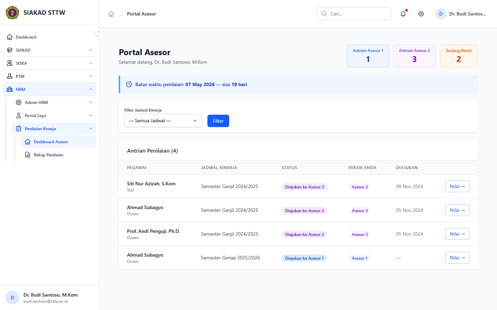

# Workflow Report: Dashboard Asesor HRM

**Tanggal**: 2026-04-18  
**Role**: Asesor  
**Modul**: HRM > Penilaian Kinerja  
**Fitur**: Dashboard Asesor HRM  
**Status**: ⚠️ Partial

## Deskripsi Workflow

Antrian penilaian asesor untuk laporan kinerja pegawai.

## Ringkasan

1 langkah berhasil, 0 langkah gagal, dan 1 temuan warning tercatat.

## Langkah-langkah

### 1. Dashboard Asesor

**Deskripsi**: Halaman dashboard untuk antrian penilaian asesor untuk laporan kinerja pegawai. Screenshot diambil setelah halaman selesai dimuat penuh.

**Akun**: Asesor

**URL**: `http://127.0.0.1:8000/hrm/asesor`

**Catatan langkah**: server-error: Landing default setelah login menuju http://127.0.0.1:8000/dashboard mengalami error, sehingga scan dilanjutkan dari /hrm/asesor.

## Temuan & Masalah

| # | Halaman | URL | Kategori | Deskripsi | Screenshot | Prioritas |
|---|---------|-----|----------|-----------|------------|-----------|
| 1 | Dashboard Asesor | `http://127.0.0.1:8000/hrm/asesor` | `server-error` | Landing default setelah login menuju http://127.0.0.1:8000/dashboard mengalami error, sehingga scan dilanjutkan dari /hrm/asesor. | [Lihat](screenshots/01_dashboard.png) | Critical |

## Catatan

- Screenshot diambil otomatis menggunakan Playwright dengan full-page capture.
- Navigasi utama diprioritaskan melalui sidebar; jika sebuah halaman hanya bisa dicapai dari quick action atau tombol sekunder, report akan menandainya sebagai `missing-sidebar`.
- Form pada report ini dibuka untuk verifikasi visual dan field wajib, tidak disubmit secara destruktif agar hasil scan tidak memalsukan status sukses.
- Data yang tampil mengikuti seeder HRM yang aktif saat scan dijalankan.
