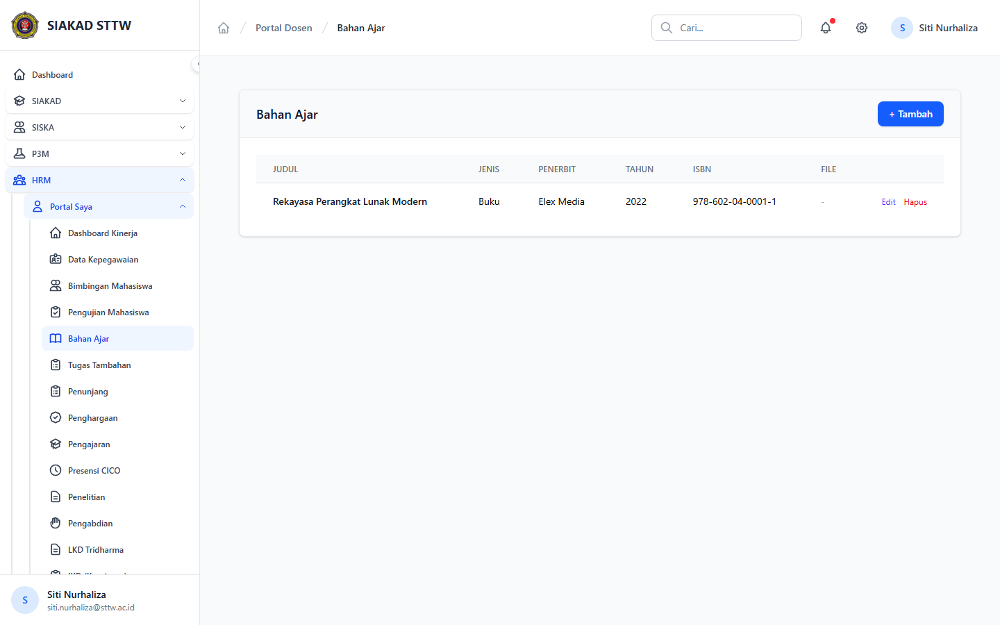
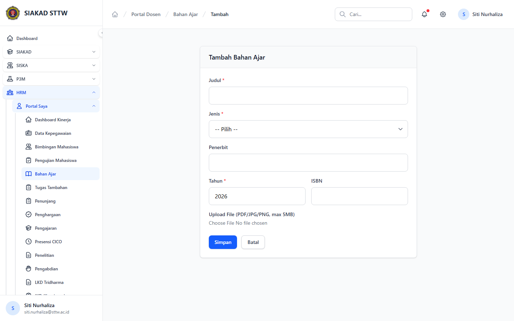

# Workflow Report: Bahan Ajar Dosen

**Tanggal**: 2026-04-18  
**Role**: Dosen  
**Modul**: HRM > Portal Saya  
**Fitur**: Bahan Ajar Dosen  
**Status**: ✅ Berhasil

## Deskripsi Workflow

Daftar bahan ajar dan form penambahan bahan ajar.

## Ringkasan

Semua 2 langkah pada scan ini lolos tanpa error maupun warning.

## Langkah-langkah

### 1. Daftar Bahan Ajar

**Deskripsi**: Halaman ini merekam tampilan utama daftar bahan ajar sebagai bagian dari alur bahan ajar dosen.

**Akun**: Portal Dosen

**URL**: `http://127.0.0.1:8000/hrm/portal/kinerja/bahan-ajar`

### 2. Form Tambah Bahan Ajar

**Deskripsi**: Form dibuka tanpa submit untuk memverifikasi field wajib, struktur input, dan tombol aksi pada bahan ajar dosen.

**Akun**: Portal Dosen

**URL**: `http://127.0.0.1:8000/hrm/portal/kinerja/bahan-ajar/create`

## Temuan & Masalah

Tidak ada temuan kritis maupun warning pada scan ini.

## Catatan

- Screenshot diambil otomatis menggunakan Playwright dengan full-page capture.
- Navigasi utama diprioritaskan melalui sidebar; jika sebuah halaman hanya bisa dicapai dari quick action atau tombol sekunder, report akan menandainya sebagai `missing-sidebar`.
- Form pada report ini dibuka untuk verifikasi visual dan field wajib, tidak disubmit secara destruktif agar hasil scan tidak memalsukan status sukses.
- Data yang tampil mengikuti seeder HRM yang aktif saat scan dijalankan.
