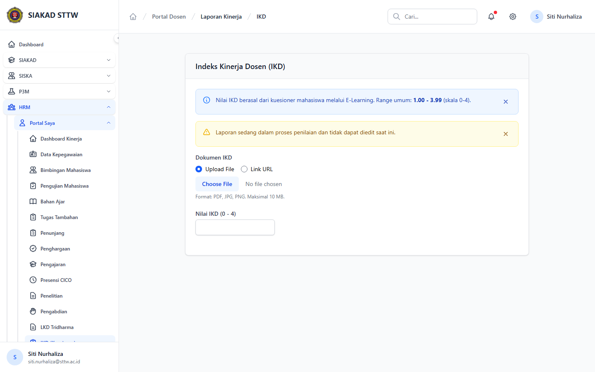

# Workflow Report: IKD Dosen

**Tanggal**: 2026-04-18  
**Role**: Dosen  
**Modul**: HRM > Portal Saya  
**Fitur**: IKD Dosen  
**Status**: ✅ Berhasil

## Deskripsi Workflow

Halaman input dan ringkasan IKD.

## Ringkasan

Semua 1 langkah pada scan ini lolos tanpa error maupun warning.

## Langkah-langkah

### 1. Halaman IKD

**Deskripsi**: Halaman input dan ringkasan IKD. Langkah ini difokuskan pada tampilan halaman ikd.

**Akun**: Portal Dosen

**URL**: `http://127.0.0.1:8000/hrm/portal/laporan/ikd`

## Temuan & Masalah

Tidak ada temuan kritis maupun warning pada scan ini.

## Catatan

- Screenshot diambil otomatis menggunakan Playwright dengan full-page capture.
- Navigasi utama diprioritaskan melalui sidebar; jika sebuah halaman hanya bisa dicapai dari quick action atau tombol sekunder, report akan menandainya sebagai `missing-sidebar`.
- Form pada report ini dibuka untuk verifikasi visual dan field wajib, tidak disubmit secara destruktif agar hasil scan tidak memalsukan status sukses.
- Data yang tampil mengikuti seeder HRM yang aktif saat scan dijalankan.
