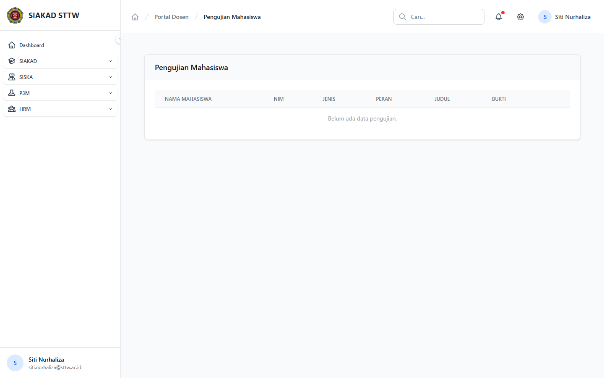

# Workflow Report: Pengujian Mahasiswa Dosen

**Tanggal**: 2026-04-18  
**Role**: Dosen  
**Modul**: HRM > Portal Saya  
**Fitur**: Pengujian Mahasiswa Dosen  
**Status**: ⚠️ Partial

## Deskripsi Workflow

Daftar pengujian dan form penambahan pengujian.

## Ringkasan

1 langkah berhasil, 1 langkah gagal, dan 2 temuan warning tercatat.

## Langkah-langkah

### 1. Daftar Pengujian

**Deskripsi**: Halaman ini merekam tampilan utama daftar pengujian sebagai bagian dari alur pengujian mahasiswa dosen.

**Akun**: Portal Dosen

**URL**: `http://127.0.0.1:8000/hrm/portal/kinerja/pengujian`

**Catatan langkah**: no-data: Halaman tampil tetapi data yang ditampilkan masih kosong atau belum tersedia. missing-sidebar: Halaman ini dicapai lewat quick action atau tombol sekunder karena tidak ada item sidebar langsung.

## Temuan & Masalah

| # | Halaman | URL | Kategori | Deskripsi | Screenshot | Prioritas |
|---|---------|-----|----------|-----------|------------|-----------|
| 1 | Daftar Pengujian | `http://127.0.0.1:8000/hrm/portal/kinerja/pengujian` | `no-data` | Halaman tampil tetapi data yang ditampilkan masih kosong atau belum tersedia. | [Lihat](screenshots/01_index.png) | Low |
| 2 | Daftar Pengujian | `http://127.0.0.1:8000/hrm/portal/kinerja/pengujian` | `missing-sidebar` | Halaman ini dicapai lewat quick action atau tombol sekunder karena tidak ada item sidebar langsung. | [Lihat](screenshots/01_index.png) | Medium |
| 3 | Form Tambah Pengujian | `http://127.0.0.1:8000/hrm/portal/kinerja/pengujian` | `missing-feature` | Elemen aksi "/Tambah/i" tidak ditemukan pada area utama halaman. | [Lihat](screenshots/err_02_create.png) | High |

## Catatan

- Screenshot diambil otomatis menggunakan Playwright dengan full-page capture.
- Navigasi utama diprioritaskan melalui sidebar; jika sebuah halaman hanya bisa dicapai dari quick action atau tombol sekunder, report akan menandainya sebagai `missing-sidebar`.
- Form pada report ini dibuka untuk verifikasi visual dan field wajib, tidak disubmit secara destruktif agar hasil scan tidak memalsukan status sukses.
- Data yang tampil mengikuti seeder HRM yang aktif saat scan dijalankan.
